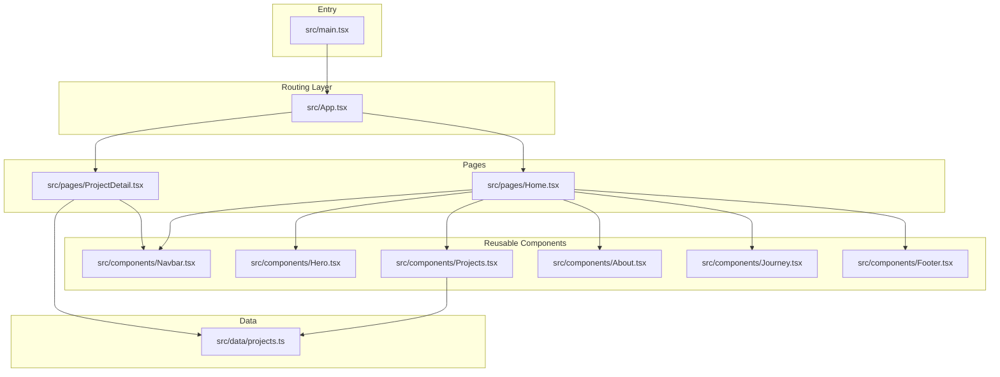
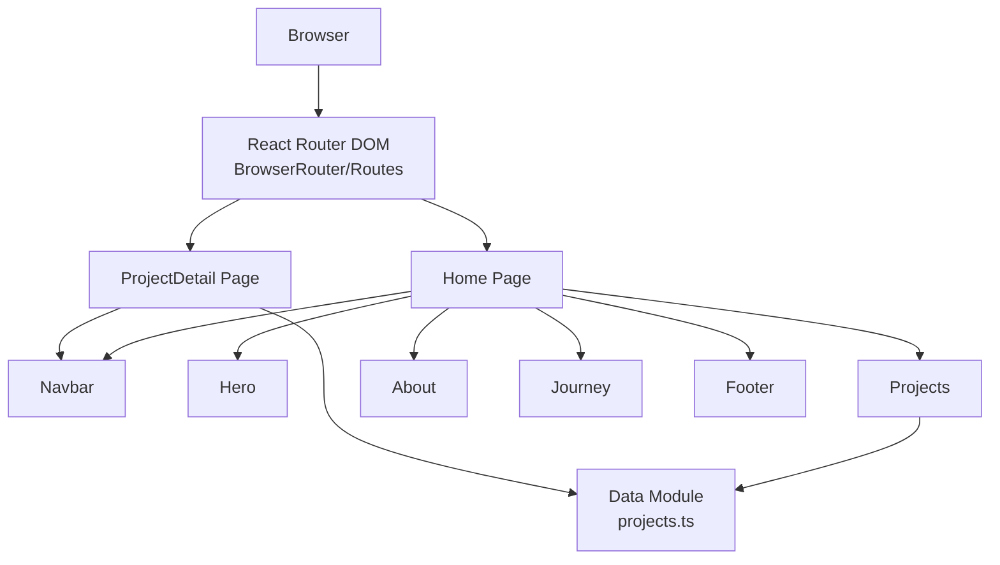
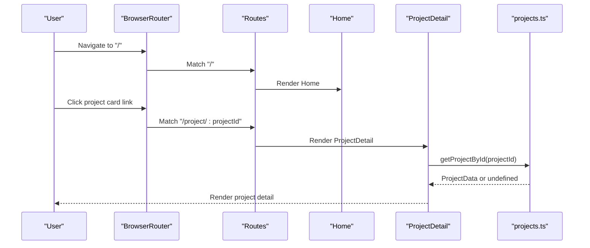
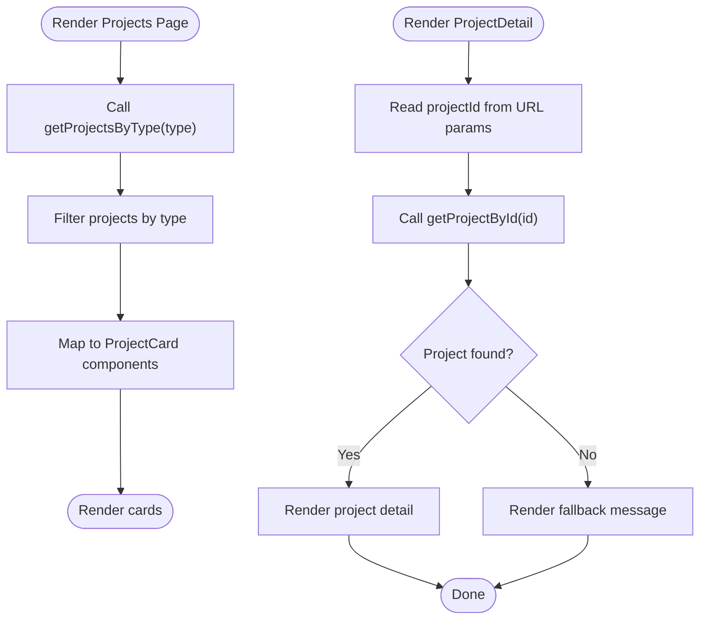
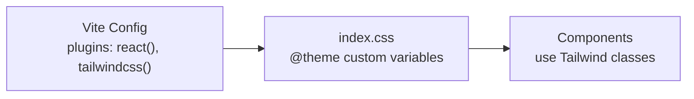
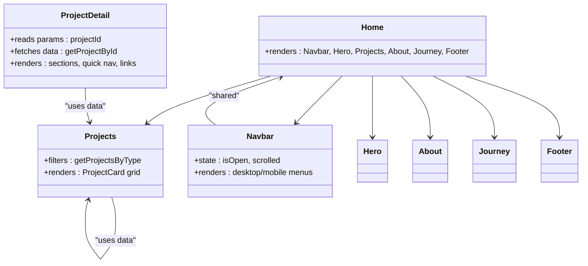
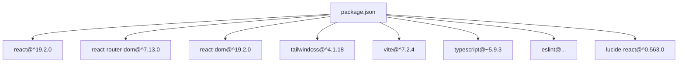

# Architecture Overview

<cite>
**Referenced Files in This Document**
- [package.json](file://package.json)
- [vite.config.ts](file://vite.config.ts)
- [src/main.tsx](file://src/main.tsx)
- [src/App.tsx](file://src/App.tsx)
- [src/pages/Home.tsx](file://src/pages/Home.tsx)
- [src/pages/ProjectDetail.tsx](file://src/pages/ProjectDetail.tsx)
- [src/data/projects.ts](file://src/data/projects.ts)
- [src/components/Navbar.tsx](file://src/components/Navbar.tsx)
- [src/components/Hero.tsx](file://src/components/Hero.tsx)
- [src/components/Projects.tsx](file://src/components/Projects.tsx)
- [src/components/About.tsx](file://src/components/About.tsx)
- [src/components/Journey.tsx](file://src/components/Journey.tsx)
- [src/components/Footer.tsx](file://src/components/Footer.tsx)
- [src/index.css](file://src/index.css)
</cite>

## Table of Contents
1. [Introduction](#introduction)
2. [Project Structure](#project-structure)
3. [Core Components](#core-components)
4. [Architecture Overview](#architecture-overview)
5. [Detailed Component Analysis](#detailed-component-analysis)
6. [Dependency Analysis](#dependency-analysis)
7. [Performance Considerations](#performance-considerations)
8. [Troubleshooting Guide](#troubleshooting-guide)
9. [Conclusion](#conclusion)

## Introduction
This document describes the architecture of the Fahim Portfolio Next.js application. It outlines the high-level design patterns, component-based structure, client-side routing, build system integration, data flow, and styling approach. The project adopts functional components, React Router DOM for SPA navigation, Vite for fast development and builds, TypeScript for type safety, and Tailwind CSS for styling with a custom theme.

## Project Structure
The project follows a clear modular structure:
- Entry point: src/main.tsx renders the root App component.
- Root component: src/App.tsx configures routing with React Router DOM.
- Pages: src/pages/ contains page-level components (Home, ProjectDetail).
- Reusable components: src/components/ contains shared UI components (Navbar, Hero, Projects, About, Journey, Footer).
- Data: src/data/ centralizes typed project data and helper functions.
- Styling: src/index.css defines a custom Tailwind theme and base styles.

**Diagram sources**
- [src/main.tsx](file://src/main.tsx#L1-L11)
- [src/App.tsx](file://src/App.tsx#L1-L30)
- [src/pages/Home.tsx](file://src/pages/Home.tsx#L1-L22)
- [src/pages/ProjectDetail.tsx](file://src/pages/ProjectDetail.tsx#L1-L365)
- [src/components/Navbar.tsx](file://src/components/Navbar.tsx#L1-L112)
- [src/components/Hero.tsx](file://src/components/Hero.tsx#L1-L68)
- [src/components/Projects.tsx](file://src/components/Projects.tsx#L1-L108)
- [src/components/About.tsx](file://src/components/About.tsx#L1-L103)
- [src/components/Journey.tsx](file://src/components/Journey.tsx#L1-L41)
- [src/components/Footer.tsx](file://src/components/Footer.tsx#L1-L82)
- [src/data/projects.ts](file://src/data/projects.ts#L1-L485)

**Section sources**
- [src/main.tsx](file://src/main.tsx#L1-L11)
- [src/App.tsx](file://src/App.tsx#L1-L30)
- [src/pages/Home.tsx](file://src/pages/Home.tsx#L1-L22)
- [src/pages/ProjectDetail.tsx](file://src/pages/ProjectDetail.tsx#L1-L365)
- [src/components/Navbar.tsx](file://src/components/Navbar.tsx#L1-L112)
- [src/components/Hero.tsx](file://src/components/Hero.tsx#L1-L68)
- [src/components/Projects.tsx](file://src/components/Projects.tsx#L1-L108)
- [src/components/About.tsx](file://src/components/About.tsx#L1-L103)
- [src/components/Journey.tsx](file://src/components/Journey.tsx#L1-L41)
- [src/components/Footer.tsx](file://src/components/Footer.tsx#L1-L82)
- [src/data/projects.ts](file://src/data/projects.ts#L1-L485)

## Core Components
- Entry point: src/main.tsx creates the root and mounts App.
- Routing root: src/App.tsx wraps routes in BrowserRouter and sets up a ScrollToTop side effect.
- Pages:
  - Home: Composes Navbar, Hero, Projects, About, Journey, and Footer.
  - ProjectDetail: Renders a dynamic project detail page using URL params and centralized data.
- Reusable components: Navbar, Hero, Projects, About, Journey, Footer encapsulate UI and interactions.
- Data module: Typed ProjectData model, arrays of projects, and helpers to filter/get projects.

Key technical decisions:
- React 19.2.0: Latest stable React runtime for concurrent features and improved DX.
- TypeScript: Strong typing across components and data.
- Vite: Fast dev server and optimized builds with React plugin and Tailwind integration.
- Tailwind CSS: Utility-first styling with a custom theme and base styles.

**Section sources**
- [src/main.tsx](file://src/main.tsx#L1-L11)
- [src/App.tsx](file://src/App.tsx#L1-L30)
- [src/pages/Home.tsx](file://src/pages/Home.tsx#L1-L22)
- [src/pages/ProjectDetail.tsx](file://src/pages/ProjectDetail.tsx#L1-L365)
- [src/components/Navbar.tsx](file://src/components/Navbar.tsx#L1-L112)
- [src/components/Hero.tsx](file://src/components/Hero.tsx#L1-L68)
- [src/components/Projects.tsx](file://src/components/Projects.tsx#L1-L108)
- [src/components/About.tsx](file://src/components/About.tsx#L1-L103)
- [src/components/Journey.tsx](file://src/components/Journey.tsx#L1-L41)
- [src/components/Footer.tsx](file://src/components/Footer.tsx#L1-L82)
- [src/data/projects.ts](file://src/data/projects.ts#L1-L485)
- [package.json](file://package.json#L12-L32)
- [vite.config.ts](file://vite.config.ts#L1-L9)
- [src/index.css](file://src/index.css#L1-L135)

## Architecture Overview
The application is a single-page application (SPA) structured around functional components and React Router DOM. The routing layer delegates to page components, which compose reusable components. Centralized data is accessed via a dedicated data module. Styling leverages Tailwind CSS with a custom theme defined in index.css.

**Diagram sources**
- [src/App.tsx](file://src/App.tsx#L1-L30)
- [src/pages/Home.tsx](file://src/pages/Home.tsx#L1-L22)
- [src/pages/ProjectDetail.tsx](file://src/pages/ProjectDetail.tsx#L1-L365)
- [src/components/Navbar.tsx](file://src/components/Navbar.tsx#L1-L112)
- [src/components/Hero.tsx](file://src/components/Hero.tsx#L1-L68)
- [src/components/Projects.tsx](file://src/components/Projects.tsx#L1-L108)
- [src/components/About.tsx](file://src/components/About.tsx#L1-L103)
- [src/components/Journey.tsx](file://src/components/Journey.tsx#L1-L41)
- [src/components/Footer.tsx](file://src/components/Footer.tsx#L1-L82)
- [src/data/projects.ts](file://src/data/projects.ts#L1-L485)

## Detailed Component Analysis

### Routing and Navigation Flow
The routing layer configures two routes: the home page and the project detail page. A ScrollToTop component ensures the viewport scrolls to the top on route changes. The Home page composes multiple reusable components, while the ProjectDetail page fetches project data by ID from the data module.

**Diagram sources**
- [src/App.tsx](file://src/App.tsx#L17-L27)
- [src/pages/Home.tsx](file://src/pages/Home.tsx#L1-L22)
- [src/pages/ProjectDetail.tsx](file://src/pages/ProjectDetail.tsx#L88-L103)
- [src/data/projects.ts](file://src/data/projects.ts#L478-L485)

**Section sources**
- [src/App.tsx](file://src/App.tsx#L1-L30)
- [src/pages/Home.tsx](file://src/pages/Home.tsx#L1-L22)
- [src/pages/ProjectDetail.tsx](file://src/pages/ProjectDetail.tsx#L1-L365)
- [src/data/projects.ts](file://src/data/projects.ts#L1-L485)

### Data Flow and Centralization
Centralized project data is modeled with a strict interface and exported as an array with helper functions. The Projects page filters projects by type, and the ProjectDetail page retrieves a specific project by ID. This pattern minimizes duplication and keeps data access predictable.

**Diagram sources**
- [src/pages/ProjectDetail.tsx](file://src/pages/ProjectDetail.tsx#L88-L103)
- [src/components/Projects.tsx](file://src/components/Projects.tsx#L76-L107)
- [src/data/projects.ts](file://src/data/projects.ts#L478-L485)

**Section sources**
- [src/data/projects.ts](file://src/data/projects.ts#L1-L485)
- [src/components/Projects.tsx](file://src/components/Projects.tsx#L1-L108)
- [src/pages/ProjectDetail.tsx](file://src/pages/ProjectDetail.tsx#L1-L365)

### Styling System and Theme
Tailwind CSS is configured via a Vite plugin and a custom theme defined in index.css. The theme variables define color palettes, typography, spacing, transitions, and shadows. Base styles and utility classes are applied consistently across components.

**Diagram sources**
- [vite.config.ts](file://vite.config.ts#L1-L9)
- [src/index.css](file://src/index.css#L1-L135)

**Section sources**
- [vite.config.ts](file://vite.config.ts#L1-L9)
- [src/index.css](file://src/index.css#L1-L135)

### Component Composition Patterns
- Home page composes multiple sections: Navbar, Hero, Projects, About, Journey, and Footer.
- ProjectDetail page uses helper components for navigation, section wrappers, panels, and dividers to structure content dynamically from the centralized data.
- Navbar demonstrates responsive behavior with state and scroll-aware styling.

**Diagram sources**
- [src/pages/Home.tsx](file://src/pages/Home.tsx#L1-L22)
- [src/pages/ProjectDetail.tsx](file://src/pages/ProjectDetail.tsx#L1-L365)
- [src/components/Projects.tsx](file://src/components/Projects.tsx#L1-L108)
- [src/components/Navbar.tsx](file://src/components/Navbar.tsx#L1-L112)
- [src/components/Hero.tsx](file://src/components/Hero.tsx#L1-L68)
- [src/components/About.tsx](file://src/components/About.tsx#L1-L103)
- [src/components/Journey.tsx](file://src/components/Journey.tsx#L1-L41)
- [src/components/Footer.tsx](file://src/components/Footer.tsx#L1-L82)
- [src/data/projects.ts](file://src/data/projects.ts#L1-L485)

**Section sources**
- [src/pages/Home.tsx](file://src/pages/Home.tsx#L1-L22)
- [src/pages/ProjectDetail.tsx](file://src/pages/ProjectDetail.tsx#L1-L365)
- [src/components/Projects.tsx](file://src/components/Projects.tsx#L1-L108)
- [src/components/Navbar.tsx](file://src/components/Navbar.tsx#L1-L112)
- [src/components/Hero.tsx](file://src/components/Hero.tsx#L1-L68)
- [src/components/About.tsx](file://src/components/About.tsx#L1-L103)
- [src/components/Journey.tsx](file://src/components/Journey.tsx#L1-L41)
- [src/components/Footer.tsx](file://src/components/Footer.tsx#L1-L82)
- [src/data/projects.ts](file://src/data/projects.ts#L1-L485)

## Dependency Analysis
The project’s dependencies include React, React Router DOM, React DOM, Tailwind CSS v4, and Vite with React and Tailwind plugins. TypeScript and ESLint support are included for type safety and code quality.

**Diagram sources**
- [package.json](file://package.json#L12-L32)

**Section sources**
- [package.json](file://package.json#L1-L35)

## Performance Considerations
- Vite provides fast cold starts and hot module replacement, accelerating development iteration.
- React 19 enables concurrent rendering features and improved scheduling.
- Lazy loading is supported by the bundler; consider code-splitting for heavier pages if needed.
- Tailwind’s JIT mode (via Tailwind CSS v4) optimizes CSS generation during development and build.

[No sources needed since this section provides general guidance]

## Troubleshooting Guide
- If routing does not update the viewport position, verify the ScrollToTop side effect is rendered under BrowserRouter.
- If project details fail to render, confirm the projectId parameter matches an existing project ID and that getProjectById returns a value.
- If styles appear incorrect, check that Tailwind is enabled in Vite and that index.css is imported at the application root.

**Section sources**
- [src/App.tsx](file://src/App.tsx#L6-L15)
- [src/pages/ProjectDetail.tsx](file://src/pages/ProjectDetail.tsx#L88-L103)
- [src/index.css](file://src/index.css#L1-L1)

## Conclusion
The Fahim Portfolio application employs a clean, modular architecture centered on functional components, centralized data, and client-side routing. Vite streamlines development and builds, while Tailwind CSS with a custom theme ensures consistent, maintainable styling. The separation between pages and reusable components, along with a dedicated data module, supports scalability and readability.