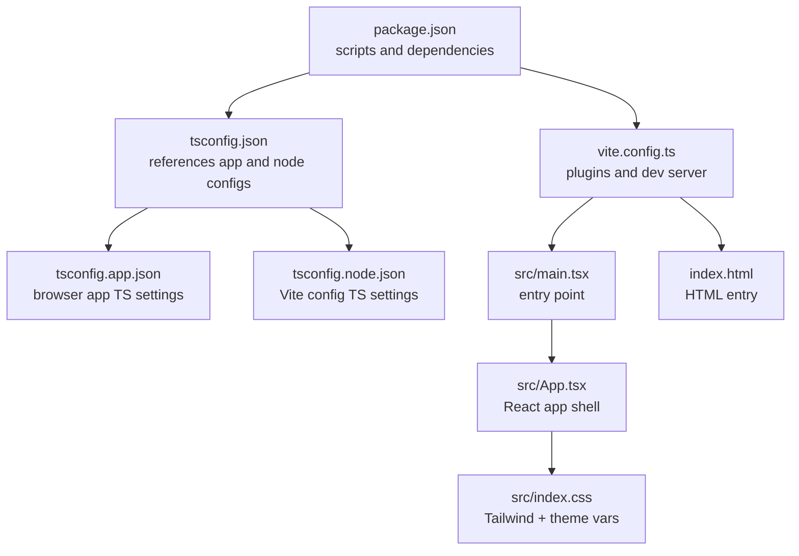
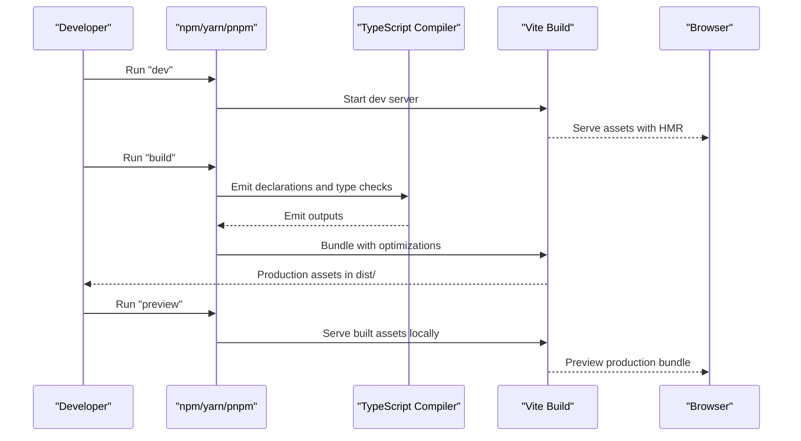
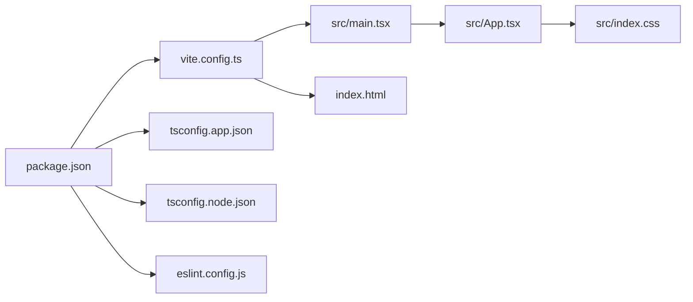

# Build System

<cite>
**Referenced Files in This Document**
- [vite.config.ts](file://vite.config.ts)
- [package.json](file://package.json)
- [tsconfig.json](file://tsconfig.json)
- [tsconfig.app.json](file://tsconfig.app.json)
- [tsconfig.node.json](file://tsconfig.node.json)
- [eslint.config.js](file://eslint.config.js)
- [index.html](file://index.html)
- [src/main.tsx](file://src/main.tsx)
- [src/App.tsx](file://src/App.tsx)
- [src/index.css](file://src/index.css)
- [README.md](file://README.md)
</cite>

## Table of Contents
1. [Introduction](#introduction)
2. [Project Structure](#project-structure)
3. [Core Components](#core-components)
4. [Architecture Overview](#architecture-overview)
5. [Detailed Component Analysis](#detailed-component-analysis)
6. [Dependency Analysis](#dependency-analysis)
7. [Performance Considerations](#performance-considerations)
8. [Troubleshooting Guide](#troubleshooting-guide)
9. [Conclusion](#conclusion)
10. [Appendices](#appendices)

## Introduction
This document explains the build system configuration for a Vite-powered React + TypeScript project. It covers the Vite configuration, multi-environment TypeScript setups, development workflow, linting, and production optimization strategies. It also provides practical guidance for building, previewing, and deploying the application.

## Project Structure
The project follows a conventional Vite + React + TypeScript layout with a dual TypeScript configuration model and a Tailwind CSS integration via the Vite plugin. The build scripts orchestrate TypeScript compilation and Vite bundling.

**Diagram sources**
- [package.json](file://package.json#L1-L35)
- [vite.config.ts](file://vite.config.ts#L1-L9)
- [tsconfig.json](file://tsconfig.json#L1-L8)
- [tsconfig.app.json](file://tsconfig.app.json#L1-L29)
- [tsconfig.node.json](file://tsconfig.node.json#L1-L27)
- [src/main.tsx](file://src/main.tsx#L1-L11)
- [src/App.tsx](file://src/App.tsx#L1-L30)
- [src/index.css](file://src/index.css#L1-L135)
- [index.html](file://index.html#L1-L24)

**Section sources**
- [package.json](file://package.json#L1-L35)
- [vite.config.ts](file://vite.config.ts#L1-L9)
- [tsconfig.json](file://tsconfig.json#L1-L8)
- [tsconfig.app.json](file://tsconfig.app.json#L1-L29)
- [tsconfig.node.json](file://tsconfig.node.json#L1-L27)
- [index.html](file://index.html#L1-L24)
- [src/main.tsx](file://src/main.tsx#L1-L11)
- [src/App.tsx](file://src/App.tsx#L1-L30)
- [src/index.css](file://src/index.css#L1-L135)

## Core Components
- Vite configuration: Enables React Fast Refresh and Tailwind CSS integration via the Vite plugin.
- TypeScript configuration: Dual-config model with separate settings for the browser app and Vite’s config.
- Scripts: Dev server, build pipeline combining TypeScript emit and Vite bundling, preview, and linting.
- Linting: ESLint flat config with TypeScript and React-specific plugins.

Key responsibilities:
- Vite: Development server, HMR, bundling, and asset handling.
- TypeScript: Type checking and module resolution for app and config contexts.
- ESLint: Static analysis and style enforcement.

**Section sources**
- [vite.config.ts](file://vite.config.ts#L1-L9)
- [tsconfig.app.json](file://tsconfig.app.json#L1-L29)
- [tsconfig.node.json](file://tsconfig.node.json#L1-L27)
- [package.json](file://package.json#L6-L11)
- [eslint.config.js](file://eslint.config.js#L1-L24)

## Architecture Overview
The build pipeline integrates TypeScript compilation with Vite bundling. The development server runs with hot module replacement, while the production build performs tree-shaking, minification, and asset optimization.

**Diagram sources**
- [package.json](file://package.json#L6-L11)
- [vite.config.ts](file://vite.config.ts#L1-L9)
- [tsconfig.app.json](file://tsconfig.app.json#L1-L29)
- [tsconfig.node.json](file://tsconfig.node.json#L1-L27)

## Detailed Component Analysis

### Vite Configuration
- Plugins:
  - React plugin enables Fast Refresh and JSX transformations.
  - Tailwind CSS plugin integrates Tailwind directives and purging.
- Purpose: Configure the dev server, HMR, and bundling behavior.

Practical usage:
- Development: Start the dev server using the configured script.
- Production: Build with Vite to produce optimized assets.

**Section sources**
- [vite.config.ts](file://vite.config.ts#L1-L9)
- [package.json](file://package.json#L6-L11)

### TypeScript Configuration Model
- Root reference config:
  - Uses project references to split app and node configs.
- App config (browser):
  - Targets modern environments, uses bundler module resolution, JSX transform for React, strictness flags, and Vite client types.
- Node config (Vite config):
  - Targets Node-like environment for Vite’s own configuration, uses bundler module resolution, and includes Vite config file.

Why this separation matters:
- Ensures accurate type checking for both browser code and Vite configuration.
- Aligns with Vite’s bundler mode and module detection.

**Section sources**
- [tsconfig.json](file://tsconfig.json#L1-L8)
- [tsconfig.app.json](file://tsconfig.app.json#L1-L29)
- [tsconfig.node.json](file://tsconfig.node.json#L1-L27)

### HTML and Entry Point
- HTML entry defines the root container and page metadata.
- Entry point mounts the React root and renders the app shell.

Implications:
- The HTML file injects the compiled script at runtime.
- CSS is imported from the entry point to ensure Tailwind is processed.

**Section sources**
- [index.html](file://index.html#L1-L24)
- [src/main.tsx](file://src/main.tsx#L1-L11)
- [src/App.tsx](file://src/App.tsx#L1-L30)

### Tailwind CSS Integration
- Tailwind is imported in the CSS file and integrated via the Vite plugin.
- Theme variables are defined centrally for consistent design tokens.

Optimization:
- Purge unused styles during production builds.
- Use JIT mode for rapid iteration in development.

**Section sources**
- [vite.config.ts](file://vite.config.ts#L1-L9)
- [src/index.css](file://src/index.css#L1-L135)

### Linting Setup
- ESLint flat config extends recommended rules for JS, TS, React Hooks, and React Refresh.
- Ignores the dist folder and targets TS/TSX files.
- The README suggests enabling type-aware lint rules for production-grade projects.

Recommended enhancements:
- Enable type-checked configs for stricter linting.
- Optionally integrate React-specific plugins for deeper checks.

**Section sources**
- [eslint.config.js](file://eslint.config.js#L1-L24)
- [README.md](file://README.md#L14-L74)

### Build Commands and Workflow
- Development:
  - Start the dev server with hot reloading.
- Building:
  - Run TypeScript emit and then Vite build to produce production assets.
- Preview:
  - Serve the built assets locally to validate production behavior.
- Linting:
  - Run ESLint across the project.

**Section sources**
- [package.json](file://package.json#L6-L11)

## Dependency Analysis
The build system relies on a tight integration between Vite, TypeScript, and ESLint. The dual TypeScript configuration ensures accurate type checking for both the app and Vite’s config. The Vite plugin ecosystem handles React and Tailwind integration.

**Diagram sources**
- [package.json](file://package.json#L1-L35)
- [vite.config.ts](file://vite.config.ts#L1-L9)
- [tsconfig.app.json](file://tsconfig.app.json#L1-L29)
- [tsconfig.node.json](file://tsconfig.node.json#L1-L27)
- [eslint.config.js](file://eslint.config.js#L1-L24)
- [src/main.tsx](file://src/main.tsx#L1-L11)
- [src/App.tsx](file://src/App.tsx#L1-L30)
- [src/index.css](file://src/index.css#L1-L135)
- [index.html](file://index.html#L1-L24)

**Section sources**
- [package.json](file://package.json#L1-L35)
- [vite.config.ts](file://vite.config.ts#L1-L9)
- [tsconfig.app.json](file://tsconfig.app.json#L1-L29)
- [tsconfig.node.json](file://tsconfig.node.json#L1-L27)
- [eslint.config.js](file://eslint.config.js#L1-L24)

## Performance Considerations
- Prefer bundler module resolution and verbatim module syntax for precise dependency handling.
- Keep strictness flags enabled to catch potential performance pitfalls early.
- Use Tailwind’s purge and JIT appropriately for development vs. production.
- Minimize unnecessary dependencies and keep the dev server focused on essential plugins.
- Leverage Vite’s native ES module support and fast refresh for efficient iteration.

[No sources needed since this section provides general guidance]

## Troubleshooting Guide
Common issues and resolutions:
- TypeScript errors in Vite config:
  - Ensure the Node TS config includes the Vite config file and uses bundler module resolution.
- React Fast Refresh not working:
  - Verify the React plugin is enabled and JSX transform is configured.
- Tailwind classes not applied:
  - Confirm Tailwind is imported in the CSS and the Vite plugin is active.
- Lint errors in TSX files:
  - Extend type-aware configs and set parser project paths accordingly.
- Build fails with missing types:
  - Run TypeScript emit before Vite build to ensure type declarations are generated.

**Section sources**
- [tsconfig.node.json](file://tsconfig.node.json#L1-L27)
- [vite.config.ts](file://vite.config.ts#L1-L9)
- [src/index.css](file://src/index.css#L1-L135)
- [eslint.config.js](file://eslint.config.js#L1-L24)
- [package.json](file://package.json#L6-L11)

## Conclusion
This build system combines Vite, React, TypeScript, and Tailwind for a modern, efficient development workflow. The dual TypeScript configuration ensures robust type checking across the app and Vite’s config, while ESLint provides strong static analysis. Following the documented scripts and configurations yields a reliable development and production pipeline.

[No sources needed since this section summarizes without analyzing specific files]

## Appendices

### Practical Commands
- Development server: npm run dev
- Build for production: npm run build
- Preview production bundle: npm run preview
- Lint the project: npm run lint

**Section sources**
- [package.json](file://package.json#L6-L11)

### Environment Variables
- Not explicitly defined in the repository files. If needed, define them in a .env file and consume them via Vite’s environment variable prefix for client-side code.

[No sources needed since this section provides general guidance]

### Deployment Preparation
- Ensure the build completes successfully and the dist directory is served statically.
- Validate that Tailwind purging and minification are active in production.
- Confirm that the HTML entry points to the correct built script and that assets resolve correctly.

[No sources needed since this section provides general guidance]