# About Section

<cite>
**Referenced Files in This Document**
- [About.tsx](file://src/components/About.tsx)
- [Home.tsx](file://src/pages/Home.tsx)
- [index.css](file://src/index.css)
- [Navbar.tsx](file://src/components/Navbar.tsx)
- [Hero.tsx](file://src/components/Hero.tsx)
- [Journey.tsx](file://src/components/Journey.tsx)
- [Projects.tsx](file://src/components/Projects.tsx)
- [package.json](file://package.json)
</cite>

## Table of Contents
1. [Introduction](#introduction)
2. [Project Structure](#project-structure)
3. [Core Components](#core-components)
4. [Architecture Overview](#architecture-overview)
5. [Detailed Component Analysis](#detailed-component-analysis)
6. [Dependency Analysis](#dependency-analysis)
7. [Performance Considerations](#performance-considerations)
8. [Troubleshooting Guide](#troubleshooting-guide)
9. [Conclusion](#conclusion)
10. [Appendices](#appendices)

## Introduction
This document explains the About Section component and its surrounding ecosystem. It covers how personal information and professional background are organized, how the personal photo placeholder is implemented, and how biographical details are presented. It also documents responsive layout strategies, typography choices, and visual hierarchy. Practical customization examples, accessibility considerations, image optimization guidance, and mobile-responsive patterns are included to help adapt the About Section for different content lengths and branding needs.

## Project Structure
The About Section is part of the Home page composition and leverages a dark-themed portfolio design system built with Tailwind v4 and a custom theme. The Home page composes several sections in order, including Hero, Projects, About, and Journey.

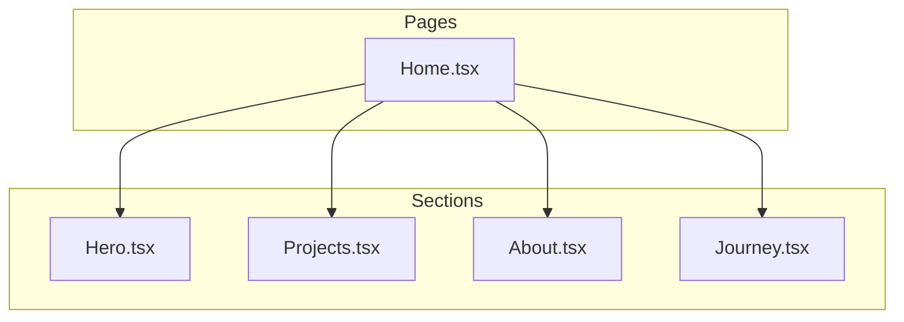

**Diagram sources**
- [Home.tsx](file://src/pages/Home.tsx#L8-L21)
- [Hero.tsx](file://src/components/Hero.tsx#L21-L67)
- [Projects.tsx](file://src/components/Projects.tsx#L76-L107)
- [About.tsx](file://src/components/About.tsx#L10-L102)
- [Journey.tsx](file://src/components/Journey.tsx#L14-L39)

**Section sources**
- [Home.tsx](file://src/pages/Home.tsx#L8-L21)
- [index.css](file://src/index.css#L3-L51)

## Core Components
- About Section: Presents greeting, biographical summary, professional roles, and social/contact links. Uses a two-column grid layout on large screens and stacks content on smaller screens.
- Home Page: Composes About alongside Hero and Projects.
- Theme and Typography: Tailwind v4 theme defines color tokens, spacing, typography families, and transitions used across the About Section.

Key characteristics:
- Grid layout: On large screens, the About Section uses a five-column grid where text occupies three columns and the photo occupies two columns.
- Responsive stacking: On smaller screens, the grid collapses to a single column, stacking the photo above the text.
- Color tokens: Uses background, surface, primary, accent, and text tokens for consistent theming.
- Typography: Uses Inter for body text and script fonts for emphasis; headings leverage the body font family with adjusted weights and line heights.

**Section sources**
- [About.tsx](file://src/components/About.tsx#L10-L102)
- [Home.tsx](file://src/pages/Home.tsx#L8-L21)
- [index.css](file://src/index.css#L3-L51)

## Architecture Overview
The About Section participates in the page composition via the Home page. It relies on the shared theme system for colors, typography, and spacing. Social and contact links integrate with external services and mailto.

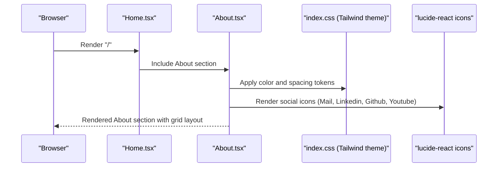

**Diagram sources**
- [Home.tsx](file://src/pages/Home.tsx#L8-L21)
- [About.tsx](file://src/components/About.tsx#L1-L103)
- [index.css](file://src/index.css#L3-L51)
- [package.json](file://package.json#L12-L16)

## Detailed Component Analysis

### About Section Layout and Content Organization
- Two-column grid on large screens:
  - Left column (3/5 width): Greeting, biographical paragraphs, professional roles list, and social links.
  - Right column (2/5 width): Photo placeholder area.
- Responsive behavior:
  - On smaller screens, the grid becomes a single column with the photo stacked above the text.
- Content blocks:
  - Greeting: A prominent heading introduces the visitor.
  - Bio paragraph: A concise summary of background and journey.
  - Roles list: An unordered list enumerates professional roles and places.
  - Social links: Four social/contact icons with accessible labels.

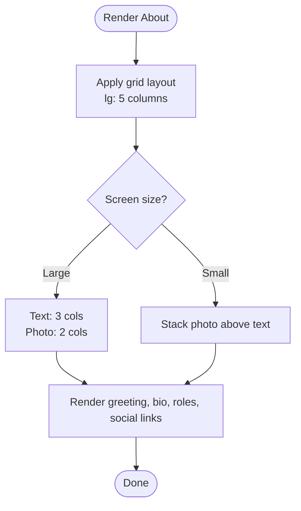

**Diagram sources**
- [About.tsx](file://src/components/About.tsx#L10-L102)

**Section sources**
- [About.tsx](file://src/components/About.tsx#L10-L102)

### Personal Photo Placeholder Implementation
- The photo area is a container with a fixed aspect ratio and rounded corners.
- Inside the container, a centered layout displays:
  - A large emoji representing a person.
  - Full name.
  - Job title.
  - Location.
- This placeholder can be replaced with an actual image by swapping the inner content while preserving the outer container’s aspect ratio and alignment.

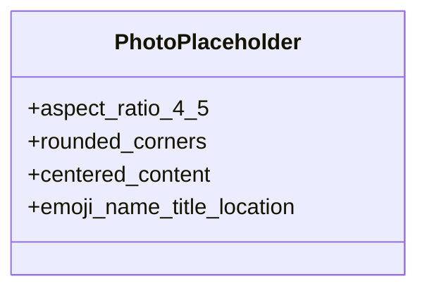

**Diagram sources**
- [About.tsx](file://src/components/About.tsx#L85-L97)

**Section sources**
- [About.tsx](file://src/components/About.tsx#L85-L97)

### Biographical Information Display
- Greeting: A secondary-level heading sets the tone.
- Bio paragraphs: Two paragraphs provide background and current role context.
- Roles list: A bullet-free list with subtle markers highlights professional roles and associated places.
- Social links: A horizontal group of icons with accessible labels provides contact avenues.

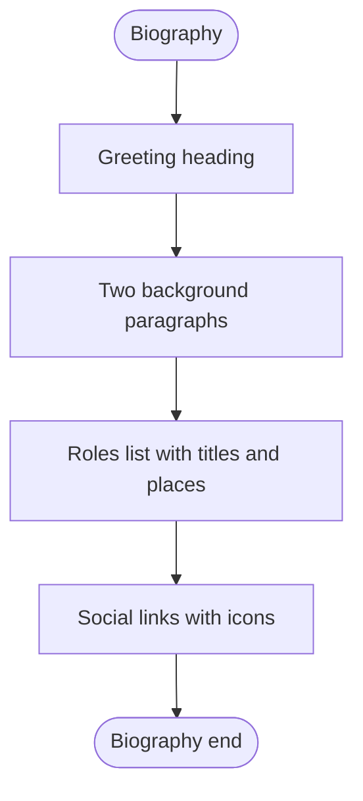

**Diagram sources**
- [About.tsx](file://src/components/About.tsx#L16-L82)

**Section sources**
- [About.tsx](file://src/components/About.tsx#L16-L82)

### Responsive Layout Strategies
- Container constraints:
  - Max-width container ensures content remains readable across breakpoints.
  - Horizontal padding is applied at the section level.
- Grid behavior:
  - Large screens: Five-column grid with proportional column spans for text and photo.
  - Small screens: Single column layout for improved readability and focus.
- Aspect ratio:
  - The photo area maintains a 4:5 aspect ratio to preserve visual balance regardless of screen size.

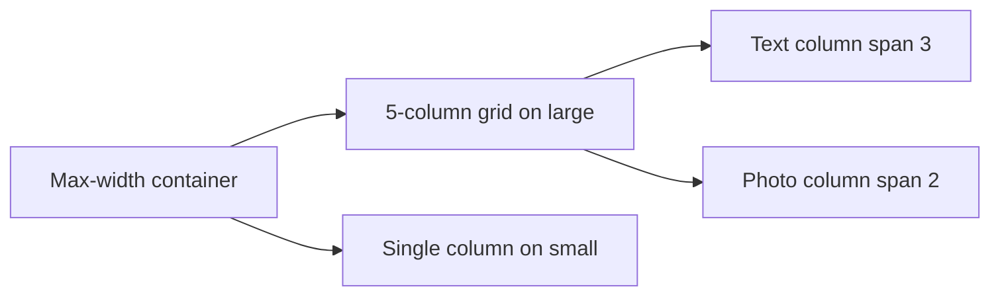

**Diagram sources**
- [About.tsx](file://src/components/About.tsx#L12-L14)
- [About.tsx](file://src/components/About.tsx#L14-L14)

**Section sources**
- [About.tsx](file://src/components/About.tsx#L12-L14)
- [About.tsx](file://src/components/About.tsx#L87-L87)

### Typography Choices and Visual Hierarchy
- Theme-defined typography:
  - Body font: Inter for readability.
  - Display/script fonts: Used for emphasis and branding accents.
- Headings:
  - Headings use the body font family with adjusted weights and line heights for clarity.
- Text roles:
  - Primary text for headings and emphasized content.
  - Secondary text for descriptive paragraphs.
  - Muted text for supporting details and list markers.

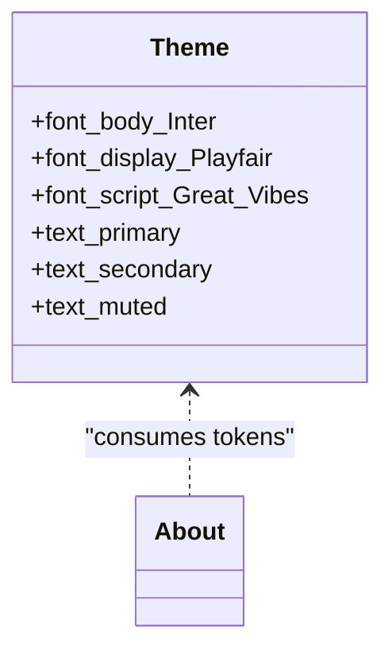

**Diagram sources**
- [index.css](file://src/index.css#L35-L41)
- [index.css](file://src/index.css#L68-L73)

**Section sources**
- [index.css](file://src/index.css#L35-L41)
- [index.css](file://src/index.css#L68-L73)
- [About.tsx](file://src/components/About.tsx#L17-L44)

### Integration with Personal Branding Elements
- Name and title:
  - The About Section prominently displays the full name and job title, aligning with the Hero’s script-based branding.
- Social links:
  - Consistent iconography and hover states reinforce brand identity.
- Color palette:
  - Accent and primary colors from the theme are used for links and interactive elements, maintaining a cohesive look.

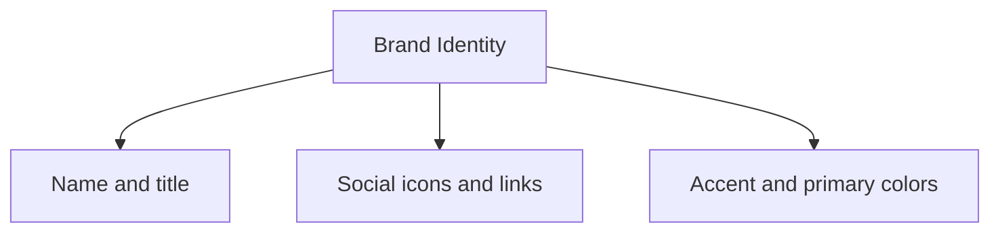

**Diagram sources**
- [Hero.tsx](file://src/components/Hero.tsx#L37-L45)
- [About.tsx](file://src/components/About.tsx#L47-L82)
- [index.css](file://src/index.css#L11-L19)

**Section sources**
- [Hero.tsx](file://src/components/Hero.tsx#L37-L45)
- [About.tsx](file://src/components/About.tsx#L47-L82)
- [index.css](file://src/index.css#L11-L19)

### Contact Information Placement
- Social and contact links are placed after the roles list, ensuring they are discoverable without overwhelming the main biography.
- Each link includes an accessible label for assistive technologies.
- The email link uses a mailto scheme for quick contact initiation.

```mermaid
sequenceDiagram
participant User as "Visitor"
participant About as "About Section"
participant Link as "Social/Contact Link"
User->>About : View About
About->>Link : Render with aria-label
User->>Link : Click link
Link-->>User : Open profile/email
```

**Diagram sources**
- [About.tsx](file://src/components/About.tsx#L47-L82)

**Section sources**
- [About.tsx](file://src/components/About.tsx#L47-L82)

### Practical Customization Examples
- Changing the greeting:
  - Modify the greeting heading text within the About component.
- Updating biographical paragraphs:
  - Adjust the paragraph texts to reflect recent experiences or goals.
- Adding or removing roles:
  - Extend or trim the roles array to match current professional titles and affiliations.
- Replacing the photo placeholder:
  - Swap the emoji/name/location content inside the photo container with an actual image while keeping the aspect ratio and centering.
- Adjusting social links:
  - Add or remove links and update their aria-labels accordingly.

**Section sources**
- [About.tsx](file://src/components/About.tsx#L3-L8)
- [About.tsx](file://src/components/About.tsx#L17-L44)
- [About.tsx](file://src/components/About.tsx#L85-L97)
- [About.tsx](file://src/components/About.tsx#L47-L82)

### Adapting Layout for Different Content Lengths
- Short content:
  - Reduce the number of paragraphs and roles to maintain visual balance.
- Long content:
  - Keep the grid layout for readability; consider splitting long paragraphs into multiple shorter ones.
- Photo area:
  - Maintain the aspect ratio and centering; if adding an image, ensure it respects the 4:5 constraint.

**Section sources**
- [About.tsx](file://src/components/About.tsx#L12-L14)
- [About.tsx](file://src/components/About.tsx#L87-L87)

## Dependency Analysis
The About Section depends on:
- Tailwind v4 theme tokens for colors, typography, and spacing.
- lucide-react icons for social and contact visuals.
- Composition via the Home page.

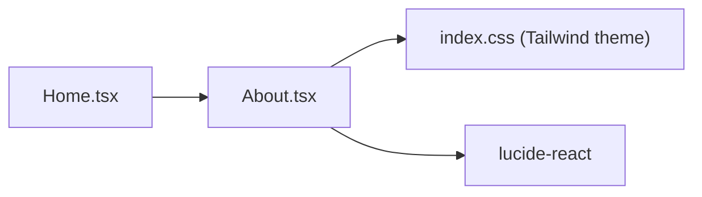

**Diagram sources**
- [About.tsx](file://src/components/About.tsx#L1-L1)
- [index.css](file://src/index.css#L1-L1)
- [Home.tsx](file://src/pages/Home.tsx#L4-L4)
- [package.json](file://package.json#L12-L16)

**Section sources**
- [About.tsx](file://src/components/About.tsx#L1-L1)
- [index.css](file://src/index.css#L1-L1)
- [Home.tsx](file://src/pages/Home.tsx#L4-L4)
- [package.json](file://package.json#L12-L16)

## Performance Considerations
- Lazy loading: While the About Section does not include images, when replacing the placeholder with an actual image, use lazy loading to improve initial load performance.
- Aspect ratio containers: Maintaining a fixed aspect ratio avoids layout shifts during image load.
- Icon rendering: lucide-react icons are lightweight and render efficiently as inline SVGs.

[No sources needed since this section provides general guidance]

## Troubleshooting Guide
- Accessibility:
  - Ensure each link has a descriptive aria-label for screen readers.
  - Verify keyboard focus visibility and color contrast for interactive elements.
- Responsiveness:
  - Confirm the grid collapses to a single column on small screens.
  - Test the aspect ratio of the photo area across devices.
- Branding consistency:
  - Match the color tokens and typography tokens used in the About Section with the rest of the site.

**Section sources**
- [About.tsx](file://src/components/About.tsx#L47-L82)
- [index.css](file://src/index.css#L110-L113)
- [index.css](file://src/index.css#L3-L51)

## Conclusion
The About Section is a well-structured, responsive component that effectively communicates personal and professional identity. Its grid-based layout, consistent use of theme tokens, and thoughtful typography create a cohesive presentation. By following the customization and accessibility recommendations, teams can tailor the About Section to reflect evolving personal branding and content needs while maintaining strong performance and usability.

## Appendices

### A. How the About Section Fits Into the Site Navigation
- The Navbar includes a link to the About section, enabling smooth navigation to the section via anchor navigation.

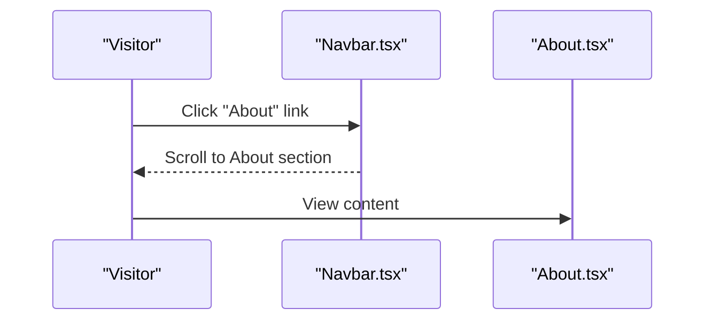

**Diagram sources**
- [Navbar.tsx](file://src/components/Navbar.tsx#L5-L11)
- [About.tsx](file://src/components/About.tsx#L10-L12)

**Section sources**
- [Navbar.tsx](file://src/components/Navbar.tsx#L5-L11)
- [About.tsx](file://src/components/About.tsx#L10-L12)

### B. Related Sections That Complement the About Section
- Hero: Establishes name and title with script fonts and sets the stage for personal branding.
- Journey: Reinforces professional background and achievements.
- Projects: Demonstrates practical work aligned with the About Section’s claims.

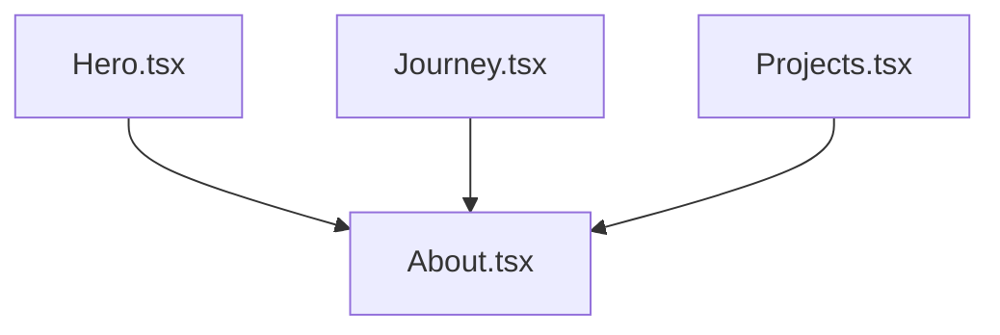

**Diagram sources**
- [Hero.tsx](file://src/components/Hero.tsx#L37-L45)
- [Journey.tsx](file://src/components/Journey.tsx#L14-L39)
- [Projects.tsx](file://src/components/Projects.tsx#L76-L107)
- [About.tsx](file://src/components/About.tsx#L10-L102)

**Section sources**
- [Hero.tsx](file://src/components/Hero.tsx#L37-L45)
- [Journey.tsx](file://src/components/Journey.tsx#L14-L39)
- [Projects.tsx](file://src/components/Projects.tsx#L76-L107)
- [About.tsx](file://src/components/About.tsx#L10-L102)