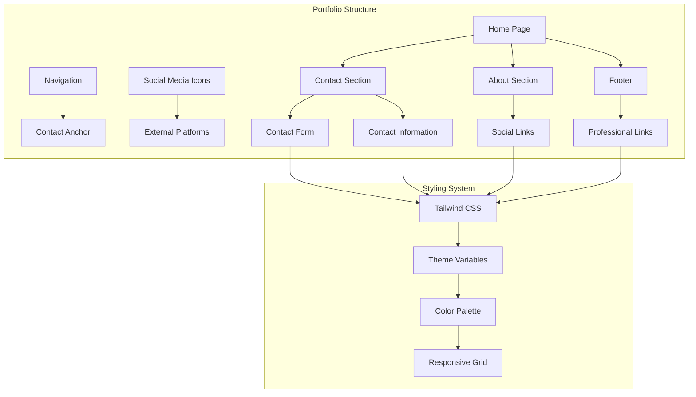
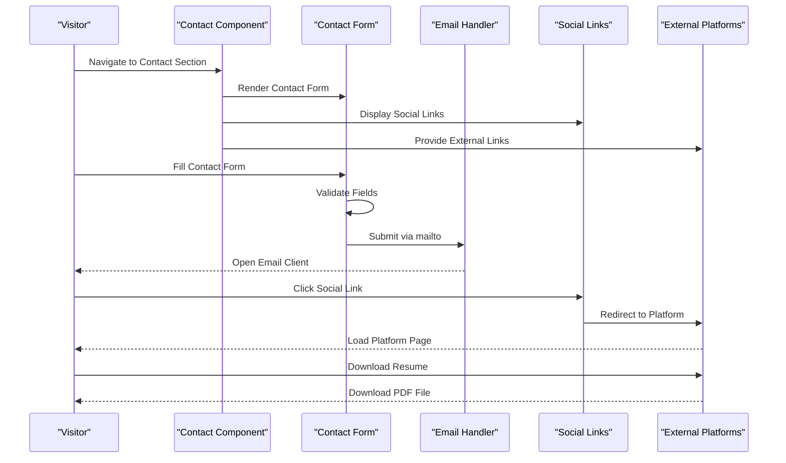
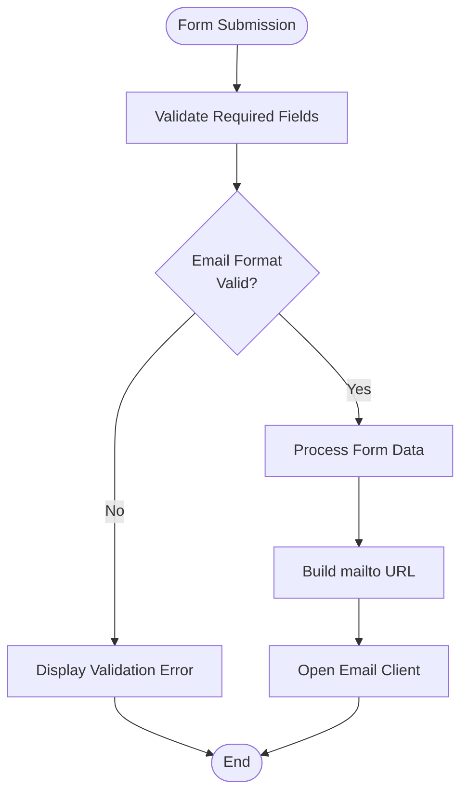
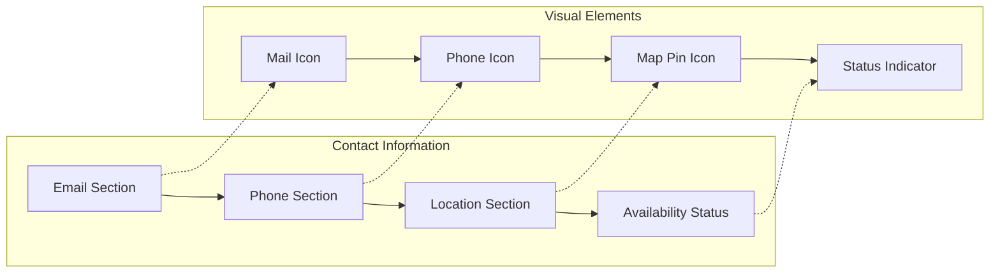
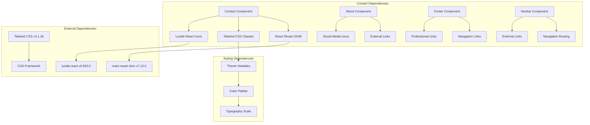

# Contact Section

<cite>
**Referenced Files in This Document**
- [Contact.tsx](file://src/components/Contact.tsx)
- [Footer.tsx](file://src/components/Footer.tsx)
- [About.tsx](file://src/components/About.tsx)
- [Navbar.tsx](file://src/components/Navbar.tsx)
- [index.css](file://src/index.css)
- [App.css](file://src/App.css)
- [Home.tsx](file://src/pages/Home.tsx)
- [App.tsx](file://src/App.tsx)
- [package.json](file://package.json)
</cite>

## Table of Contents
1. [Introduction](#introduction)
2. [Project Structure](#project-structure)
3. [Core Components](#core-components)
4. [Architecture Overview](#architecture-overview)
5. [Detailed Component Analysis](#detailed-component-analysis)
6. [Dependency Analysis](#dependency-analysis)
7. [Performance Considerations](#performance-considerations)
8. [Troubleshooting Guide](#troubleshooting-guide)
9. [Conclusion](#conclusion)

## Introduction

The contact section component serves as the primary gateway for visitor inquiries and professional connections on the portfolio website. This comprehensive documentation covers the contact form implementation, social media integration, external link management, and responsive design patterns that facilitate seamless professional networking interactions.

The contact section integrates multiple communication channels including traditional email/contact information, interactive contact forms, and professional networking platforms. It provides visitors with clear pathways to initiate conversations, explore collaboration opportunities, and connect through various professional channels.

## Project Structure

The contact functionality is distributed across several key components within the portfolio architecture:

**Diagram sources**
- [Home.tsx](file://src/pages/Home.tsx#L8-L21)
- [Contact.tsx](file://src/components/Contact.tsx#L3-L116)
- [Footer.tsx](file://src/components/Footer.tsx#L1-L81)

**Section sources**
- [Home.tsx](file://src/pages/Home.tsx#L8-L21)
- [App.tsx](file://src/App.tsx#L17-L27)

## Core Components

The contact section implementation consists of several interconnected components that work together to provide a comprehensive contact experience:

### Primary Contact Component

The main contact component ([Contact.tsx](file://src/components/Contact.tsx)) serves as the central hub for visitor interactions, featuring:

- **Contact Information Display**: Email, phone, and location details with visual iconography
- **Interactive Contact Form**: Multi-field form with validation and submission handling
- **Professional Status Indicator**: Real-time availability and relocation willingness indicators
- **Responsive Grid Layout**: Two-column layout that adapts to different screen sizes

### Social Media Integration

The portfolio implements comprehensive social media integration through multiple touchpoints:

- **About Section Social Links**: GitHub, LinkedIn, YouTube, and Email integration
- **Footer Professional Links**: Resume download, email contact, and LinkedIn profile
- **Consistent Iconography**: Unified styling using Lucide React icons

### External Link Management

Professional platform integration is handled through dedicated external link management:

- **Resume Access**: Direct PDF download capability
- **Professional Profiles**: LinkedIn and other professional platform links
- **GitHub Integration**: Code repository access for project showcase

**Section sources**
- [Contact.tsx](file://src/components/Contact.tsx#L3-L116)
- [About.tsx](file://src/components/About.tsx#L1-L103)
- [Footer.tsx](file://src/components/Footer.tsx#L1-L81)

## Architecture Overview

The contact section architecture follows a modular design pattern that separates concerns while maintaining cohesive functionality:

**Diagram sources**
- [Contact.tsx](file://src/components/Contact.tsx#L63-L111)
- [Footer.tsx](file://src/components/Footer.tsx#L26-L52)
- [About.tsx](file://src/components/About.tsx#L46-L82)

The architecture ensures that contact functionality remains accessible across different sections of the portfolio while maintaining consistent styling and user experience.

## Detailed Component Analysis

### Contact Form Implementation

The contact form ([Contact.tsx](file://src/components/Contact.tsx)) implements a sophisticated form handling system with comprehensive validation:

#### Form Structure and Validation

The form utilizes HTML5 validation attributes combined with Tailwind CSS styling for enhanced user experience:

**Diagram sources**
- [Contact.tsx](file://src/components/Contact.tsx#L63-L111)

#### Field Specifications

The form includes four essential fields with specific validation requirements:

| Field | Type | Required | Purpose |
|-------|------|----------|---------|
| Name | Text | Yes | Visitor's full name |
| Email | Email | Yes | Valid email address |
| Subject | Text | Yes | Message subject line |
| Message | Textarea | Yes | Detailed inquiry content |

#### Styling and Accessibility

The form implements comprehensive styling and accessibility features:

- **Focus States**: Clear visual indication for keyboard navigation
- **Hover Effects**: Smooth transitions for interactive elements
- **Placeholder Text**: Descriptive hints for field completion
- **Responsive Design**: Adapts to mobile and desktop screens

**Section sources**
- [Contact.tsx](file://src/components/Contact.tsx#L63-L111)

### Contact Information Display

The contact information section ([Contact.tsx](file://src/components/Contact.tsx)) presents professional contact details in an organized, visually appealing format:

#### Information Layout

The layout follows a two-column grid system that optimizes space usage:

**Diagram sources**
- [Contact.tsx](file://src/components/Contact.tsx#L18-L60)

#### Information Categories

Each contact method is presented with consistent visual treatment:

- **Email**: Mail icon with clickable mailto link
- **Phone**: Phone icon with tel link for direct dialing
- **Location**: Map pin icon with static location information
- **Availability**: Animated status indicator with real-time availability messaging

**Section sources**
- [Contact.tsx](file://src/components/Contact.tsx#L18-L60)

### Social Media Integration

The portfolio implements comprehensive social media integration across multiple components:

#### Social Media Platforms

The integration covers major professional networking platforms:

| Platform | Icon | Purpose | External Link |
|----------|------|---------|---------------|
| GitHub | Github | Code repositories | https://github.com/FahimKamal |
| LinkedIn | Linkedin | Professional network | https://www.linkedin.com/in/fk-ahmed |
| YouTube | Youtube | Video content | https://www.youtube.com/@FK_1_3 |
| Email | Mail | Direct communication | mailto:fahimkamal63@gmail.com |

#### Implementation Patterns

Social media integration follows consistent patterns across components:

- **External Links**: Proper target and rel attributes for security
- **Accessibility**: ARIA labels for screen reader support
- **Visual Consistency**: Unified styling and hover effects
- **Responsive Design**: Flexible layouts for different screen sizes

**Section sources**
- [About.tsx](file://src/components/About.tsx#L46-L82)
- [Footer.tsx](file://src/components/Footer.tsx#L26-L52)

### External Link Management

Professional platform integration extends beyond social media to include comprehensive external link management:

#### Professional Resources

External links provide access to professional resources and platforms:

- **Resume Download**: Direct PDF access for CV viewing
- **LinkedIn Profile**: Professional networking platform
- **GitHub Repositories**: Code showcase and collaboration
- **YouTube Channel**: Video content and tutorials

#### Security Considerations

External link implementation prioritizes security and user safety:

- **noopener noreferrer**: Prevents security vulnerabilities
- **target="_blank"**: Opens links in new tabs
- **Consistent Styling**: Uniform appearance across all external links
- **Accessibility Compliance**: Proper ARIA labels and keyboard navigation

**Section sources**
- [Footer.tsx](file://src/components/Footer.tsx#L26-L52)
- [Navbar.tsx](file://src/components/Navbar.tsx#L5-L11)

## Dependency Analysis

The contact section components demonstrate clear separation of concerns with well-defined dependencies:

**Diagram sources**
- [Contact.tsx](file://src/components/Contact.tsx#L1)
- [About.tsx](file://src/components/About.tsx#L1)
- [Footer.tsx](file://src/components/Footer.tsx#L1)
- [Navbar.tsx](file://src/components/Navbar.tsx#L1)
- [package.json](file://package.json#L12-L17)

### Component Relationships

The contact section components maintain loose coupling while sharing common styling and functionality:

- **Shared Styling**: All components use the same theme variables
- **Common Icons**: Lucide React provides consistent iconography
- **Navigation Integration**: Contact section accessible via navigation
- **Responsive Design**: Consistent grid system across components

**Section sources**
- [package.json](file://package.json#L12-L17)
- [index.css](file://src/index.css#L3-L51)

## Performance Considerations

The contact section implementation prioritizes performance and user experience optimization:

### Lightweight Implementation

- **Minimal Dependencies**: Only essential libraries (lucide-react, react-router-dom)
- **Efficient Styling**: Tailwind CSS provides optimized CSS delivery
- **No External APIs**: Direct mailto functionality eliminates API overhead
- **Static Content**: Contact information loaded statically without server requests

### Responsive Performance

- **Mobile Optimization**: Adaptive grid layouts for different screen sizes
- **Touch-Friendly**: Sufficient spacing for mobile interaction
- **Fast Loading**: Minimal JavaScript bundle for quick rendering
- **Accessibility**: Keyboard navigation and screen reader support

### Security Optimizations

- **Secure External Links**: Proper rel attributes prevent security vulnerabilities
- **Email Protection**: mailto links reduce spam exposure
- **Content Security**: Controlled external link sources
- **Privacy Considerations**: No tracking or analytics scripts

## Troubleshooting Guide

Common issues and solutions for the contact section implementation:

### Form Submission Issues

**Problem**: Contact form not submitting properly
**Solution**: Verify mailto protocol support in email client and ensure required fields are filled

**Problem**: Form validation not working
**Solution**: Check browser compatibility with HTML5 validation attributes

### Styling Issues

**Problem**: Contact section not displaying correctly
**Solution**: Verify Tailwind CSS is properly configured and theme variables are accessible

**Problem**: Social media icons not rendering
**Solution**: Ensure lucide-react is properly installed and imported

### Navigation Issues

**Problem**: Contact anchor links not working
**Solution**: Verify section ID matches navigation href attributes

**Problem**: External links opening in same tab
**Solution**: Check target and rel attributes are properly set for external links

### Accessibility Issues

**Problem**: Screen reader not announcing contact information
**Solution**: Add appropriate ARIA labels and ensure proper semantic markup

**Problem**: Keyboard navigation not working
**Solution**: Verify focus states and ensure all interactive elements are keyboard accessible

**Section sources**
- [Contact.tsx](file://src/components/Contact.tsx#L63-L111)
- [Footer.tsx](file://src/components/Footer.tsx#L26-L52)
- [About.tsx](file://src/components/About.tsx#L46-L82)

## Conclusion

The contact section component successfully implements a comprehensive contact and networking solution that balances functionality, aesthetics, and user experience. The modular architecture ensures maintainability while the responsive design provides optimal experiences across all device types.

Key strengths of the implementation include:

- **Comprehensive Communication Channels**: Multiple contact methods accommodate diverse visitor preferences
- **Professional Integration**: Seamless connection to external professional platforms
- **Accessibility Compliance**: Thoughtful design considerations for all users
- **Performance Optimization**: Lightweight implementation with minimal dependencies
- **Security Best Practices**: Proper handling of external links and form submissions

The contact section serves as an effective bridge between visitors and professional opportunities, providing clear pathways for collaboration while maintaining the portfolio's aesthetic standards and technical excellence.