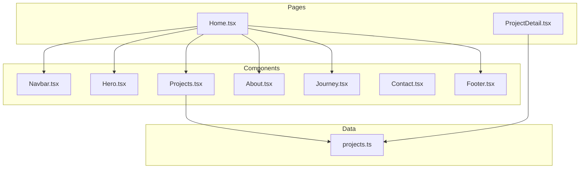
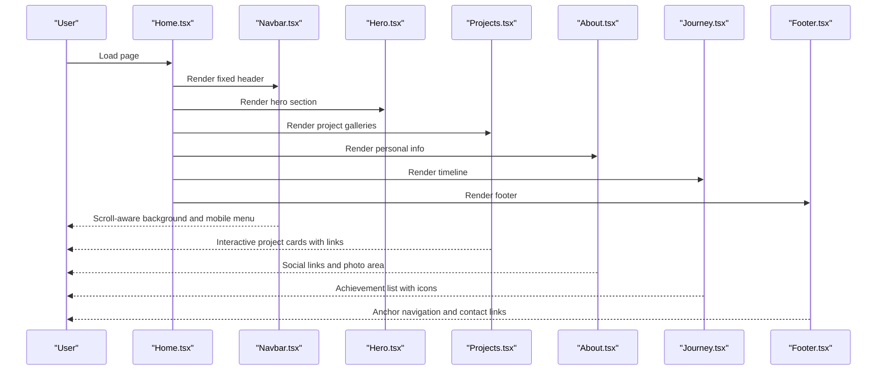
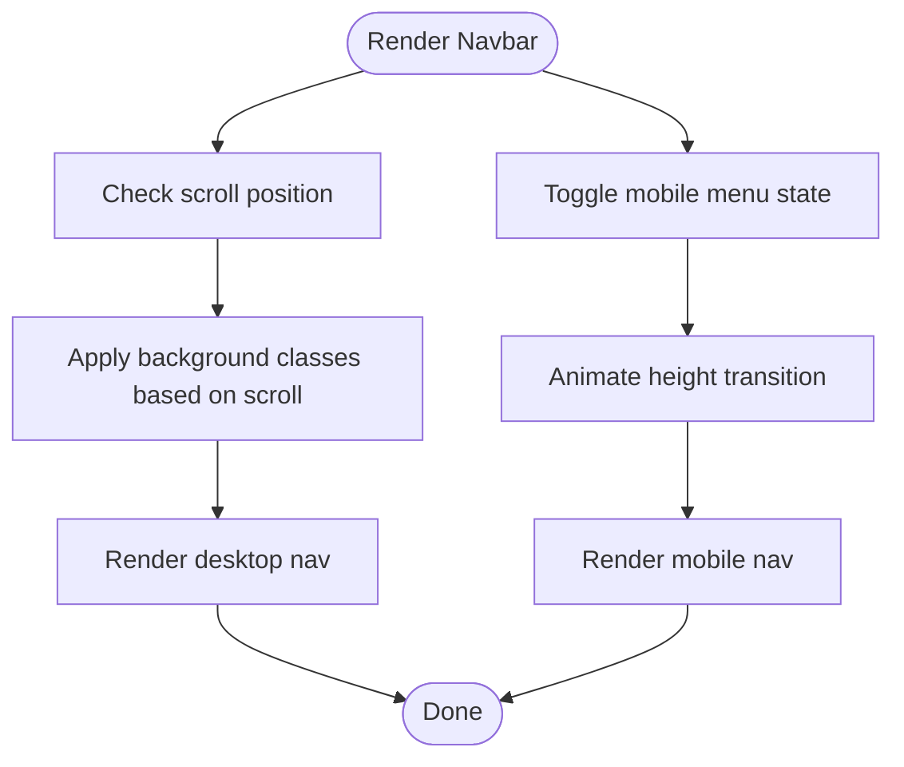
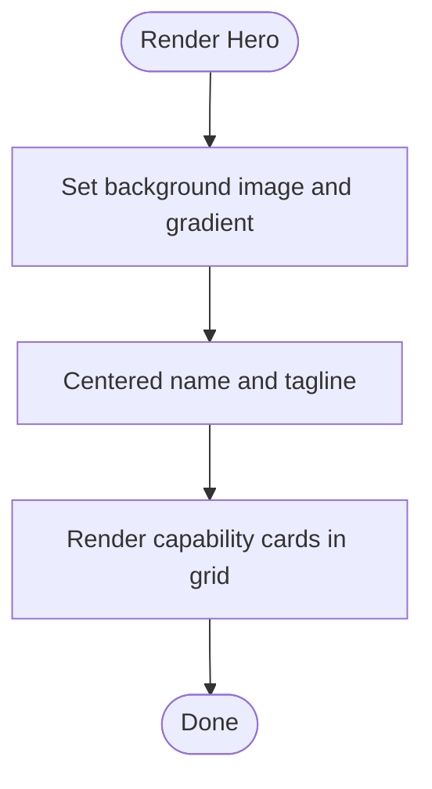
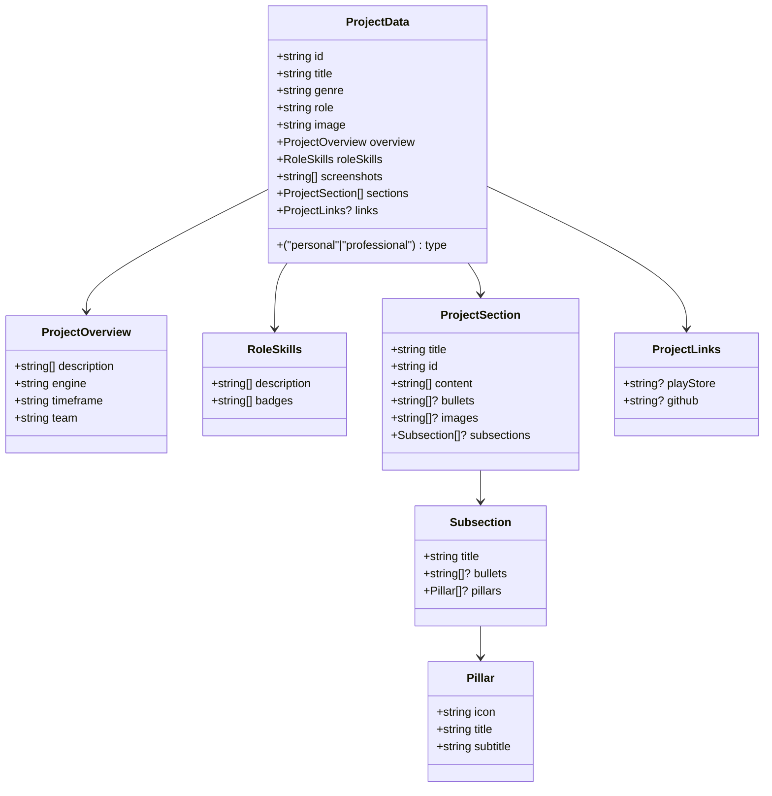
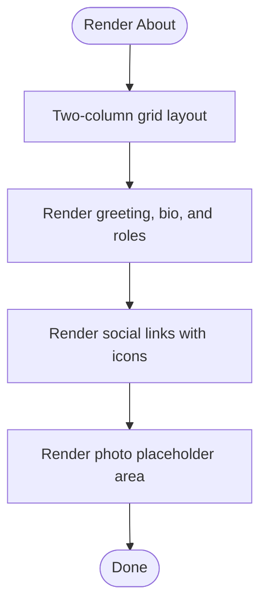
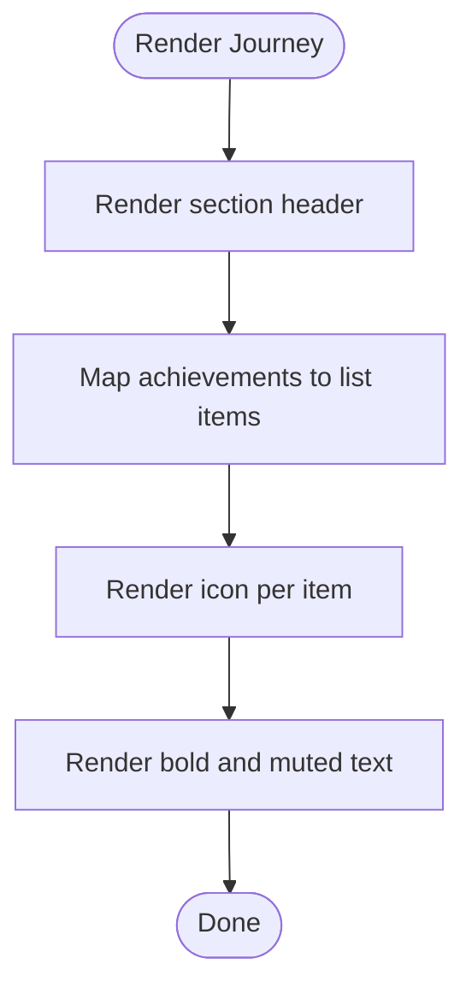
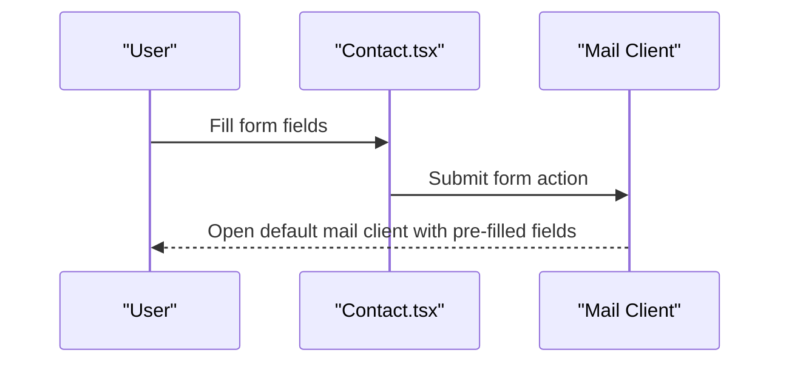
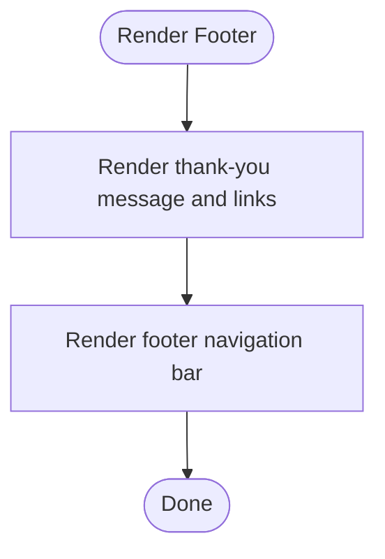
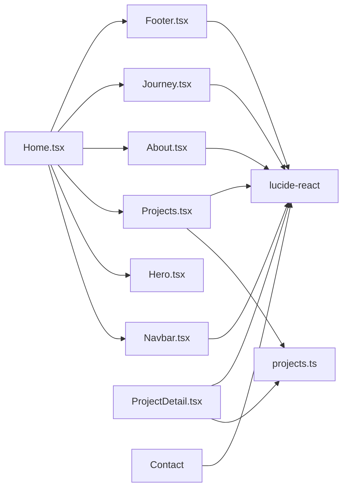

# Core Components

<cite>
**Referenced Files in This Document**
- [Navbar.tsx](file://src/components/Navbar.tsx)
- [Hero.tsx](file://src/components/Hero.tsx)
- [Projects.tsx](file://src/components/Projects.tsx)
- [About.tsx](file://src/components/About.tsx)
- [Journey.tsx](file://src/components/Journey.tsx)
- [Contact.tsx](file://src/components/Contact.tsx)
- [Footer.tsx](file://src/components/Footer.tsx)
- [Home.tsx](file://src/pages/Home.tsx)
- [ProjectDetail.tsx](file://src/pages/ProjectDetail.tsx)
- [projects.ts](file://src/data/projects.ts)
- [index.css](file://src/index.css)
- [package.json](file://package.json)
</cite>

## Table of Contents
1. [Introduction](#introduction)
2. [Project Structure](#project-structure)
3. [Core Components](#core-components)
4. [Architecture Overview](#architecture-overview)
5. [Detailed Component Analysis](#detailed-component-analysis)
6. [Dependency Analysis](#dependency-analysis)
7. [Performance Considerations](#performance-considerations)
8. [Troubleshooting Guide](#troubleshooting-guide)
9. [Conclusion](#conclusion)

## Introduction
This document explains the core UI building blocks of the portfolio website, focusing on the component architecture pattern used throughout the application. It covers prop interfaces, state management with React hooks, component composition strategies, and integration patterns. The components documented here include Navbar, Hero, Projects, About, Journey, Contact, and Footer. Practical examples demonstrate usage, customization options, responsive design considerations, reusability, styling with Tailwind CSS, and accessibility implementations.

## Project Structure
The portfolio is a Next.js application structured around reusable functional components organized by feature. Each major section of the portfolio is implemented as a standalone component that can be composed within pages. Data for projects is centralized in a typed dataset module, enabling consistent rendering across components.

**Diagram sources**
- [Home.tsx](file://src/pages/Home.tsx#L1-L22)
- [ProjectDetail.tsx](file://src/pages/ProjectDetail.tsx#L1-L365)
- [Navbar.tsx](file://src/components/Navbar.tsx#L1-L112)
- [Hero.tsx](file://src/components/Hero.tsx#L1-L68)
- [Projects.tsx](file://src/components/Projects.tsx#L1-L108)
- [About.tsx](file://src/components/About.tsx#L1-L103)
- [Journey.tsx](file://src/components/Journey.tsx#L1-L41)
- [Contact.tsx](file://src/components/Contact.tsx#L1-L117)
- [Footer.tsx](file://src/components/Footer.tsx#L1-L82)
- [projects.ts](file://src/data/projects.ts#L1-L485)

**Section sources**
- [Home.tsx](file://src/pages/Home.tsx#L1-L22)
- [ProjectDetail.tsx](file://src/pages/ProjectDetail.tsx#L1-L365)

## Core Components
This section documents the primary UI components and their roles, props, state, styling, and composition patterns.

- Navbar
  - Purpose: Fixed header navigation with desktop and mobile views, scroll-aware background, and external link support.
  - Props: None.
  - State: Local state for mobile menu visibility and scroll detection.
  - Composition: Used in Home and ProjectDetail pages; integrates with route anchors for smooth scrolling.
  - Accessibility: Uses aria-label for the mobile menu toggle; maintains keyboard focus styles.

- Hero
  - Purpose: Hero section with background image and gradient overlay, personal name display, and capability highlights.
  - Props: None.
  - State: None.
  - Composition: Renders under Navbar in Home; displays three capability cards with icons.

- Projects
  - Purpose: Project gallery displaying personal and professional projects with interactive cards and links.
  - Props: None.
  - State: None.
  - Composition: Uses a typed dataset module to render two sections (Personal and Professional).
  - Data: Consumes ProjectData interface and helper functions to filter by type.

- About
  - Purpose: Personal introduction, role list, photo placeholder, and social links.
  - Props: None.
  - State: None.
  - Composition: Grid layout with text content and a photo area; includes social media links with aria-labels.

- Journey
  - Purpose: Timeline-style presentation of professional milestones and achievements.
  - Props: None.
  - State: None.
  - Composition: Centered layout with a list of items, each with an icon and descriptive text.

- Contact
  - Purpose: Contact information and a form that opens the user’s default mail client.
  - Props: None.
  - State: None.
  - Composition: Two-column layout with contact details and a form; styled with Tailwind utilities.

- Footer
  - Purpose: Secondary navigation and contact links; thank-you message and footer bar.
  - Props: None.
  - State: None.
  - Composition: Two-column layout with links and a navigation bar; includes anchor links to main sections.

**Section sources**
- [Navbar.tsx](file://src/components/Navbar.tsx#L1-L112)
- [Hero.tsx](file://src/components/Hero.tsx#L1-L68)
- [Projects.tsx](file://src/components/Projects.tsx#L1-L108)
- [About.tsx](file://src/components/About.tsx#L1-L103)
- [Journey.tsx](file://src/components/Journey.tsx#L1-L41)
- [Contact.tsx](file://src/components/Contact.tsx#L1-L117)
- [Footer.tsx](file://src/components/Footer.tsx#L1-L82)

## Architecture Overview
The application follows a component-centric architecture:
- Functional components with local state where needed.
- Shared design tokens via CSS custom properties for theme consistency.
- Centralized data module for project content and filtering.
- Composition via page-level containers that assemble sections.

**Diagram sources**
- [Home.tsx](file://src/pages/Home.tsx#L1-L22)
- [Navbar.tsx](file://src/components/Navbar.tsx#L1-L112)
- [Hero.tsx](file://src/components/Hero.tsx#L1-L68)
- [Projects.tsx](file://src/components/Projects.tsx#L1-L108)
- [About.tsx](file://src/components/About.tsx#L1-L103)
- [Journey.tsx](file://src/components/Journey.tsx#L1-L41)
- [Footer.tsx](file://src/components/Footer.tsx#L1-L82)

## Detailed Component Analysis

### Navbar
- State management
  - Tracks mobile menu open state.
  - Tracks scroll position to adjust background and blur effect.
- Responsive behavior
  - Desktop: Horizontal list of navigation items.
  - Mobile: Collapsible drawer with animated height transitions.
- Accessibility
  - Uses aria-label for the mobile menu toggle.
  - Maintains focus styles and hover states for keyboard navigation.
- Styling
  - Uses Tailwind utilities for spacing, transitions, and backdrop blur.
  - Conditional classes based on scroll state.

**Diagram sources**
- [Navbar.tsx](file://src/components/Navbar.tsx#L17-L23)
- [Navbar.tsx](file://src/components/Navbar.tsx#L77-L81)

**Section sources**
- [Navbar.tsx](file://src/components/Navbar.tsx#L1-L112)

### Hero
- Purpose
  - Hero background with gradient overlay and centered personal branding.
  - Capability strip below hero with three capability cards.
- Styling
  - Uses Tailwind utilities for responsive typography and grid layout.
  - Gradient overlays and background image for visual depth.
- Composition
  - Renders a capabilities array with icon, title, and description.

**Diagram sources**
- [Hero.tsx](file://src/components/Hero.tsx#L23-L47)
- [Hero.tsx](file://src/components/Hero.tsx#L50-L64)

**Section sources**
- [Hero.tsx](file://src/components/Hero.tsx#L1-L68)

### Projects
- Data model
  - ProjectData interface defines shape for project entries.
  - Helper functions filter projects by type and retrieve by ID.
- Composition
  - Two sections: Personal Projects and Professional Work.
  - Each project rendered as a card with genre, image, title overlay, role, and optional links.
- Styling
  - Responsive grid layouts with Tailwind utilities.
  - Hover effects and lazy loading for images.

**Diagram sources**
- [projects.ts](file://src/data/projects.ts#L1-L41)

**Section sources**
- [Projects.tsx](file://src/components/Projects.tsx#L1-L108)
- [projects.ts](file://src/data/projects.ts#L1-L485)

### About
- Layout
  - Two-column grid: text content on the left, photo placeholder on the right.
- Social links
  - GitHub, LinkedIn, YouTube, and Email with aria-labels for accessibility.
- Styling
  - Tailwind utilities for spacing, typography, and responsive grid.

**Diagram sources**
- [About.tsx](file://src/components/About.tsx#L14-L97)

**Section sources**
- [About.tsx](file://src/components/About.tsx#L1-L103)

### Journey
- Presentation
  - Timeline-style list with icons and descriptive text.
- Styling
  - Consistent spacing and typography using Tailwind utilities.

**Diagram sources**
- [Journey.tsx](file://src/components/Journey.tsx#L16-L38)

**Section sources**
- [Journey.tsx](file://src/components/Journey.tsx#L1-L41)

### Contact
- Form
  - Form action opens the user’s default mail client with prefilled fields.
- Information
  - Displays email, phone, and location with icons.
- Styling
  - Two-column layout with Tailwind utilities; focus states and transitions.

**Diagram sources**
- [Contact.tsx](file://src/components/Contact.tsx#L63-L111)

**Section sources**
- [Contact.tsx](file://src/components/Contact.tsx#L1-L117)

### Footer
- Composition
  - Two-column layout with a thank-you message and contact links.
  - Footer bar with anchor links to main sections.
- Styling
  - Tailwind utilities for spacing, typography, and responsive layout.

**Diagram sources**
- [Footer.tsx](file://src/components/Footer.tsx#L4-L79)

**Section sources**
- [Footer.tsx](file://src/components/Footer.tsx#L1-L82)

## Dependency Analysis
- Component dependencies
  - Home composes Navbar, Hero, Projects, About, Journey, and Footer.
  - Projects depends on the projects dataset module for rendering.
  - ProjectDetail composes Navbar and uses the projects dataset for detailed content.
- External libraries
  - lucide-react for icons.
  - react-router-dom for navigation and linking.
- Theming and styling
  - Tailwind CSS v4 with custom theme tokens for colors, typography, and spacing.

**Diagram sources**
- [Home.tsx](file://src/pages/Home.tsx#L1-L22)
- [Projects.tsx](file://src/components/Projects.tsx#L1-L108)
- [ProjectDetail.tsx](file://src/pages/ProjectDetail.tsx#L1-L365)
- [projects.ts](file://src/data/projects.ts#L1-L485)
- [package.json](file://package.json#L12-L16)

**Section sources**
- [Home.tsx](file://src/pages/Home.tsx#L1-L22)
- [ProjectDetail.tsx](file://src/pages/ProjectDetail.tsx#L1-L365)
- [projects.ts](file://src/data/projects.ts#L1-L485)
- [package.json](file://package.json#L12-L16)

## Performance Considerations
- Lazy loading images
  - Project cards use lazy loading to improve initial load performance.
- Minimal state
  - Navbar uses minimal state to reduce re-renders; scroll listener is cleaned up on unmount.
- CSS custom properties
  - Centralized theme tokens minimize repeated Tailwind utilities and enable easy theme switching.
- Responsive grids
  - Tailwind responsive modifiers ensure efficient rendering across breakpoints.

[No sources needed since this section provides general guidance]

## Troubleshooting Guide
- Mobile menu does not close after navigation
  - Ensure click handlers on mobile links toggle the menu state off and prevent event propagation where necessary.
- Scroll-aware navbar not applying background
  - Verify scroll listener is attached on mount and removed on unmount.
- Project gallery not rendering
  - Confirm project data is correctly typed and filtered by type; ensure image paths exist.
- Contact form not opening mail client
  - Validate form action and required field presence; confirm browser allows mailto actions.
- Footer links not scrolling smoothly
  - Ensure anchor IDs match the intended sections and smooth scroll behavior is enabled.

**Section sources**
- [Navbar.tsx](file://src/components/Navbar.tsx#L17-L23)
- [Projects.tsx](file://src/components/Projects.tsx#L18-L23)
- [Contact.tsx](file://src/components/Contact.tsx#L63-L111)
- [Footer.tsx](file://src/components/Footer.tsx#L62-L76)

## Conclusion
The portfolio website employs a clean, component-centric architecture with clear separation of concerns. Each component encapsulates its own styling, state, and composition, enabling reuse and maintainability. The design system leverages Tailwind CSS and CSS custom properties for consistent theming, while the typed data module ensures reliable rendering across components. Accessibility is addressed through semantic markup, aria labels, and focus management. This foundation supports easy extension and customization for future enhancements.