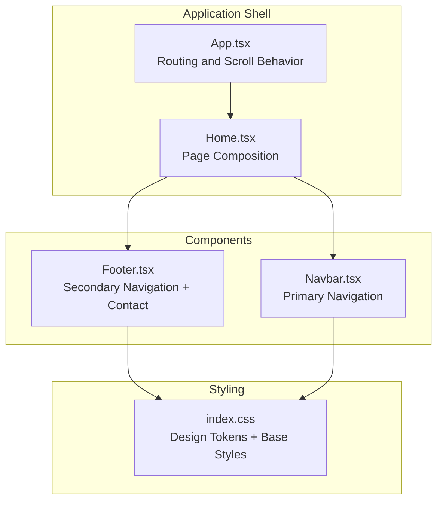
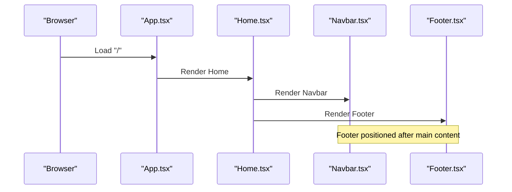
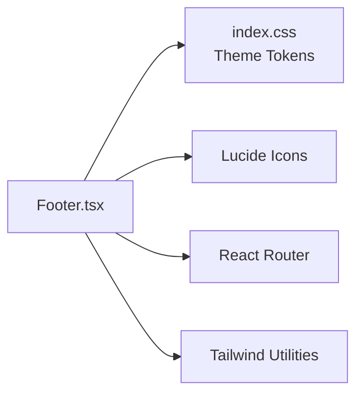
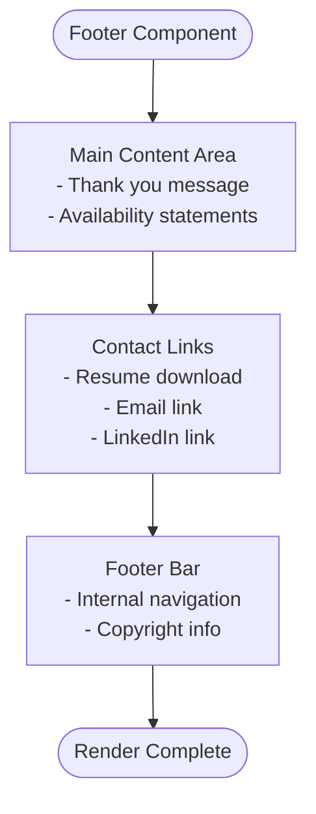

# Footer Component

<cite>
**Referenced Files in This Document**
- [Footer.tsx](file://src/components/Footer.tsx)
- [Navbar.tsx](file://src/components/Navbar.tsx)
- [Home.tsx](file://src/pages/Home.tsx)
- [App.tsx](file://src/App.tsx)
- [index.css](file://src/index.css)
- [package.json](file://package.json)
</cite>

## Table of Contents
1. [Introduction](#introduction)
2. [Project Structure](#project-structure)
3. [Core Components](#core-components)
4. [Architecture Overview](#architecture-overview)
5. [Detailed Component Analysis](#detailed-component-analysis)
6. [Dependency Analysis](#dependency-analysis)
7. [Performance Considerations](#performance-considerations)
8. [Troubleshooting Guide](#troubleshooting-guide)
9. [Conclusion](#conclusion)
10. [Appendices](#appendices)

## Introduction
This document provides comprehensive guidance for the footer component focused on site navigation and supplementary information display. It explains layout patterns, quick navigation links, social media integration, responsive design strategies, copyright information placement, and brand identity maintenance. It also covers integration with navigation elements, external link management, accessibility considerations, and practical customization examples.

## Project Structure
The footer is part of a modular React application using Tailwind CSS for styling and Lucide icons for visual elements. The footer integrates with the main application layout and shares design tokens and typography with the rest of the site.

**Diagram sources**
- [App.tsx](file://src/App.tsx#L17-L27)
- [Home.tsx](file://src/pages/Home.tsx#L8-L21)
- [Navbar.tsx](file://src/components/Navbar.tsx#L13-L111)
- [Footer.tsx](file://src/components/Footer.tsx#L3-L81)
- [index.css](file://src/index.css#L3-L51)

**Section sources**
- [App.tsx](file://src/App.tsx#L17-L27)
- [Home.tsx](file://src/pages/Home.tsx#L8-L21)
- [index.css](file://src/index.css#L3-L51)

## Core Components
The footer component provides:
- A primary content area with a thank-you message and brief service availability statements
- A secondary contact area with quick-access links (resume download, email, LinkedIn)
- A footer bar containing internal navigation links and copyright information

Key characteristics:
- Uses a two-column grid layout on medium screens and above
- Responsive typography and spacing with Tailwind utilities
- Consistent color palette and typography inherited from the global theme
- External link safety with target and rel attributes
- Hover states and transitions for interactive elements

**Section sources**
- [Footer.tsx](file://src/components/Footer.tsx#L3-L81)
- [index.css](file://src/index.css#L3-L51)

## Architecture Overview
The footer participates in the page composition managed by the Home page component. The App component sets up routing and scroll behavior, while the Navbar provides primary navigation. The footer complements these by offering quick access to contact information and internal navigation.

**Diagram sources**
- [App.tsx](file://src/App.tsx#L17-L27)
- [Home.tsx](file://src/pages/Home.tsx#L8-L21)
- [Navbar.tsx](file://src/components/Navbar.tsx#L13-L111)
- [Footer.tsx](file://src/components/Footer.tsx#L3-L81)

## Detailed Component Analysis

### Footer Layout Patterns
The footer employs a two-section structure:
- Main content area: thank-you message and service availability statements
- Contact area: quick-access links with icons
- Footer bar: internal navigation and copyright information

Responsive behavior:
- On small screens, the two-column layout stacks vertically
- On medium screens and above, a two-column grid layout is used
- Flexbox is used for the footer bar to align items horizontally with wrapping support

Color and typography:
- Inherits background and text color tokens from the global theme
- Uses accent color for icons and hover states
- Maintains consistent spacing and typography scales

**Section sources**
- [Footer.tsx](file://src/components/Footer.tsx#L7-L55)
- [Footer.tsx](file://src/components/Footer.tsx#L58-L78)
- [index.css](file://src/index.css#L3-L51)

### Quick Navigation Links
The footer bar contains four internal navigation links:
- Personal Projects
- Professional Work
- About
- Contact

These links are designed to complement the Navbar and provide quick access to major sections of the portfolio. They use the same text color and hover behavior as the Navbar links.

Integration with navigation:
- The Navbar defines the canonical list of navigation targets
- The Footer mirrors these targets for quick access
- Both components share the same color tokens and typography

**Section sources**
- [Footer.tsx](file://src/components/Footer.tsx#L62-L75)
- [Navbar.tsx](file://src/components/Navbar.tsx#L5-L11)
- [index.css](file://src/index.css#L3-L51)

### Social Media Integration
The current footer does not include explicit social media icons. However, it demonstrates a pattern that can be extended:
- Use Lucide icons for consistent visual language
- Apply the same hover and color treatment as other links
- Maintain proper external link attributes (target and rel)

Recommended additions:
- Add social media icons (GitHub, Twitter/X, Instagram, etc.)
- Include appropriate alt text and aria-labels
- Ensure consistent sizing and spacing with existing icons

**Section sources**
- [Footer.tsx](file://src/components/Footer.tsx#L43-L51)
- [package.json](file://package.json#L12-L14)

### Responsive Design Strategies
The footer implements several responsive patterns:
- Grid-based layout with column gaps that adapt to screen size
- Flexbox-based footer bar with wrap support for narrow screens
- Conditional class application based on viewport size
- Consistent spacing using Tailwind utilities

Breakpoint handling:
- Two-column layout activates at the medium breakpoint
- Footer bar switches from column to row layout at the medium breakpoint
- Links wrap to new lines when space is constrained

Accessibility considerations:
- Proper contrast ratios maintained through theme tokens
- Sufficient touch target sizes for mobile interaction
- Focus styles inherited from base styles

**Section sources**
- [Footer.tsx](file://src/components/Footer.tsx#L9-L12)
- [Footer.tsx](file://src/components/Footer.tsx#L60-L61)
- [index.css](file://src/index.css#L58-L66)

### Copyright Information Placement
Copyright information is placed in the footer bar alongside navigation links. This placement:
- Keeps it visible without requiring scrolling
- Associates it with the navigation context
- Provides a logical grouping of site information

Placement strategy:
- Centered within the footer bar container
- Uses muted text color for visual hierarchy
- Maintains consistent vertical rhythm with navigation links

**Section sources**
- [Footer.tsx](file://src/components/Footer.tsx#L61-L61)

### Brand Identity Maintenance
The footer maintains brand identity through:
- Consistent color palette using theme tokens
- Unified typography scales and weights
- Iconography using Lucide React components
- Visual continuity with other components

Brand elements:
- Accent color for interactive elements and icons
- Primary color for prominent text
- Surface backgrounds for content areas
- Consistent spacing and alignment

**Section sources**
- [Footer.tsx](file://src/components/Footer.tsx#L5-L5)
- [index.css](file://src/index.css#L3-L51)

### Integration with Navigation Elements
The footer integrates with the Navbar through:
- Shared navigation targets and anchors
- Consistent styling and interaction patterns
- Complementary roles (primary vs. secondary navigation)

External link management:
- Resume link opens in a new tab with noreferrer
- Email link uses mailto protocol
- LinkedIn link opens externally with security attributes
- Internal links use hash anchors for smooth scrolling

**Section sources**
- [Footer.tsx](file://src/components/Footer.tsx#L27-L51)
- [Navbar.tsx](file://src/components/Navbar.tsx#L5-L11)

### Practical Customization Examples

#### Customizing Footer Content
To modify the footer content:
1. Edit the main content area messages and statements
2. Adjust the grid layout classes for different column counts
3. Modify spacing utilities for visual balance
4. Update typography classes for emphasis or hierarchy

Example modifications:
- Change the thank-you message tone
- Add new service availability statements
- Adjust the number of contact options
- Modify the footer bar content and layout

#### Adding New Navigation Links
To add new navigation links:
1. Update the navigation array in the Navbar component
2. Add corresponding anchor elements in the Footer component
3. Ensure consistent styling and spacing
4. Test smooth scrolling behavior

Implementation steps:
- Define new navigation targets in the Navbar
- Add corresponding links in the Footer
- Verify anchor IDs match the intended sections
- Test responsive behavior across breakpoints

#### Implementing Social Media Connectivity
To add social media links:
1. Import desired Lucide icons
2. Add new link elements with appropriate icons
3. Configure external link attributes
4. Test accessibility and responsiveness

Best practices:
- Use consistent icon sizing and spacing
- Apply the same hover and focus states
- Ensure proper alt text and aria labels
- Test on various screen sizes

**Section sources**
- [Footer.tsx](file://src/components/Footer.tsx#L27-L51)
- [Navbar.tsx](file://src/components/Navbar.tsx#L5-L11)
- [package.json](file://package.json#L12-L14)

### Accessibility Considerations
The footer incorporates several accessibility features:
- Semantic HTML structure with proper heading hierarchy
- Sufficient color contrast maintained through theme tokens
- Focus-visible styles inherited from base styles
- Proper link attributes for external resources
- Consistent keyboard navigation patterns

Enhancement opportunities:
- Add ARIA labels for icon-only links
- Implement skip links for screen reader users
- Ensure proper landmark roles for navigation sections
- Test with assistive technologies regularly

**Section sources**
- [index.css](file://src/index.css#L110-L113)
- [Footer.tsx](file://src/components/Footer.tsx#L29-L31)
- [Footer.tsx](file://src/components/Footer.tsx#L46-L48)

## Dependency Analysis
The footer component depends on:
- Theme tokens defined in the global stylesheet
- Lucide React icons for visual elements
- React Router for navigation integration
- Tailwind CSS utilities for responsive design

**Diagram sources**
- [Footer.tsx](file://src/components/Footer.tsx#L1-L1)
- [index.css](file://src/index.css#L3-L51)
- [package.json](file://package.json#L12-L14)

**Section sources**
- [Footer.tsx](file://src/components/Footer.tsx#L1-L1)
- [index.css](file://src/index.css#L3-L51)
- [package.json](file://package.json#L12-L14)

## Performance Considerations
The footer is lightweight and performs well:
- Minimal DOM nodes and simple structure
- Efficient use of Tailwind utilities
- No heavy JavaScript dependencies
- SVG icons render efficiently

Optimization opportunities:
- Consider lazy-loading icons if bundle size becomes a concern
- Use CSS custom properties for theme tokens to reduce CSS bloat
- Implement CSS-in-JS for dynamic theming if needed

## Troubleshooting Guide
Common issues and solutions:
- Links not opening in new tabs: Verify target and rel attributes are present
- Icons not displaying: Ensure Lucide React is properly installed and imported
- Color inconsistencies: Check that theme tokens are correctly defined and applied
- Responsive layout problems: Verify Tailwind breakpoints and grid classes
- External link security warnings: Confirm proper use of noreferrer and noopener

Debugging steps:
1. Inspect element to verify class names and styles
2. Check browser console for missing dependencies
3. Validate HTML structure and semantic markup
4. Test across different screen sizes and devices
5. Verify accessibility compliance with screen readers

**Section sources**
- [Footer.tsx](file://src/components/Footer.tsx#L29-L31)
- [Footer.tsx](file://src/components/Footer.tsx#L46-L48)
- [package.json](file://package.json#L12-L14)

## Conclusion
The footer component provides an effective secondary navigation layer that complements the primary Navbar. Its responsive design, consistent theming, and practical contact information make it a valuable addition to the portfolio. The component's modular structure allows for easy customization while maintaining design consistency across the application.

## Appendices

### Footer Component Structure Reference

**Diagram sources**
- [Footer.tsx](file://src/components/Footer.tsx#L3-L81)

### Theme Token Reference
The footer inherits design tokens from the global stylesheet:
- Background colors for containers and surfaces
- Text color tokens for primary, secondary, and muted text
- Accent color for interactive elements and icons
- Border colors for separators and dividers
- Typography scales and font families

**Section sources**
- [index.css](file://src/index.css#L3-L51)