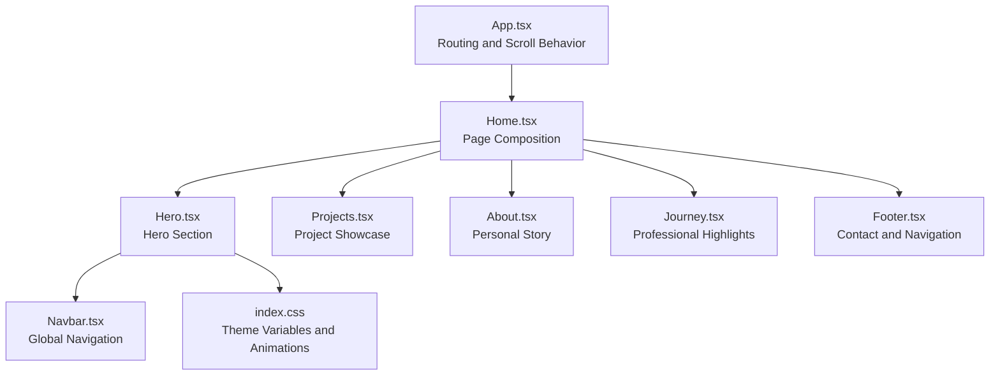
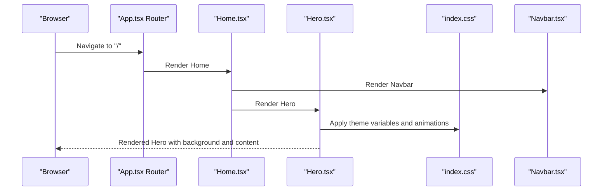
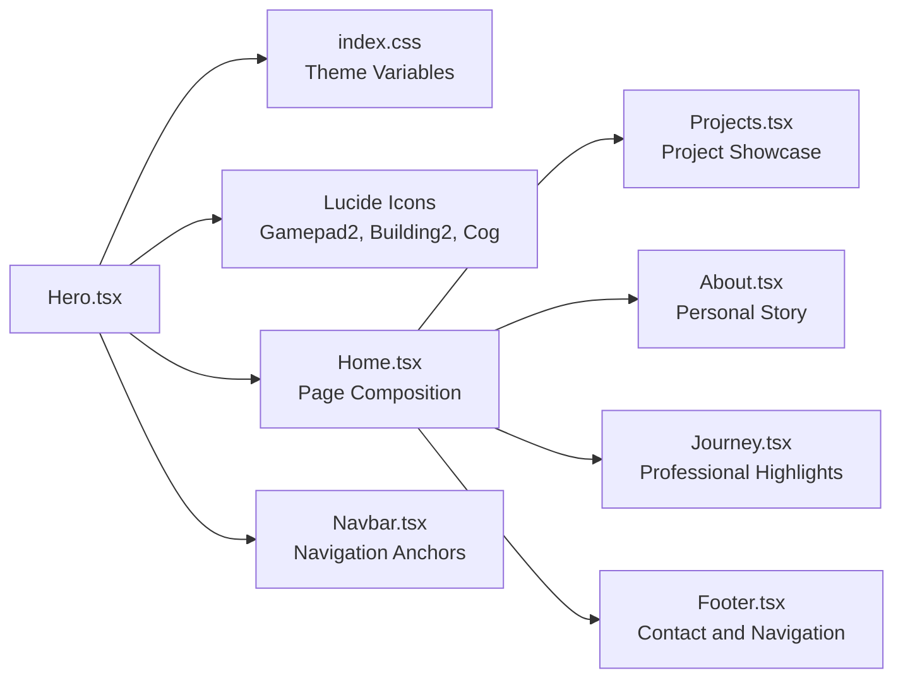

# Hero Section

<cite>
**Referenced Files in This Document**
- [Hero.tsx](file://src/components/Hero.tsx)
- [Home.tsx](file://src/pages/Home.tsx)
- [App.tsx](file://src/App.tsx)
- [index.css](file://src/index.css)
- [App.css](file://src/App.css)
- [Navbar.tsx](file://src/components/Navbar.tsx)
- [About.tsx](file://src/components/About.tsx)
- [Journey.tsx](file://src/components/Journey.tsx)
- [Footer.tsx](file://src/components/Footer.tsx)
- [projects.ts](file://src/data/projects.ts)
</cite>

## Table of Contents
1. [Introduction](#introduction)
2. [Project Structure](#project-structure)
3. [Core Components](#core-components)
4. [Architecture Overview](#architecture-overview)
5. [Detailed Component Analysis](#detailed-component-analysis)
6. [Dependency Analysis](#dependency-analysis)
7. [Performance Considerations](#performance-considerations)
8. [Troubleshooting Guide](#troubleshooting-guide)
9. [Conclusion](#conclusion)
10. [Appendices](#appendices)

## Introduction
The Hero section is the introductory presentation area of the portfolio website, designed to establish the first impression through personal branding, capability highlighting, and content organization. It serves as the visual anchor for the entire site, combining a striking background image with layered typography and a capability strip to communicate expertise and attract attention. This document explains the component’s role, visual design patterns, typography hierarchy, responsive layout strategies, integration with background styling and animations, customization options, accessibility considerations, performance implications, and best practices for conversion-focused design.

## Project Structure
The Hero component is part of a modular React application structured around feature-based components and pages. The Hero integrates with the Home page and the global theme system, while other sections (Projects, About, Journey, Footer) provide complementary content and navigation anchors.

**Diagram sources**
- [App.tsx](file://src/App.tsx#L17-L27)
- [Home.tsx](file://src/pages/Home.tsx#L8-L21)
- [Hero.tsx](file://src/components/Hero.tsx#L21-L67)
- [Navbar.tsx](file://src/components/Navbar.tsx#L13-L111)
- [index.css](file://src/index.css#L3-L51)

**Section sources**
- [Hero.tsx](file://src/components/Hero.tsx#L21-L67)
- [Home.tsx](file://src/pages/Home.tsx#L8-L21)
- [App.tsx](file://src/App.tsx#L17-L27)
- [index.css](file://src/index.css#L3-L51)

## Core Components
The Hero component is composed of:
- A full-viewport background section with an image and gradient overlay
- Centered personal branding with a script-style name and job title
- A capability strip below the hero with three capability cards, each featuring an icon, title, and description

Key implementation highlights:
- Background image with full coverage and gradient overlay for readability
- Responsive typography scales for headings and subtitle
- Capability list mapped from a static dataset with Lucide icons
- Semantic section structure with accessible markup

Practical customization points:
- Replace the background image URL and alt text
- Adjust typography scale classes for headings and subtitle
- Modify capability entries to reflect current skills and offerings
- Change color tokens and gradients to align with brand identity

**Section sources**
- [Hero.tsx](file://src/components/Hero.tsx#L21-L67)
- [index.css](file://src/index.css#L3-L51)

## Architecture Overview
The Hero section participates in a page-level composition where the Home page orchestrates the Hero alongside other sections. Global theming and animations are centralized in the theme stylesheet, while routing ensures smooth navigation and scroll behavior.

**Diagram sources**
- [App.tsx](file://src/App.tsx#L17-L27)
- [Home.tsx](file://src/pages/Home.tsx#L8-L21)
- [Hero.tsx](file://src/components/Hero.tsx#L21-L67)
- [index.css](file://src/index.css#L3-L51)
- [Navbar.tsx](file://src/components/Navbar.tsx#L13-L111)

## Detailed Component Analysis

### Hero Background and Content Organization
The Hero background establishes visual dominance with:
- Full-viewport container with centered alignment
- Absolute-positioned background image covering the area
- Gradient overlay blending background and foreground content
- Centered content block with padding and spacing for readability

Content organization:
- Two stacked headings using script fonts for personal branding
- Subtitle with uppercase tracking for role identification
- Capability strip below the hero with grid layout for skill presentation

Responsive strategy:
- Uses Tailwind utilities for breakpoint-specific font sizing and spacing
- Grid layout adapts from single column to three-column on medium screens

Accessibility considerations:
- Background image has an empty alt attribute to prevent screen reader announcements
- Gradient overlay improves text contrast against varying background colors
- Semantic section structure supports navigation anchors

**Section sources**
- [Hero.tsx](file://src/components/Hero.tsx#L21-L67)
- [index.css](file://src/index.css#L115-L135)

### Typography Hierarchy and Visual Design Patterns
Typography hierarchy:
- Script fonts for headings to convey personality and brand identity
- Uppercase subtitle with tracking for emphasis and legibility
- Consistent use of display and body font families from theme variables

Color palette integration:
- Primary and primary-light colors for headings
- Surface-light background for the capability strip
- Accent color for icons and interactive elements

Design patterns:
- Layered composition with background image and gradient overlay
- Centered content alignment for strong focal point
- Grid-based capability presentation for scannability

**Section sources**
- [Hero.tsx](file://src/components/Hero.tsx#L37-L45)
- [index.css](file://src/index.css#L3-L51)

### Capability Cards and Skill Presentation
The capability strip showcases three distinct areas of expertise:
- Each card includes an icon, title, and description
- Icons are dynamically rendered from a dataset
- Grid layout ensures balanced presentation across breakpoints

Customization options:
- Add or remove capability entries
- Replace icons with alternatives from the icon library
- Adjust grid columns and spacing for different layouts

**Section sources**
- [Hero.tsx](file://src/components/Hero.tsx#L3-L19)
- [Hero.tsx](file://src/components/Hero.tsx#L50-L64)

### Integration with Navigation and Page Layout
The Hero integrates with the global navigation and page layout:
- Fixed navbar with backdrop blur and scroll-aware styling
- Smooth scrolling behavior on route changes
- Page composition with sections anchored for navigation

Navigation anchors:
- Hero section uses an ID for linking from the navbar
- Other sections (Projects, About, Journey, Footer) provide anchors for internal navigation

**Section sources**
- [Hero.tsx](file://src/components/Hero.tsx#L21-L23)
- [Navbar.tsx](file://src/components/Navbar.tsx#L13-L111)
- [App.tsx](file://src/App.tsx#L7-L15)

### Practical Customization Examples
- Changing background image: update the image URL and alt text in the background container
- Adjusting typography: modify heading and subtitle classes for different font sizes and weights
- Updating capabilities: edit the capability dataset to reflect current skills and offerings
- Theming adjustments: override theme variables in the theme stylesheet for brand alignment

These customizations can be made without altering the component’s structure, maintaining separation of concerns and reusability.

**Section sources**
- [Hero.tsx](file://src/components/Hero.tsx#L27-L32)
- [Hero.tsx](file://src/components/Hero.tsx#L3-L19)
- [index.css](file://src/index.css#L3-L51)

## Dependency Analysis
The Hero component depends on:
- Theme variables and animations from the global stylesheet
- Icon components from the icon library
- Static capability data for rendering capability cards

Integration points:
- Page composition in the Home page
- Navigation anchors for internal linking
- Project showcase and other sections for content continuity

**Diagram sources**
- [Hero.tsx](file://src/components/Hero.tsx#L1-L19)
- [index.css](file://src/index.css#L3-L51)
- [Home.tsx](file://src/pages/Home.tsx#L8-L21)
- [Navbar.tsx](file://src/components/Navbar.tsx#L13-L111)
- [About.tsx](file://src/components/About.tsx#L10-L102)
- [Journey.tsx](file://src/components/Journey.tsx#L14-L40)
- [Footer.tsx](file://src/components/Footer.tsx#L3-L81)

**Section sources**
- [Hero.tsx](file://src/components/Hero.tsx#L1-L19)
- [index.css](file://src/index.css#L3-L51)
- [Home.tsx](file://src/pages/Home.tsx#L8-L21)

## Performance Considerations
Background image performance:
- The hero background uses a full-viewport image with object-cover scaling
- Consider lazy-loading strategies for large images and optimizing image assets
- Ensure the image is appropriately sized for different viewport widths

Layout and rendering:
- The grid layout for capabilities scales gracefully across breakpoints
- Minimize reflows by avoiding dynamic layout shifts in the hero content
- Use CSS containment for complex layouts if performance degrades

Accessibility and UX:
- Provide sufficient contrast between text and background overlays
- Avoid excessive motion for users who prefer reduced motion
- Ensure keyboard navigation remains functional when the navbar becomes fixed

[No sources needed since this section provides general guidance]

## Troubleshooting Guide
Common issues and resolutions:
- Background image not appearing: verify the image path and ensure the asset is served correctly
- Text readability problems: adjust the gradient overlay opacity or switch to a different blend mode
- Capability icons missing: confirm the icon library is installed and the icon names match the dataset
- Navigation overlap: check the fixed navbar styles and z-index stacking context
- Scroll behavior anomalies: review the route change scroll-to-top implementation

Accessibility checks:
- Verify that decorative background images have empty alt attributes
- Test color contrast ratios for headings and subtitles against the gradient overlay
- Confirm that interactive elements (icons, links) meet accessibility contrast requirements

**Section sources**
- [Hero.tsx](file://src/components/Hero.tsx#L27-L32)
- [Hero.tsx](file://src/components/Hero.tsx#L54-L56)
- [Navbar.tsx](file://src/components/Navbar.tsx#L26-L30)
- [App.tsx](file://src/App.tsx#L7-L15)

## Conclusion
The Hero section establishes a strong first impression through personal branding, capability highlighting, and thoughtful visual design. Its responsive layout, integration with global theming, and modular structure support both accessibility and performance. By customizing background imagery, typography, and capability content, teams can tailor the hero to reflect evolving brand identity and conversion goals while maintaining a clean, accessible, and performant user experience.

[No sources needed since this section summarizes without analyzing specific files]

## Appendices
- Accessibility checklist: contrast ratios, alt attributes, keyboard navigation, reduced motion preferences
- Performance checklist: image optimization, lazy loading, layout stability, CSS containment
- Customization checklist: background image, typography scales, capability entries, theme overrides

[No sources needed since this section provides general guidance]