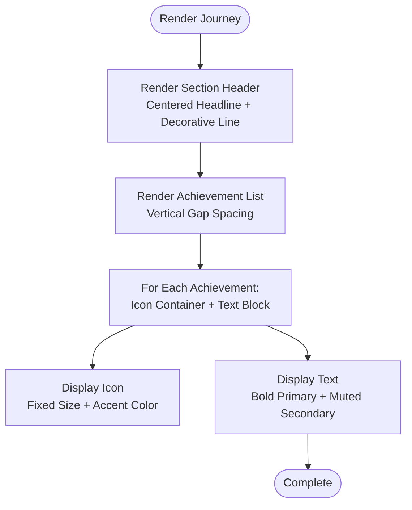

# Journey Section

<cite>
**Referenced Files in This Document**
- [Journey.tsx](file://src/components/Journey.tsx)
- [Home.tsx](file://src/pages/Home.tsx)
- [App.tsx](file://src/App.tsx)
- [index.css](file://src/index.css)
- [App.css](file://src/App.css)
- [package.json](file://package.json)
</cite>

## Table of Contents
1. [Introduction](#introduction)
2. [Project Structure](#project-structure)
3. [Core Components](#core-components)
4. [Architecture Overview](#architecture-overview)
5. [Detailed Component Analysis](#detailed-component-analysis)
6. [Dependency Analysis](#dependency-analysis)
7. [Performance Considerations](#performance-considerations)
8. [Troubleshooting Guide](#troubleshooting-guide)
9. [Conclusion](#conclusion)

## Introduction
The Journey section component presents a professional timeline and skill progression visualization. It displays achievements, professional milestones, educational background, and competency frameworks in a clean, icon-enhanced list format. The component follows a card-based layout with a centered headline and subtle decorative elements, integrating seamlessly with the portfolio's dark navy theme and responsive design system.

## Project Structure
The Journey component is organized as a standalone React functional component that renders a section containing a series of achievement entries. It is integrated into the main application layout through the Home page, which composes multiple sections including Hero, Projects, About, and Journey.

**Diagram sources**
- [App.tsx](file://src/App.tsx#L17-L27)
- [Home.tsx](file://src/pages/Home.tsx#L8-L21)
- [Journey.tsx](file://src/components/Journey.tsx#L1-L41)

**Section sources**
- [App.tsx](file://src/App.tsx#L1-L30)
- [Home.tsx](file://src/pages/Home.tsx#L1-L22)

## Core Components
The Journey component consists of:
- A data array of achievement entries, each containing an icon reference, bold text (primary title), and muted text (contextual details)
- A section wrapper with vertical padding and centered content
- A headline with decorative underline
- A vertically spaced list of achievement items, each featuring:
  - A fixed-size icon container with accent color
  - A text block with bold primary text and muted secondary text

Key characteristics:
- Uses Lucide React icons for visual representation
- Implements a consistent spacing pattern with vertical gaps
- Leverages theme variables for colors and typography
- Responsive layout through container constraints and flex alignment

**Section sources**
- [Journey.tsx](file://src/components/Journey.tsx#L1-L41)

## Architecture Overview
The Journey component participates in a client-side routing architecture. The App component sets up routing and scroll-to-top behavior, while the Home page composes the Journey section alongside other page sections. The component relies on Tailwind CSS utility classes for styling and theme variables for consistent design tokens.

**Diagram sources**
- [App.tsx](file://src/App.tsx#L7-L15)
- [App.tsx](file://src/App.tsx#L21-L25)
- [Home.tsx](file://src/pages/Home.tsx#L8-L21)
- [Journey.tsx](file://src/components/Journey.tsx#L14-L40)

## Detailed Component Analysis

### Timeline Visualization Patterns
The component employs a simple yet effective timeline visualization pattern:
- Vertical stacking of items with consistent spacing
- Icon-based markers aligned to the left of each entry
- Text-based content with clear hierarchy (bold for titles, muted for descriptions)
- Centered layout with constrained maximum width for readability

**Diagram sources**
- [Journey.tsx](file://src/components/Journey.tsx#L14-L40)

**Section sources**
- [Journey.tsx](file://src/components/Journey.tsx#L14-L40)

### Chronological Ordering and Experience Presentation
The component does not enforce chronological ordering in code; the order reflects the sequence of entries in the achievements array. This approach allows flexibility in prioritizing content without strict temporal constraints. The presentation emphasizes impact and relevance through the combination of icons and descriptive text.

Practical considerations:
- Add new entries by appending to the achievements array
- Reorder by adjusting array indices
- Maintain consistent icon usage for visual coherence

**Section sources**
- [Journey.tsx](file://src/components/Journey.tsx#L3-L12)

### Skill Representation Methods
Skill representation is achieved through:
- Icon selection that visually communicates competence areas
- Descriptive text that specifies proficiency levels and technologies
- Consistent formatting that highlights key skills in bold text

Integration points:
- The component can be extended to support dynamic skill badges or progress indicators
- Future enhancements could include interactive hover states or tooltips

**Section sources**
- [Journey.tsx](file://src/components/Journey.tsx#L3-L12)

### Professional Milestones and Educational Background
The component effectively showcases:
- Professional roles and responsibilities
- Educational qualifications and achievements
- Competitions and contributions

Implementation approach:
- Use relevant icons to distinguish between work experience, education, and achievements
- Maintain consistent text formatting for easy scanning
- Keep descriptions concise while preserving key details

**Section sources**
- [Journey.tsx](file://src/components/Journey.tsx#L3-L12)

### Responsive Design Considerations
Responsive behavior is handled through:
- Container constraints with max-width and horizontal centering
- Flexible spacing using vertical gap utilities
- Icon sizing that remains consistent across breakpoints
- Typography scaling through theme variables

Breakpoint handling:
- The component uses utility classes that adapt to different screen sizes
- No custom media queries are needed due to Tailwind's built-in responsive utilities
- Content maintains readability through constrained widths and appropriate spacing

**Section sources**
- [Journey.tsx](file://src/components/Journey.tsx#L16-L21)
- [index.css](file://src/index.css#L3-L51)

### Accessibility Features
Accessibility considerations present in the current implementation:
- Semantic HTML structure with section and paragraph elements
- Color contrast maintained through theme variables
- Focus styles applied globally for keyboard navigation
- Clear text hierarchy enabling screen reader comprehension

Areas for enhancement:
- Add ARIA labels to icons for improved screen reader support
- Implement keyboard navigation for interactive elements
- Consider adding skip links for main content

**Section sources**
- [index.css](file://src/index.css#L109-L113)

### Integration with Professional Data Structures
The component currently uses a static data structure. Integration patterns for dynamic data:
- Replace static array with props-based data
- Support for external data sources (APIs, CMS)
- Type-safe interfaces for data validation

Current data model:
- Each entry requires an icon reference, bold text, and muted text
- No additional metadata is currently utilized

**Section sources**
- [Journey.tsx](file://src/components/Journey.tsx#L3-L12)

## Dependency Analysis
The Journey component has minimal external dependencies, relying primarily on:
- React for component structure and rendering
- Lucide React for SVG icons
- Tailwind CSS for styling and responsive utilities

**Diagram sources**
- [Journey.tsx](file://src/components/Journey.tsx#L1-L41)
- [App.tsx](file://src/App.tsx#L1-L30)
- [package.json](file://package.json#L12-L17)

**Section sources**
- [package.json](file://package.json#L12-L17)

## Performance Considerations
Performance characteristics of the current implementation:
- Lightweight rendering with simple list iteration
- Minimal re-renders due to static data
- Efficient use of CSS utilities without heavy JavaScript computations

Optimization opportunities:
- Memoize the achievements array if it becomes dynamic
- Consider virtualization for very long timelines
- Lazy load icons if bundle size becomes a concern
- Implement code splitting for larger datasets

Rendering efficiency:
- Single pass through the achievements array
- Stateless component with predictable rendering
- No unnecessary DOM manipulations

## Troubleshooting Guide
Common issues and solutions:
- Icons not displaying: Verify Lucide React installation and import paths
- Styling inconsistencies: Check Tailwind configuration and theme variable usage
- Layout problems: Ensure container constraints and responsive utilities are applied correctly
- Color contrast issues: Review theme variables against accessibility guidelines

Debugging steps:
1. Confirm dependencies are installed and up to date
2. Validate CSS class names match Tailwind configuration
3. Test component in isolation to identify styling conflicts
4. Check browser console for runtime errors

**Section sources**
- [package.json](file://package.json#L12-L17)
- [index.css](file://src/index.css#L3-L51)

## Conclusion
The Journey section component provides an elegant solution for visualizing professional timelines and skill progression. Its minimalist design, combined with the portfolio's cohesive theming and responsive framework, creates an effective showcase for achievements and milestones. The component's simplicity enables easy customization while maintaining strong accessibility and performance characteristics.

Future enhancements could include interactive elements, dynamic data binding, and expanded visual indicators for skill levels, building upon the solid foundation established by the current implementation.