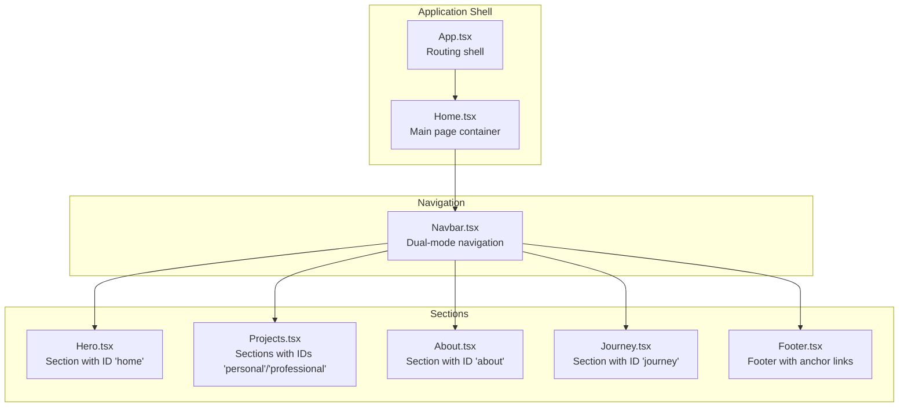
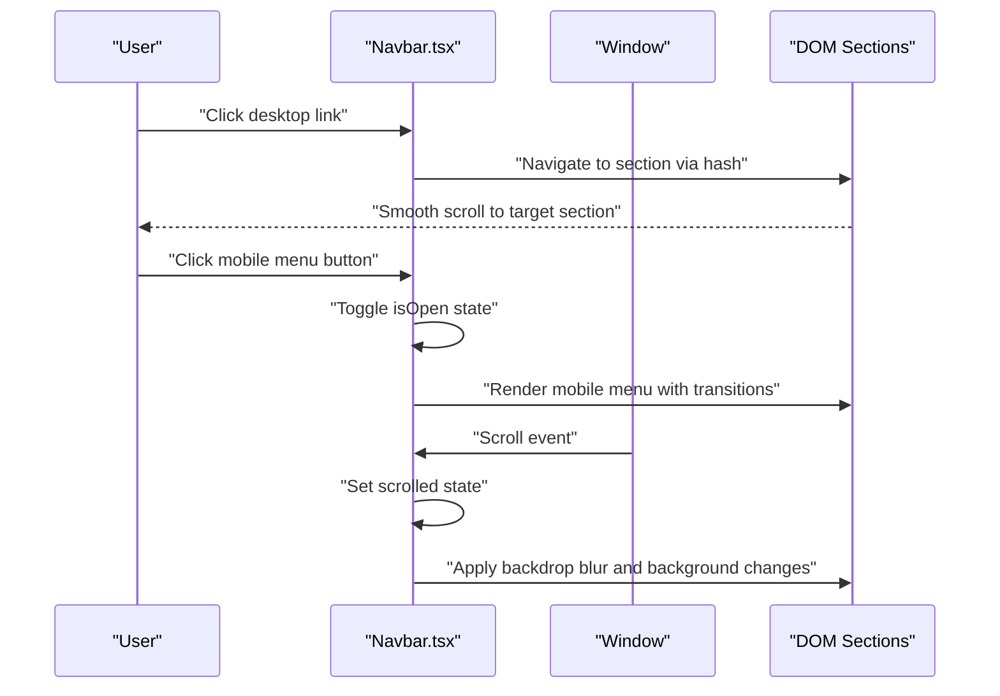
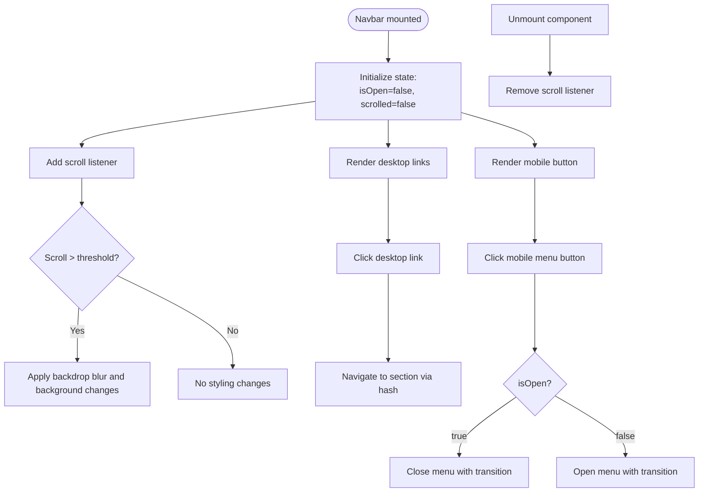
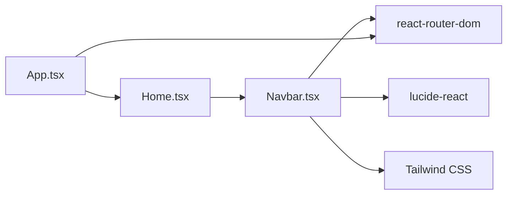

# Navigation System

<cite>
**Referenced Files in This Document**
- [Navbar.tsx](file://src/components/Navbar.tsx)
- [App.tsx](file://src/App.tsx)
- [Home.tsx](file://src/pages/Home.tsx)
- [Hero.tsx](file://src/components/Hero.tsx)
- [About.tsx](file://src/components/About.tsx)
- [Projects.tsx](file://src/components/Projects.tsx)
- [Journey.tsx](file://src/components/Journey.tsx)
- [Footer.tsx](file://src/components/Footer.tsx)
- [projects.ts](file://src/data/projects.ts)
- [index.css](file://src/index.css)
- [App.css](file://src/App.css)
- [package.json](file://package.json)
</cite>

## Table of Contents
1. [Introduction](#introduction)
2. [Project Structure](#project-structure)
3. [Core Components](#core-components)
4. [Architecture Overview](#architecture-overview)
5. [Detailed Component Analysis](#detailed-component-analysis)
6. [Dependency Analysis](#dependency-analysis)
7. [Performance Considerations](#performance-considerations)
8. [Troubleshooting Guide](#troubleshooting-guide)
9. [Conclusion](#conclusion)
10. [Appendices](#appendices)

## Introduction
This document provides a comprehensive guide to the navigation system component, focusing on the Navbar implementation. It explains the dual-mode navigation approach with desktop and mobile variants, scroll-aware styling with backdrop blur effects, and responsive design patterns. It documents the state management using React hooks for mobile menu toggle and scroll detection, covers navigation link configuration with external link handling and hash-based routing for anchor links, and addresses accessibility features including ARIA labels. Practical examples demonstrate adding new navigation items, customizing styling with Tailwind CSS classes, and implementing smooth scrolling behavior. The guide also covers mobile-first design principles, transition animations, and performance optimizations for navigation interactions.

## Project Structure
The navigation system is centered around the Navbar component and integrates with the application’s routing and page structure. The Navbar is rendered within the Home page and coordinates with other sections that use anchor-based navigation.

**Diagram sources**
- [App.tsx](file://src/App.tsx#L17-L27)
- [Home.tsx](file://src/pages/Home.tsx#L8-L21)
- [Navbar.tsx](file://src/components/Navbar.tsx#L13-L112)
- [Hero.tsx](file://src/components/Hero.tsx#L21-L68)
- [Projects.tsx](file://src/components/Projects.tsx#L76-L107)
- [About.tsx](file://src/components/About.tsx#L10-L103)
- [Journey.tsx](file://src/components/Journey.tsx#L14-L41)
- [Footer.tsx](file://src/components/Footer.tsx#L3-L82)

**Section sources**
- [App.tsx](file://src/App.tsx#L1-L30)
- [Home.tsx](file://src/pages/Home.tsx#L1-L22)
- [Navbar.tsx](file://src/components/Navbar.tsx#L1-L112)

## Core Components
- Navbar: Implements dual-mode navigation with desktop and mobile variants, scroll-aware styling with backdrop blur, and responsive design patterns. It manages mobile menu state and scroll detection using React hooks.
- Home: Renders the Navbar and the main content sections, providing the container for anchor-based navigation.
- Routing: Uses react-router-dom for client-side routing and a ScrollToTop component to reset scroll position on route changes.

Key implementation highlights:
- Dual-mode navigation: Desktop links use anchor-style href attributes for smooth scrolling; mobile variant toggles visibility with transitions.
- Scroll-aware styling: On scroll, the navbar applies a backdrop blur effect and adjusts background transparency.
- Accessibility: Uses aria-label for the mobile menu button and standard link semantics for navigation items.
- Responsive design: Utilizes Tailwind CSS classes for breakpoints and transitions.

**Section sources**
- [Navbar.tsx](file://src/components/Navbar.tsx#L13-L112)
- [Home.tsx](file://src/pages/Home.tsx#L8-L21)
- [App.tsx](file://src/App.tsx#L6-L15)

## Architecture Overview
The navigation system follows a mobile-first responsive design with a fixed header that adapts to scroll events. The Navbar maintains two distinct rendering modes: desktop and mobile. Desktop mode displays horizontal links, while mobile mode collapses into a vertical menu triggered by a hamburger button. Anchor-based navigation enables smooth scrolling to sections within the Home page.

**Diagram sources**
- [Navbar.tsx](file://src/components/Navbar.tsx#L13-L112)
- [Hero.tsx](file://src/components/Hero.tsx#L21-L68)
- [Projects.tsx](file://src/components/Projects.tsx#L76-L107)
- [About.tsx](file://src/components/About.tsx#L10-L103)
- [Journey.tsx](file://src/components/Journey.tsx#L14-L41)
- [Footer.tsx](file://src/components/Footer.tsx#L3-L82)

## Detailed Component Analysis

### Navbar Component
The Navbar component encapsulates the navigation logic and UI. It defines navigation links, manages mobile menu state, and detects scroll events to adjust styling.

- State management:
  - isOpen: Controls mobile menu visibility and transitions.
  - scrolled: Tracks scroll position to apply backdrop blur and background adjustments.
- Rendering modes:
  - Desktop: Horizontal list of links with hover effects.
  - Mobile: Collapsible vertical menu with slide transitions.
- Scroll-aware styling:
  - Applies a backdrop blur effect and reduced background opacity when scrolled beyond a threshold.
- Accessibility:
  - Uses aria-label for the mobile menu button.
  - Maintains semantic link structure for screen readers.

**Diagram sources**
- [Navbar.tsx](file://src/components/Navbar.tsx#L13-L112)

**Section sources**
- [Navbar.tsx](file://src/components/Navbar.tsx#L13-L112)

### Navigation Link Configuration
The Navbar defines a centralized navLinks array that controls navigation items. Each item supports:
- Internal anchor links: Hash-based routing to sections within the Home page.
- External links: PDF resume link configured as external with target="_blank" and rel="noopener noreferrer".
- Accessibility: Desktop and mobile links use standard anchor elements with hover and focus states.

Practical examples:
- Adding a new internal navigation item:
  - Add an object to navLinks with name and href pointing to a section ID.
  - Ensure the target section has a matching id attribute.
- Adding a new external link:
  - Add an object to navLinks with external: true and href set to the URL.
  - The component automatically renders an anchor tag with appropriate attributes.
- Customizing styling:
  - Modify Tailwind classes on the anchor elements for desktop and mobile views.
  - Adjust color tokens and transitions defined in the theme.

**Section sources**
- [Navbar.tsx](file://src/components/Navbar.tsx#L5-L11)
- [Hero.tsx](file://src/components/Hero.tsx#L21-L68)
- [Projects.tsx](file://src/components/Projects.tsx#L76-L107)
- [About.tsx](file://src/components/About.tsx#L10-L103)
- [Journey.tsx](file://src/components/Journey.tsx#L14-L41)
- [Footer.tsx](file://src/components/Footer.tsx#L62-L75)

### Scroll-Aware Styling and Backdrop Blur
The Navbar applies scroll-aware styling by listening to scroll events and updating the scrolled state. When scrolled beyond a threshold, the header receives a backdrop blur effect and reduced background opacity, enhancing readability against content below.

Implementation details:
- Scroll detection: A useEffect hook adds a scroll listener and cleans it up on unmount.
- Threshold: The threshold is defined by the scroll position check in the handler.
- Visual effects: Tailwind classes control background and backdrop blur transitions.

**Section sources**
- [Navbar.tsx](file://src/components/Navbar.tsx#L17-L23)
- [Navbar.tsx](file://src/components/Navbar.tsx#L26-L30)

### Mobile-First Responsive Design
The Navbar follows a mobile-first approach:
- Desktop mode: Hidden on small screens, shown from medium breakpoint onward.
- Mobile mode: Collapses into a hamburger menu with a collapsible panel.
- Transitions: Smooth height transitions and duration-based animations for menu open/close.
- Breakpoints: Uses Tailwind’s md breakpoint for responsive behavior.

**Section sources**
- [Navbar.tsx](file://src/components/Navbar.tsx#L42-L64)
- [Navbar.tsx](file://src/components/Navbar.tsx#L66-L74)
- [Navbar.tsx](file://src/components/Navbar.tsx#L76-L107)

### Accessibility Features
The Navbar incorporates several accessibility features:
- ARIA label: The mobile menu button includes aria-label for assistive technologies.
- Semantic structure: Uses anchor elements for navigation items with appropriate hover and focus states.
- Keyboard navigation: Standard anchor elements support keyboard interaction.

**Section sources**
- [Navbar.tsx](file://src/components/Navbar.tsx#L67-L73)

### Smooth Scrolling Behavior
Smooth scrolling is enabled globally via the base styles, ensuring navigation links animate smoothly to their targets. The Navbar’s anchor-based links leverage this behavior to provide a seamless user experience.

**Section sources**
- [index.css](file://src/index.css#L53-L56)
- [Navbar.tsx](file://src/components/Navbar.tsx#L45-L61)

### Integration with Application Routing
The application uses react-router-dom for routing. The Navbar’s links use hash-based navigation to target sections within the Home page. A ScrollToTop component resets the scroll position on route changes, ensuring a clean initial state.

**Section sources**
- [App.tsx](file://src/App.tsx#L1-L30)
- [Home.tsx](file://src/pages/Home.tsx#L8-L21)

## Dependency Analysis
The navigation system relies on the following dependencies and integrations:
- react-router-dom: Provides routing and navigation semantics.
- lucide-react: Supplies icons for the mobile menu and social links.
- Tailwind CSS: Enables responsive design and theme tokens for colors and transitions.

**Diagram sources**
- [Navbar.tsx](file://src/components/Navbar.tsx#L1-L3)
- [Home.tsx](file://src/pages/Home.tsx#L1)
- [App.tsx](file://src/App.tsx#L1-L4)
- [package.json](file://package.json#L12-L16)

**Section sources**
- [package.json](file://package.json#L12-L16)
- [Navbar.tsx](file://src/components/Navbar.tsx#L1-L3)
- [App.tsx](file://src/App.tsx#L1-L4)

## Performance Considerations
- Event listeners: The scroll listener is attached and cleaned up in a useEffect hook to prevent memory leaks.
- Transition durations: Consistent transition durations improve perceived performance and reduce jank during state changes.
- Mobile menu animations: Height-based transitions are lightweight and performant on modern browsers.
- Global smooth scrolling: Enabling smooth scrolling at the root improves navigation responsiveness without additional JavaScript.

[No sources needed since this section provides general guidance]

## Troubleshooting Guide
Common issues and resolutions:
- Mobile menu does not close after clicking a link:
  - Ensure click handlers on mobile links call setIsOpen(false) to close the menu.
- Scroll styling not applying:
  - Verify the scroll threshold and that the scrolled state updates on scroll events.
- External links not opening in new tabs:
  - Confirm external links are configured with target="_blank" and rel="noopener noreferrer".
- Anchor links not scrolling to sections:
  - Ensure target sections have matching id attributes and that smooth scrolling is enabled globally.

**Section sources**
- [Navbar.tsx](file://src/components/Navbar.tsx#L85-L103)
- [Navbar.tsx](file://src/components/Navbar.tsx#L17-L23)
- [index.css](file://src/index.css#L53-L56)

## Conclusion
The Navbar component delivers a robust, responsive navigation experience with scroll-aware styling and smooth transitions. Its dual-mode design accommodates both desktop and mobile users, while anchor-based navigation ensures seamless section targeting. The implementation leverages React hooks for state management, Tailwind CSS for responsive design, and accessibility best practices for inclusive navigation. By following the provided examples and guidelines, developers can easily extend the navigation system with new items, customize styling, and maintain optimal performance.

[No sources needed since this section summarizes without analyzing specific files]

## Appendices

### Practical Examples

- Adding a new navigation item:
  - Extend the navLinks array with a new object containing name and href.
  - Ensure the target section has a matching id attribute.
  - Example path reference: [navLinks definition](file://src/components/Navbar.tsx#L5-L11)

- Customizing styling with Tailwind CSS classes:
  - Modify desktop and mobile link classes for hover and focus states.
  - Adjust backdrop blur and background classes for scroll-aware styling.
  - Example path references:
    - [Desktop link styling](file://src/components/Navbar.tsx#L54-L61)
    - [Mobile link styling](file://src/components/Navbar.tsx#L95-L103)
    - [Backdrop blur and background](file://src/components/Navbar.tsx#L26-L30)

- Implementing smooth scrolling behavior:
  - Enable global smooth scrolling via base styles.
  - Use anchor-based links for internal navigation.
  - Example path references:
    - [Global smooth scrolling](file://src/index.css#L53-L56)
    - [Anchor-based navigation](file://src/components/Navbar.tsx#L45-L61)

- Mobile-first design principles:
  - Use responsive breakpoints to control desktop vs. mobile rendering.
  - Implement collapsible menus with transitions for mobile interactions.
  - Example path references:
    - [Desktop vs. mobile rendering](file://src/components/Navbar.tsx#L42-L64)
    - [Mobile menu transitions](file://src/components/Navbar.tsx#L76-L107)

- Accessibility features:
  - Provide ARIA labels for interactive elements.
  - Maintain semantic link structure for screen readers.
  - Example path references:
    - [ARIA label for mobile menu](file://src/components/Navbar.tsx#L67-L73)
    - [Semantic anchor elements](file://src/components/Navbar.tsx#L45-L61)