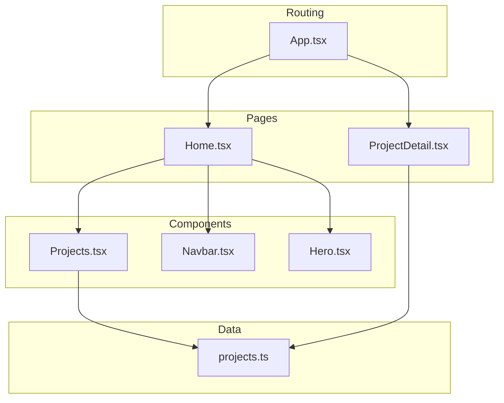
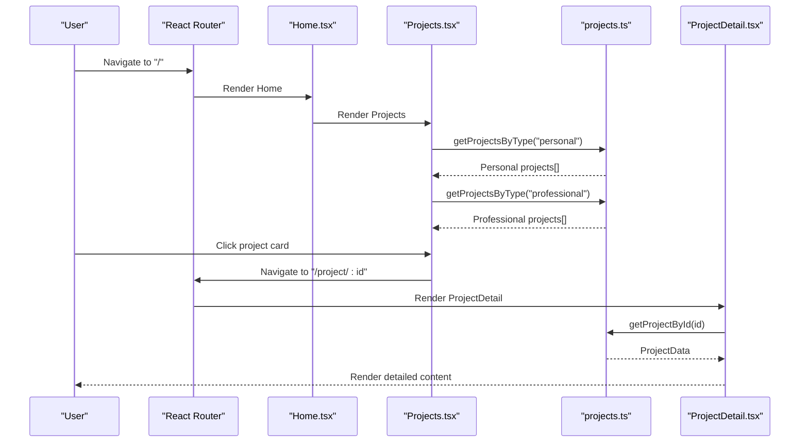
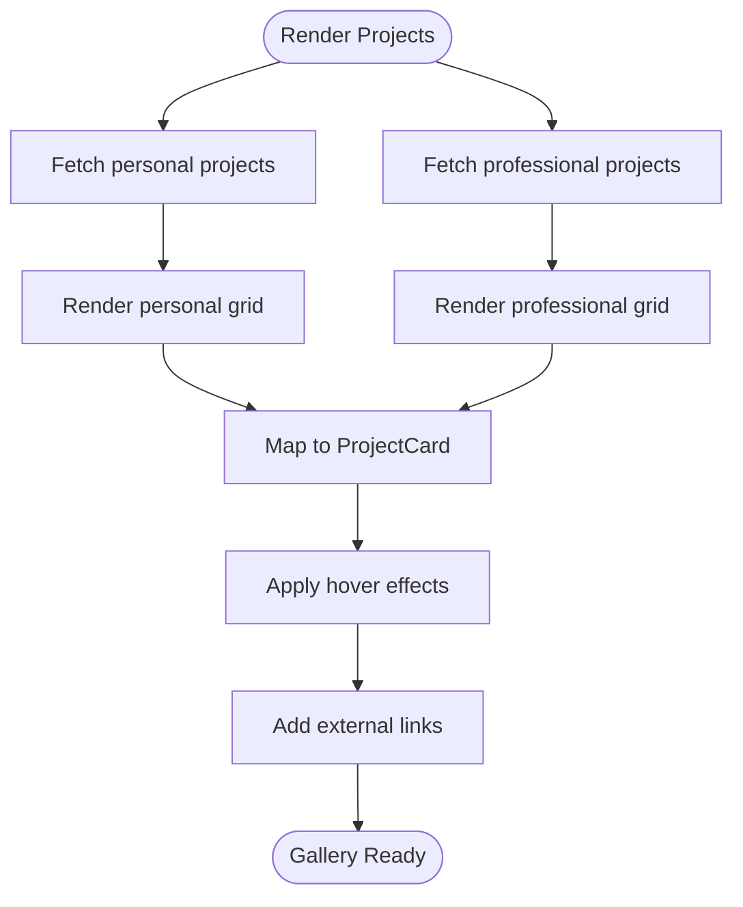
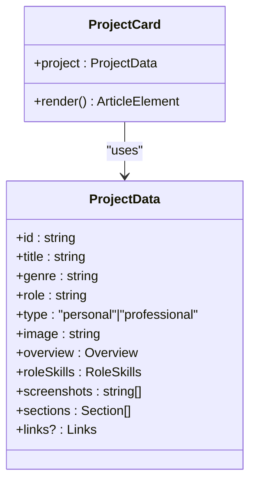
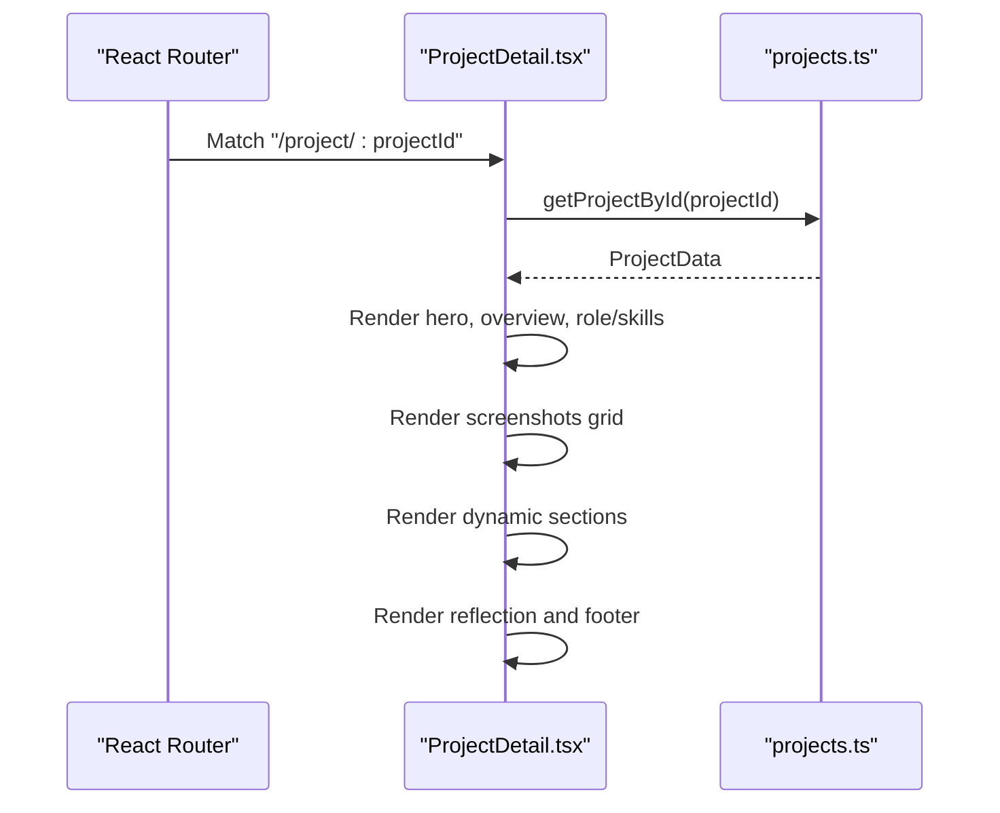
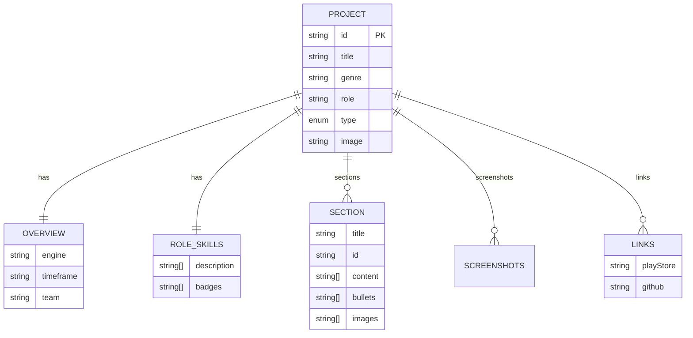
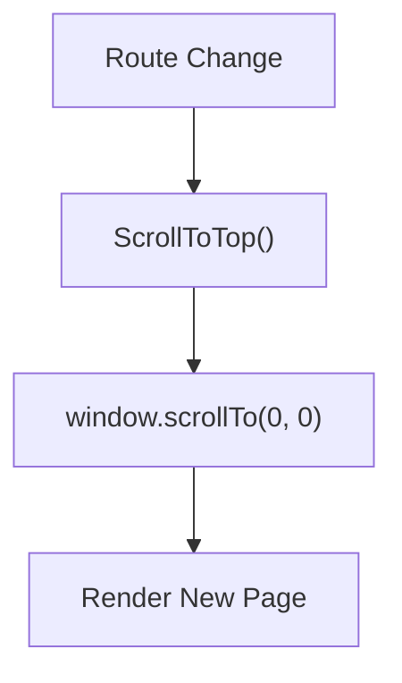
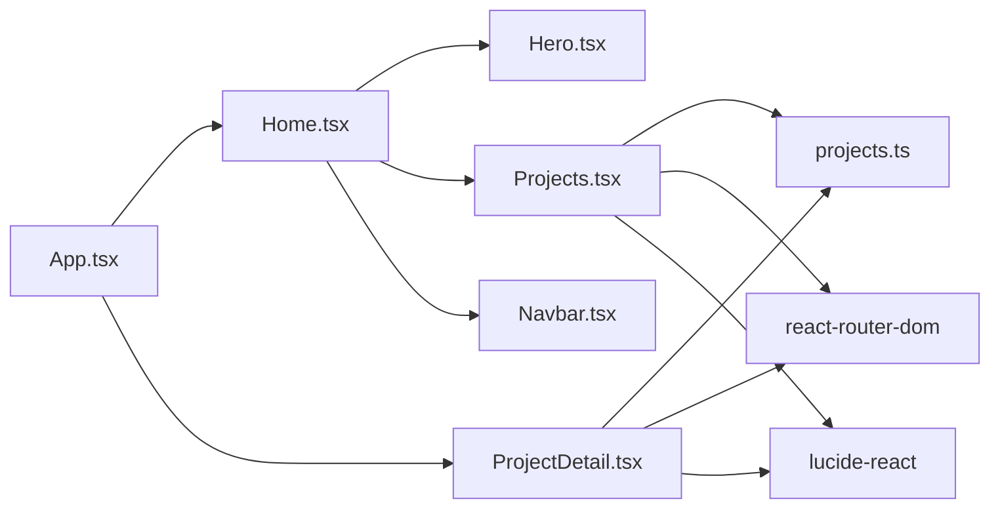

# Project Gallery

<cite>
**Referenced Files in This Document**
- [Projects.tsx](file://src/components/Projects.tsx)
- [projects.ts](file://src/data/projects.ts)
- [ProjectDetail.tsx](file://src/pages/ProjectDetail.tsx)
- [Home.tsx](file://src/pages/Home.tsx)
- [App.tsx](file://src/App.tsx)
- [Navbar.tsx](file://src/components/Navbar.tsx)
- [Hero.tsx](file://src/components/Hero.tsx)
- [package.json](file://package.json)
</cite>

## Table of Contents
1. [Introduction](#introduction)
2. [Project Structure](#project-structure)
3. [Core Components](#core-components)
4. [Architecture Overview](#architecture-overview)
5. [Detailed Component Analysis](#detailed-component-analysis)
6. [Dependency Analysis](#dependency-analysis)
7. [Performance Considerations](#performance-considerations)
8. [Troubleshooting Guide](#troubleshooting-guide)
9. [Conclusion](#conclusion)
10. [Appendices](#appendices)

## Introduction
This document explains the project gallery component that displays and organizes game development projects. It covers the gallery layout patterns, project card design, filtering mechanisms for personal/professional projects, responsive grid systems, integration with a centralized data source, dynamic content rendering, and navigation to detailed project views. It also documents interactive elements such as hover effects and thumbnails, along with practical examples for adding new projects, customizing appearance, and optimizing performance and accessibility.

## Project Structure
The gallery is part of a React application using Vite and Tailwind CSS. The gallery lives in a dedicated component that renders two sections: personal projects and professional projects. Each project is represented by a card with a thumbnail, genre tag, title overlay, role, and optional links. Detailed project pages are rendered from the centralized project data.

**Diagram sources**
- [Home.tsx](file://src/pages/Home.tsx#L8-L21)
- [Projects.tsx](file://src/components/Projects.tsx#L76-L107)
- [ProjectDetail.tsx](file://src/pages/ProjectDetail.tsx#L93-L108)
- [projects.ts](file://src/data/projects.ts#L43-L485)
- [App.tsx](file://src/App.tsx#L17-L27)
- [Navbar.tsx](file://src/components/Navbar.tsx#L13-L111)
- [Hero.tsx](file://src/components/Hero.tsx#L21-L67)

**Section sources**
- [Home.tsx](file://src/pages/Home.tsx#L8-L21)
- [Projects.tsx](file://src/components/Projects.tsx#L76-L107)
- [ProjectDetail.tsx](file://src/pages/ProjectDetail.tsx#L93-L108)
- [projects.ts](file://src/data/projects.ts#L43-L485)
- [App.tsx](file://src/App.tsx#L17-L27)
- [Navbar.tsx](file://src/components/Navbar.tsx#L13-L111)
- [Hero.tsx](file://src/components/Hero.tsx#L21-L67)

## Core Components
- Projects gallery: Renders two sections (personal and professional) using a responsive grid. Each project is rendered as a card with thumbnail, genre, title overlay, role, and optional links.
- Centralized data source: A typed array of projects with metadata, overview, role/skills, screenshots, dynamic sections, and optional links.
- Project detail page: Dynamically renders overview, role/skills, screenshots, and custom sections defined per project.
- Routing: Uses React Router to navigate between home and project detail pages.

Key implementation patterns:
- Responsive grid using Tailwind’s grid utilities with breakpoints for small and large screens.
- Hover effects on cards and thumbnails for enhanced interactivity.
- Lazy loading for images to improve performance.
- Type-safe data access via helper functions to filter by project type and retrieve by ID.

**Section sources**
- [Projects.tsx](file://src/components/Projects.tsx#L76-L107)
- [projects.ts](file://src/data/projects.ts#L43-L485)
- [ProjectDetail.tsx](file://src/pages/ProjectDetail.tsx#L93-L108)
- [App.tsx](file://src/App.tsx#L17-L27)

## Architecture Overview
The gallery follows a unidirectional data flow:
- Data is declared centrally and consumed by components.
- Components render static or dynamic content based on props.
- Navigation is handled via React Router with programmatic scrolling to top on route changes.

**Diagram sources**
- [App.tsx](file://src/App.tsx#L17-L27)
- [Home.tsx](file://src/pages/Home.tsx#L8-L21)
- [Projects.tsx](file://src/components/Projects.tsx#L76-L107)
- [projects.ts](file://src/data/projects.ts#L478-L484)
- [ProjectDetail.tsx](file://src/pages/ProjectDetail.tsx#L93-L108)

## Detailed Component Analysis

### Projects Gallery Component
Responsibilities:
- Split projects into personal and professional sections.
- Render each project as a card with thumbnail, genre tag, title overlay, role, and optional links.
- Apply responsive grid layouts and hover effects.

Layout patterns:
- Two sections stacked vertically with distinct backgrounds.
- Grid layout with responsive columns: 1 column on small screens, 2 on medium, 3 on large.
- Aspect-ratio container for thumbnails to maintain consistent card heights.

Interactive elements:
- Thumbnail link navigates to the project detail page.
- Hover scale effect on images and accent transitions on overlays.
- External links open in new tabs with safe attributes.

Filtering mechanism:
- Uses a helper to filter projects by type ("personal" or "professional").

Accessibility and performance:
- Images use lazy loading.
- Alt text is derived from project title.
- Semantic article and heading structure.

**Diagram sources**
- [Projects.tsx](file://src/components/Projects.tsx#L76-L107)
- [projects.ts](file://src/data/projects.ts#L482-L484)

**Section sources**
- [Projects.tsx](file://src/components/Projects.tsx#L5-L65)
- [Projects.tsx](file://src/components/Projects.tsx#L76-L107)
- [projects.ts](file://src/data/projects.ts#L482-L484)

### Project Card Component
Responsibilities:
- Display a single project with thumbnail, genre, title overlay, role, and optional links.
- Provide navigation to the project detail page.

Design elements:
- Genre meta tag at the top.
- Thumbnail with gradient overlay and centered title.
- Role displayed below the thumbnail.
- Optional links for Play Store and GitHub.

Interactions:
- Clicking the thumbnail navigates to the detail page.
- Hover effects on images and text for visual feedback.
- External links prevent event propagation to avoid navigating twice.

**Diagram sources**
- [Projects.tsx](file://src/components/Projects.tsx#L5-L65)
- [projects.ts](file://src/data/projects.ts#L1-L41)

**Section sources**
- [Projects.tsx](file://src/components/Projects.tsx#L5-L65)
- [projects.ts](file://src/data/projects.ts#L1-L41)

### Project Detail Page
Responsibilities:
- Render a comprehensive view of a selected project.
- Provide quick navigation to sections within the page.
- Display overview, role/skills, screenshots, and dynamic sections.

Dynamic rendering:
- Overview and role/skills panels.
- Screenshots gallery with responsive grid.
- Dynamic sections with alternating backgrounds and optional subsections, bullets, and images.
- Reflection footer with navigation back to the relevant project list.

Navigation:
- Back to project list with anchor to the correct section.
- External links to GitHub and Play Store when available.

**Diagram sources**
- [ProjectDetail.tsx](file://src/pages/ProjectDetail.tsx#L93-L108)
- [projects.ts](file://src/data/projects.ts#L478-L484)

**Section sources**
- [ProjectDetail.tsx](file://src/pages/ProjectDetail.tsx#L93-L370)
- [projects.ts](file://src/data/projects.ts#L1-L41)

### Centralized Data Source
Responsibilities:
- Define the shape of project data.
- Provide helper functions to filter by type and retrieve by ID.
- Maintain a comprehensive list of projects with detailed metadata.

Data model highlights:
- Project identifier, title, genre, role, type, and image URL.
- Overview with engine, timeframe, and team.
- Role and skills with description and badges.
- Screenshots array.
- Dynamic sections with optional bullets, images, and subsections.
- Optional links to Play Store and GitHub.

**Diagram sources**
- [projects.ts](file://src/data/projects.ts#L1-L41)

**Section sources**
- [projects.ts](file://src/data/projects.ts#L1-L41)
- [projects.ts](file://src/data/projects.ts#L43-L485)

### Navigation and Routing
Responsibilities:
- Configure routes for home and project detail pages.
- Scroll to top on route changes.
- Provide navigation anchors to project sections on the home page.

**Diagram sources**
- [App.tsx](file://src/App.tsx#L6-L15)
- [App.tsx](file://src/App.tsx#L17-L27)
- [Navbar.tsx](file://src/components/Navbar.tsx#L5-L11)

**Section sources**
- [App.tsx](file://src/App.tsx#L6-L15)
- [App.tsx](file://src/App.tsx#L17-L27)
- [Navbar.tsx](file://src/components/Navbar.tsx#L5-L11)

## Dependency Analysis
- Projects component depends on:
  - Centralized data helpers to filter projects by type.
  - React Router for navigation.
  - Lucide icons for external links.
- ProjectDetail component depends on:
  - Centralized data helpers to retrieve a single project.
  - React Router for navigation and params.
  - Lucide icons for UI elements.
- Home page composes Hero, Projects, About, and Journey components.
- App sets up routing and scroll behavior.

**Diagram sources**
- [Projects.tsx](file://src/components/Projects.tsx#L1-L3)
- [ProjectDetail.tsx](file://src/pages/ProjectDetail.tsx#L1-L3)
- [Home.tsx](file://src/pages/Home.tsx#L1-L6)
- [App.tsx](file://src/App.tsx#L1-L4)

**Section sources**
- [Projects.tsx](file://src/components/Projects.tsx#L1-L3)
- [ProjectDetail.tsx](file://src/pages/ProjectDetail.tsx#L1-L3)
- [Home.tsx](file://src/pages/Home.tsx#L1-L6)
- [App.tsx](file://src/App.tsx#L1-L4)
- [package.json](file://package.json#L12-L17)

## Performance Considerations
- Image lazy loading: Thumbnails use lazy loading to defer offscreen image loading until needed.
- Aspect-ratio containers: Fixed aspect ratios help browsers reserve space and reduce layout shifts.
- Minimal re-renders: Filtering and rendering are performed once per section render.
- Efficient grid: Tailwind’s responsive grid classes avoid complex JavaScript layout logic.
- Route transitions: Programmatic scroll to top reduces unnecessary scroll restoration overhead.

Recommendations:
- Preload critical hero images on the home page.
- Consider using modern image formats (WebP) and responsive sizes for thumbnails.
- Implement intersection observer-based preloading for cards near the viewport.
- Add skeleton loaders during initial data fetching if data grows large.

**Section sources**
- [Projects.tsx](file://src/components/Projects.tsx#L18-L23)
- [ProjectDetail.tsx](file://src/pages/ProjectDetail.tsx#L121-L126)
- [ProjectDetail.tsx](file://src/pages/ProjectDetail.tsx#L154-L161)

## Troubleshooting Guide
Common issues and resolutions:
- Project not found: The detail page checks for a valid project ID and renders a friendly message with a link back to home.
- Broken navigation: Ensure route parameters match the data IDs and that the router is configured correctly.
- Missing images: Verify image URLs exist and are served from the public directory.
- Hover effects not working: Confirm Tailwind utilities are applied and group-hover variants are enabled.

Debugging tips:
- Log project IDs and verify they match the data.
- Inspect network requests for missing assets.
- Use browser dev tools to verify CSS classes and hover states.

**Section sources**
- [ProjectDetail.tsx](file://src/pages/ProjectDetail.tsx#L97-L108)
- [App.tsx](file://src/App.tsx#L17-L27)

## Conclusion
The project gallery component provides a clean, responsive, and accessible way to showcase game development projects. It leverages a centralized data source, type-safe helpers, and React Router to deliver a seamless browsing experience. The design emphasizes visual clarity with thumbnails, genre tags, and role highlights, while interactive elements like hover effects and navigation anchors enhance usability. With lazy loading and responsive grids, the gallery performs well across devices.

## Appendices

### Practical Examples

- Adding a new project:
  - Extend the central data array with a new project object following the existing structure.
  - Ensure the type is either "personal" or "professional".
  - Provide an image URL and optional links.
  - Reference: [projects.ts](file://src/data/projects.ts#L43-L485)

- Customizing gallery appearance:
  - Adjust grid columns and spacing in the gallery sections.
  - Modify hover effects on cards and thumbnails.
  - Reference: [Projects.tsx](file://src/components/Projects.tsx#L86-L104)

- Implementing project filtering:
  - Use the type-based filtering helper to split projects into sections.
  - Reference: [projects.ts](file://src/data/projects.ts#L482-L484)

- Navigating to detailed views:
  - Use the card link to navigate to the project detail route.
  - Reference: [Projects.tsx](file://src/components/Projects.tsx#L14-L16), [ProjectDetail.tsx](file://src/pages/ProjectDetail.tsx#L93-L108)

- Accessibility features:
  - Provide meaningful alt texts for images.
  - Use semantic headings and article elements.
  - Ensure interactive elements are keyboard accessible.
  - Reference: [Projects.tsx](file://src/components/Projects.tsx#L18-L21)

- Mobile optimization:
  - Use responsive grid classes for small screens.
  - Ensure touch-friendly tap targets for navigation.
  - Reference: [Projects.tsx](file://src/components/Projects.tsx#L86-L104), [Navbar.tsx](file://src/components/Navbar.tsx#L13-L111)