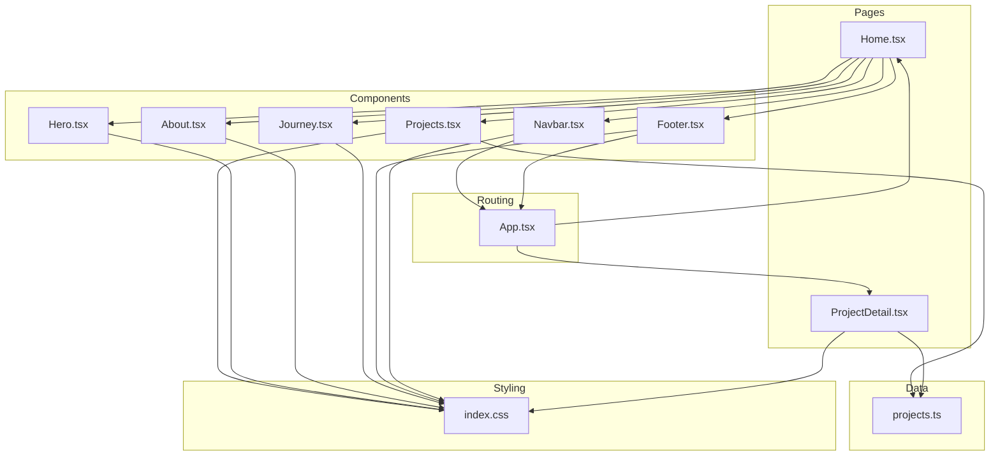
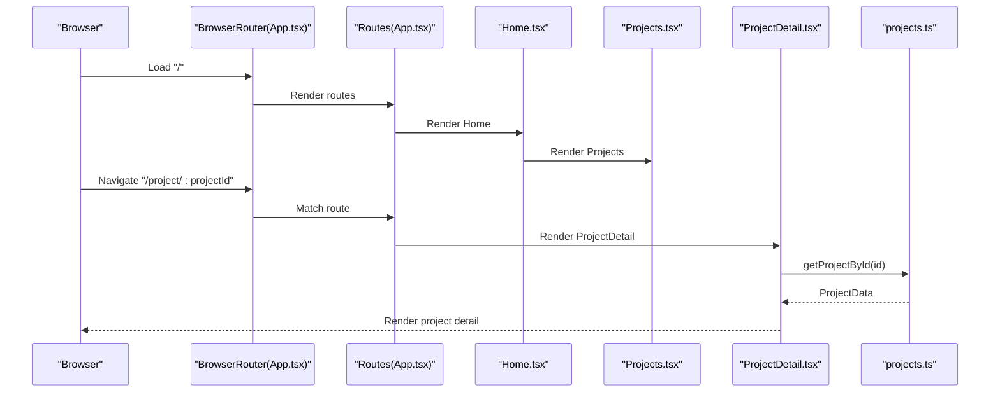
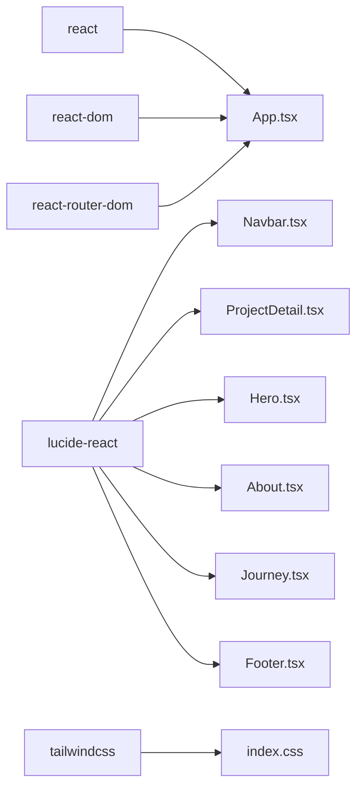

# Customization Guide

<cite>
**Referenced Files in This Document**
- [projects.ts](file://src/data/projects.ts)
- [Navbar.tsx](file://src/components/Navbar.tsx)
- [App.tsx](file://src/App.tsx)
- [index.css](file://src/index.css)
- [Home.tsx](file://src/pages/Home.tsx)
- [ProjectDetail.tsx](file://src/pages/ProjectDetail.tsx)
- [Projects.tsx](file://src/components/Projects.tsx)
- [Hero.tsx](file://src/components/Hero.tsx)
- [About.tsx](file://src/components/About.tsx)
- [Journey.tsx](file://src/components/Journey.tsx)
- [Footer.tsx](file://src/components/Footer.tsx)
- [package.json](file://package.json)
</cite>

## Table of Contents
1. [Introduction](#introduction)
2. [Project Structure](#project-structure)
3. [Core Components](#core-components)
4. [Architecture Overview](#architecture-overview)
5. [Detailed Component Analysis](#detailed-component-analysis)
6. [Dependency Analysis](#dependency-analysis)
7. [Performance Considerations](#performance-considerations)
8. [Troubleshooting Guide](#troubleshooting-guide)
9. [Conclusion](#conclusion)
10. [Appendices](#appendices)

## Introduction
This guide helps you customize and extend the portfolio for personal use or to add new functionality. It covers:
- Adding new projects to the projects data file
- Modifying the color scheme and styling in the CSS theme
- Customizing navigation links in the Navbar
- Extending routing in the App
- Practical examples for new project sections, modifying the project data structure, implementing new portfolio sections, and integrating additional external links
- Branding customization, content modification workflows, and maintaining code organization during extensions
- Step-by-step tutorials for common customization scenarios

## Project Structure
The portfolio is a React + TypeScript + Vite app using Tailwind CSS v4. The main areas are:
- Data: centralized project metadata and helpers
- Pages: route handlers for Home and ProjectDetail
- Components: reusable UI blocks for navigation, hero, projects, about, journey, footer
- Styling: a Tailwind theme with CSS variables for consistent branding

**Diagram sources**
- [Home.tsx](file://src/pages/Home.tsx#L1-L22)
- [ProjectDetail.tsx](file://src/pages/ProjectDetail.tsx#L1-L367)
- [Projects.tsx](file://src/components/Projects.tsx#L1-L108)
- [Navbar.tsx](file://src/components/Navbar.tsx#L1-L112)
- [Hero.tsx](file://src/components/Hero.tsx#L1-L68)
- [About.tsx](file://src/components/About.tsx#L1-L103)
- [Journey.tsx](file://src/components/Journey.tsx#L1-L41)
- [Footer.tsx](file://src/components/Footer.tsx#L1-L82)
- [projects.ts](file://src/data/projects.ts#L1-L485)
- [index.css](file://src/index.css#L1-L135)
- [App.tsx](file://src/App.tsx#L1-L30)

**Section sources**
- [Home.tsx](file://src/pages/Home.tsx#L1-L22)
- [App.tsx](file://src/App.tsx#L1-L30)
- [projects.ts](file://src/data/projects.ts#L1-L485)
- [index.css](file://src/index.css#L1-L135)

## Core Components
- Data model and helpers: ProjectData interface and functions to filter projects by type
- Pages: Home renders the landing sections; ProjectDetail renders a single project’s detail page
- Components: Navbar, Hero, Projects, About, Journey, Footer
- Styling: Tailwind theme variables define colors, typography, spacing, and transitions

Key customization touchpoints:
- projects.ts: Add new projects, modify project categories, adjust project sections
- Navbar.tsx: Add/remove navigation links and external links
- App.tsx: Extend routing for new pages
- index.css: Change color scheme and global styles

**Section sources**
- [projects.ts](file://src/data/projects.ts#L1-L485)
- [Home.tsx](file://src/pages/Home.tsx#L1-L22)
- [ProjectDetail.tsx](file://src/pages/ProjectDetail.tsx#L1-L367)
- [Projects.tsx](file://src/components/Projects.tsx#L1-L108)
- [Navbar.tsx](file://src/components/Navbar.tsx#L1-L112)
- [index.css](file://src/index.css#L1-L135)
- [App.tsx](file://src/App.tsx#L1-L30)

## Architecture Overview
The portfolio uses React Router for client-side routing. The App wraps routes inside a browser router and scrolls to top on navigation. Home composes multiple sections, and ProjectDetail renders a single project’s detailed view.

**Diagram sources**
- [App.tsx](file://src/App.tsx#L1-L30)
- [Home.tsx](file://src/pages/Home.tsx#L1-L22)
- [Projects.tsx](file://src/components/Projects.tsx#L1-L108)
- [ProjectDetail.tsx](file://src/pages/ProjectDetail.tsx#L1-L367)
- [projects.ts](file://src/data/projects.ts#L478-L485)

## Detailed Component Analysis

### Data Model and Project Management
The ProjectData interface defines the shape of each project entry. It includes:
- Basic metadata: id, title, genre, role, type, image
- Overview: description paragraphs, engine, timeframe, team
- Role & skills: description bullet points and badge tags
- Screenshots gallery
- Sections: title, id, content paragraphs, optional bullets, images, and subsections with pillars
- Optional links: playStore and/or github

Helpers:
- getProjectById(id): returns a single project by id
- getProjectsByType(type): filters projects by personal/professional

Practical examples:
- Adding a new project: append a new ProjectData object to the projects array
- Modifying project categories: change type to personal or professional
- Extending project sections: add new section entries with content, bullets, subsections, or images
- Integrating external links: add playStore or github under links

Best practices:
- Keep ids unique and URL-friendly
- Use consistent section ids for anchor navigation
- Maintain balanced content arrays for bullets and subsections
- Ensure images exist at the specified paths

**Section sources**
- [projects.ts](file://src/data/projects.ts#L1-L41)
- [projects.ts](file://src/data/projects.ts#L43-L485)

### Styling and Color Scheme
The Tailwind theme defines a dark navy palette with soft gold accents and light blue links. Variables include:
- Backgrounds: background, background-dark, surface, surface-light, surface-elevated
- Primary/accent: primary, primary-light, primary-dark; accent, accent-light, accent-dark
- Text: text-primary, text-secondary, text-muted
- Borders and shadows
- Typography families and sizes
- Spacing and transitions
- Border radius

How to customize:
- Modify color variables in the @theme block to change the brand colors
- Adjust typography variables for fonts and sizes
- Change spacing and transition durations for layout preferences
- Override base styles for body, headings, links, and interactive elements

Preserve core functionality:
- Keep the color naming convention intact for component classes
- Avoid removing essential variables referenced by components

**Section sources**
- [index.css](file://src/index.css#L3-L51)
- [index.css](file://src/index.css#L53-L135)

### Navigation and External Links
The Navbar component defines navigation links and handles scrolling behavior. navLinks is an array of link objects with:
- name: display label
- href: internal anchor or external URL
- external: boolean flag to render as external link

Desktop and mobile menus are rendered conditionally. External links open in a new tab with safe attributes.

How to customize:
- Add or remove items in navLinks
- Change link labels and anchors
- Toggle external flag for internal vs external destinations
- Update mobile/desktop rendering logic if needed

Preserve core functionality:
- Ensure anchors match section ids on the home page
- Keep external links secure with target and rel attributes

**Section sources**
- [Navbar.tsx](file://src/components/Navbar.tsx#L5-L11)
- [Navbar.tsx](file://src/components/Navbar.tsx#L42-L107)

### Routing and Page Composition
App.tsx sets up BrowserRouter, ScrollToTop, and routes:
- "/" renders Home
- "/project/:projectId" renders ProjectDetail

How to extend routing:
- Add new routes in Routes
- Import new page components
- Wrap with ScrollToTop if desired
- Update Navbar anchors and Footer anchors to match new sections

Preserve core functionality:
- Keep ScrollToTop behavior for smooth navigation
- Maintain route params for ProjectDetail
- Ensure anchors align with section ids

**Section sources**
- [App.tsx](file://src/App.tsx#L1-L30)
- [Home.tsx](file://src/pages/Home.tsx#L1-L22)
- [ProjectDetail.tsx](file://src/pages/ProjectDetail.tsx#L90-L105)

### Project Cards and Sections
Projects.tsx renders project cards for personal and professional projects. Each card:
- Displays genre, image, title overlay, role
- Provides external links for Play Store and GitHub
- Links to the project detail page

How to customize:
- Add new project entries to projects.ts
- Ensure images exist at specified paths
- Update links in the project entry to include external resources

Preserve core functionality:
- Keep the same ProjectData structure
- Maintain image aspect ratio and lazy loading
- Preserve link rendering logic

**Section sources**
- [Projects.tsx](file://src/components/Projects.tsx#L5-L65)
- [Projects.tsx](file://src/components/Projects.tsx#L76-L107)

### Project Detail Page
ProjectDetail.tsx:
- Fetches project by id
- Renders hero, overview, role & skills, screenshots, dynamic sections, reflection, and footer navigation
- Supports quick navigation and external links

How to customize:
- Add new sections to projects.ts for a project
- Ensure section ids match anchors
- Add external links in the project entry
- Update reflection text or add new content areas

Preserve core functionality:
- Keep getProjectById usage
- Maintain section rendering logic
- Ensure anchors and quick nav sync

**Section sources**
- [ProjectDetail.tsx](file://src/pages/ProjectDetail.tsx#L90-L105)
- [ProjectDetail.tsx](file://src/pages/ProjectDetail.tsx#L162-L208)
- [ProjectDetail.tsx](file://src/pages/ProjectDetail.tsx#L225-L293)
- [ProjectDetail.tsx](file://src/pages/ProjectDetail.tsx#L296-L337)

### Additional Sections
Hero, About, Journey, and Footer provide content sections:
- Hero: name, title, and capability highlights
- About: personal greeting, roles, social links
- Journey: achievements timeline
- Footer: contact links and navigation anchors

How to customize:
- Edit text content directly in components
- Add new social links or update existing ones
- Adjust layout grids and spacing classes

Preserve core functionality:
- Keep anchor references consistent with Navbar and Footer
- Maintain responsive layouts with Tailwind utilities

**Section sources**
- [Hero.tsx](file://src/components/Hero.tsx#L21-L67)
- [About.tsx](file://src/components/About.tsx#L10-L102)
- [Journey.tsx](file://src/components/Journey.tsx#L14-L40)
- [Footer.tsx](file://src/components/Footer.tsx#L3-L81)

## Dependency Analysis
The project uses React, React Router, Lucide icons, and Tailwind CSS v4. Dependencies are declared in package.json.

**Diagram sources**
- [package.json](file://package.json#L12-L33)
- [App.tsx](file://src/App.tsx#L1-L30)
- [Navbar.tsx](file://src/components/Navbar.tsx#L1-L112)
- [ProjectDetail.tsx](file://src/pages/ProjectDetail.tsx#L1-L367)
- [Hero.tsx](file://src/components/Hero.tsx#L1-L68)
- [About.tsx](file://src/components/About.tsx#L1-L103)
- [Journey.tsx](file://src/components/Journey.tsx#L1-L41)
- [Footer.tsx](file://src/components/Footer.tsx#L1-L82)
- [index.css](file://src/index.css#L1-L1)

**Section sources**
- [package.json](file://package.json#L12-L33)

## Performance Considerations
- Lazy loading images in project cards reduces initial load
- Minimal re-renders by passing memoized props
- Efficient Tailwind utilities for responsive layouts
- Keep images optimized and sized appropriately

[No sources needed since this section provides general guidance]

## Troubleshooting Guide
Common issues and resolutions:
- Project not found: ProjectDetail checks for a valid project id and renders a fallback message
- Broken navigation: Ensure anchors in Navbar and Footer match section ids on Home
- Missing images: Verify image paths exist and are accessible
- External links not opening: Confirm external flag and target/rel attributes are set
- Styling inconsistencies: Check Tailwind theme variables and component class usage

**Section sources**
- [ProjectDetail.tsx](file://src/pages/ProjectDetail.tsx#L94-L105)
- [Navbar.tsx](file://src/components/Navbar.tsx#L25-L30)
- [Footer.tsx](file://src/components/Footer.tsx#L62-L77)

## Conclusion
This guide outlined how to customize and extend the portfolio safely. By modifying the data model, styling variables, navigation links, and routing, you can tailor the portfolio to your needs while preserving core functionality. Follow the step-by-step tutorials below for common scenarios.

[No sources needed since this section summarizes without analyzing specific files]

## Appendices

### Step-by-Step Tutorials

#### Add a New Project
1. Open the projects data file and locate the projects array.
2. Add a new ProjectData object with:
   - Unique id
   - Title, genre, role, type (personal or professional)
   - Image path
   - Overview: description, engine, timeframe, team
   - Role & skills: description and badges
   - Screenshots: image paths
   - Sections: title, id, content, optional bullets/subsections/images
   - Optional links: playStore or github
3. Save the file and verify the project appears on the Home page and detail page.

**Section sources**
- [projects.ts](file://src/data/projects.ts#L43-L485)

#### Modify Project Categories
1. Locate the project entry in projects.ts.
2. Change type to personal or professional.
3. The Projects component automatically filters and displays projects by category.

**Section sources**
- [Projects.tsx](file://src/components/Projects.tsx#L77-L78)

#### Customize the Color Scheme
1. Open the styling file and locate the @theme block.
2. Modify color variables for background, surface, primary, accent, text, borders, and shadows.
3. Save and rebuild to apply changes.

**Section sources**
- [index.css](file://src/index.css#L3-L51)

#### Customize Navigation Links
1. Open the Navbar component and locate navLinks.
2. Add or edit link objects with name, href, and external flag.
3. Update anchors to match section ids on the Home page.
4. Save and test navigation.

**Section sources**
- [Navbar.tsx](file://src/components/Navbar.tsx#L5-L11)
- [Home.tsx](file://src/pages/Home.tsx#L8-L19)

#### Extend Routing
1. Open the App component and locate Routes.
2. Add new routes with path and element.
3. Import new page components and wrap with ScrollToTop if needed.
4. Update Navbar and Footer anchors to match new sections.

**Section sources**
- [App.tsx](file://src/App.tsx#L21-L24)
- [Home.tsx](file://src/pages/Home.tsx#L8-L19)

#### Implement New Portfolio Sections
1. Add new sections to the Home page composition in Home.tsx.
2. Create a new component for the section with Tailwind classes.
3. Ensure anchors and navigation match the new section ids.

**Section sources**
- [Home.tsx](file://src/pages/Home.tsx#L8-L19)

#### Integrate Additional External Links
1. Add external links in the project entry under links.
2. Update ProjectDetail to render the new links.
3. Ensure external links open in new tabs with safe attributes.

**Section sources**
- [ProjectDetail.tsx](file://src/pages/ProjectDetail.tsx#L313-L336)

#### Modify Personal Information
1. Edit text content in About.tsx and Hero.tsx.
2. Update social links and contact information in About.tsx and Footer.tsx.
3. Keep anchor references consistent across components.

**Section sources**
- [About.tsx](file://src/components/About.tsx#L17-L44)
- [Hero.tsx](file://src/components/Hero.tsx#L36-L46)
- [Footer.tsx](file://src/components/Footer.tsx#L26-L52)

#### Maintain Code Organization During Extensions
- Keep data model changes in projects.ts
- Keep styling changes in index.css
- Keep routing changes in App.tsx
- Keep navigation changes in Navbar.tsx
- Keep content changes in relevant components
- Use consistent naming and structure for new additions

[No sources needed since this section provides general guidance]