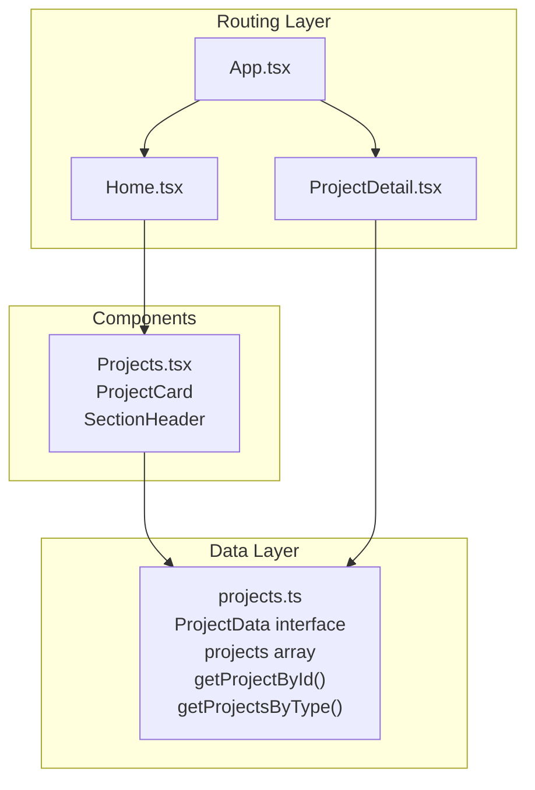
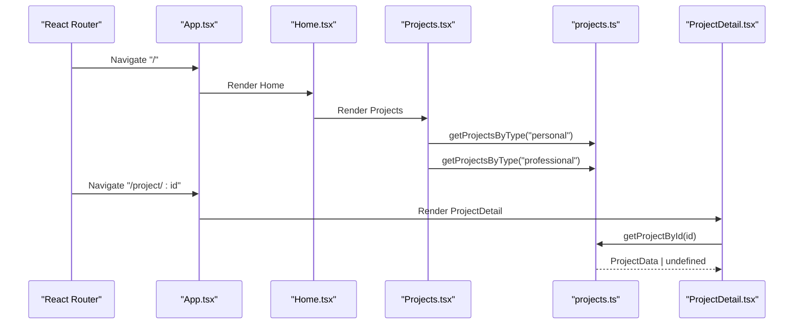
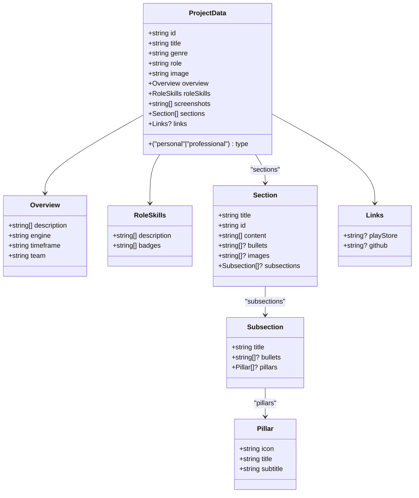
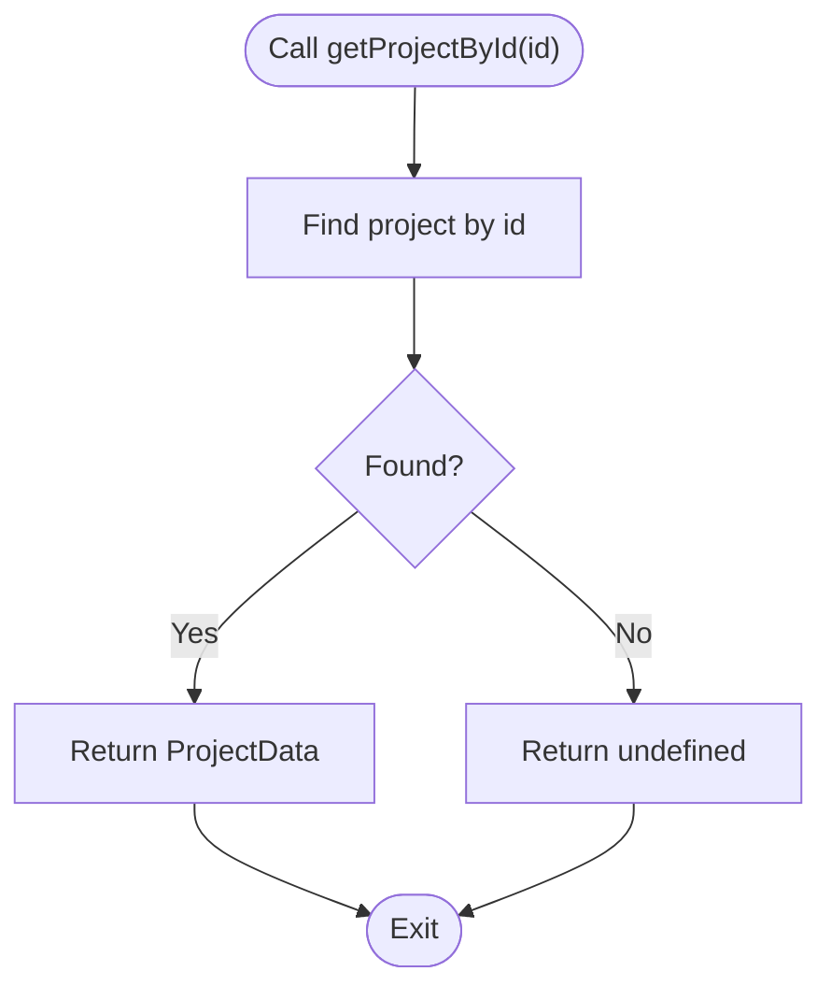
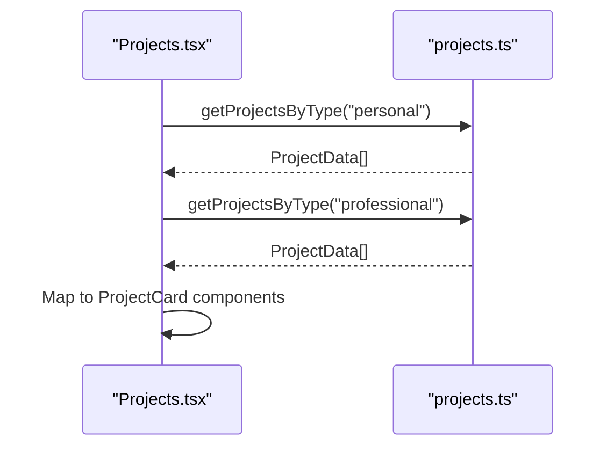
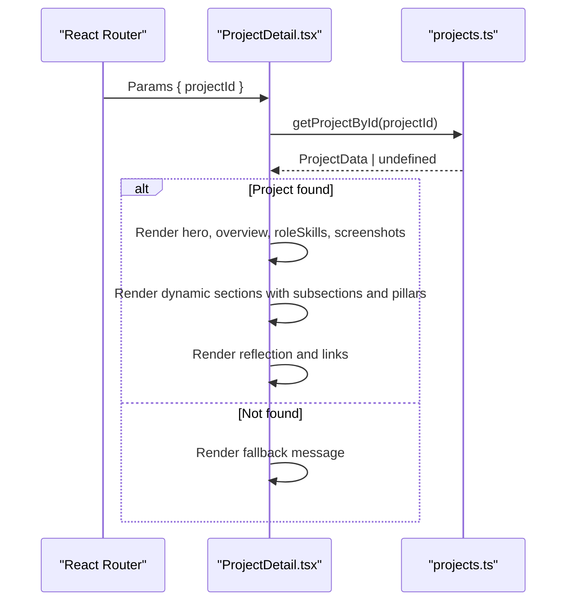
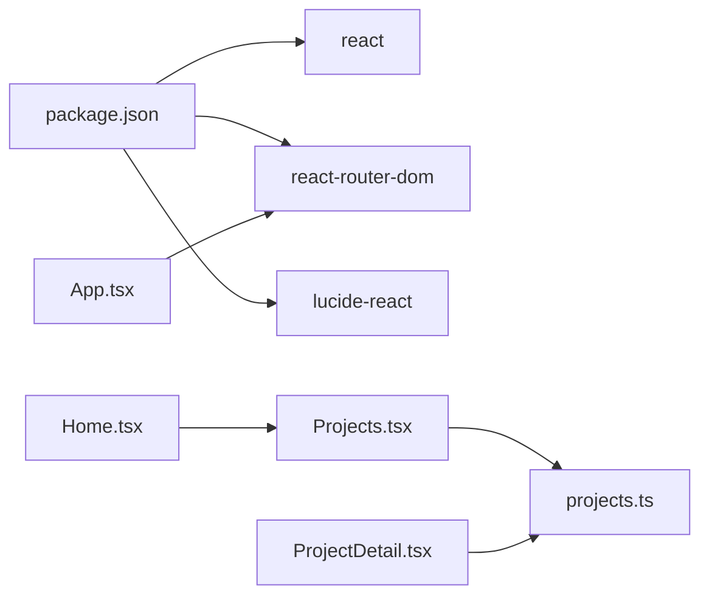

# Data Management

<cite>
**Referenced Files in This Document**
- [projects.ts](file://src/data/projects.ts)
- [App.tsx](file://src/App.tsx)
- [Home.tsx](file://src/pages/Home.tsx)
- [ProjectDetail.tsx](file://src/pages/ProjectDetail.tsx)
- [Projects.tsx](file://src/components/Projects.tsx)
- [package.json](file://package.json)
- [README.md](file://README.md)
</cite>

## Table of Contents
1. [Introduction](#introduction)
2. [Project Structure](#project-structure)
3. [Core Components](#core-components)
4. [Architecture Overview](#architecture-overview)
5. [Detailed Component Analysis](#detailed-component-analysis)
6. [Dependency Analysis](#dependency-analysis)
7. [Performance Considerations](#performance-considerations)
8. [Troubleshooting Guide](#troubleshooting-guide)
9. [Conclusion](#conclusion)
10. [Appendices](#appendices)

## Introduction
This document provides comprehensive data model documentation for the project data management system. It details the ProjectData interface structure, including project metadata, dynamic sections, links, and image asset management. It explains how project data flows through the application from centralized storage to individual components, including data fetching strategies and state management patterns. It also covers data lifecycle management, content organization best practices, and integration with the component system, along with guidelines for maintaining data consistency and updating project information.

## Project Structure
The project organizes data-centric logic under a dedicated data module and exposes typed interfaces consumed by pages and components. The routing layer integrates with the data module to render project detail pages.

**Diagram sources**
- [App.tsx](file://src/App.tsx#L17-L27)
- [Home.tsx](file://src/pages/Home.tsx#L8-L21)
- [ProjectDetail.tsx](file://src/pages/ProjectDetail.tsx#L88-L103)
- [Projects.tsx](file://src/components/Projects.tsx#L76-L107)
- [projects.ts](file://src/data/projects.ts#L43-L485)

**Section sources**
- [App.tsx](file://src/App.tsx#L1-L30)
- [Home.tsx](file://src/pages/Home.tsx#L1-L22)
- [ProjectDetail.tsx](file://src/pages/ProjectDetail.tsx#L1-L365)
- [Projects.tsx](file://src/components/Projects.tsx#L1-L108)
- [projects.ts](file://src/data/projects.ts#L1-L485)

## Core Components
This section documents the central data model and its usage across the application.

- ProjectData interface
  - Purpose: Defines the canonical shape of a project record.
  - Fields:
    - id: Unique identifier for the project.
    - title: Display title.
    - genre: Genre or category tag.
    - role: Role description.
    - type: Discriminator for personal or professional projects.
    - image: Hero image URL.
    - overview: Descriptive metadata including description paragraphs, engine, timeframe, and team.
    - roleSkills: Descriptive bullet points and skill badges.
    - screenshots: Array of screenshot image URLs.
    - sections: Array of dynamic content sections with nested subsections, optional bullets, and optional images.
    - links: Optional external resource links (Play Store and/or GitHub).

- Centralized data store
  - projects: An array of ProjectData instances.
  - getProjectById(id): Retrieves a single project by id.
  - getProjectsByType(type): Filters projects by type.

- Consumers
  - Projects component: Renders project cards for both personal and professional categories.
  - ProjectDetail page: Renders a detailed view of a selected project, including overview, role/skills, screenshots, dynamic sections, and reflection.

**Section sources**
- [projects.ts](file://src/data/projects.ts#L1-L485)
- [Projects.tsx](file://src/components/Projects.tsx#L76-L107)
- [ProjectDetail.tsx](file://src/pages/ProjectDetail.tsx#L88-L103)

## Architecture Overview
The data architecture follows a unidirectional flow:
- Data is declared centrally in the data module.
- Pages and components import typed interfaces and functions to access data.
- Routing determines which page renders and passes parameters to data accessors.

**Diagram sources**
- [App.tsx](file://src/App.tsx#L17-L27)
- [Home.tsx](file://src/pages/Home.tsx#L8-L21)
- [Projects.tsx](file://src/components/Projects.tsx#L76-L107)
- [ProjectDetail.tsx](file://src/pages/ProjectDetail.tsx#L88-L103)
- [projects.ts](file://src/data/projects.ts#L478-L484)

## Detailed Component Analysis

### ProjectData Interface
The ProjectData interface defines a strongly typed contract for project records. It supports:
- Metadata: id, title, genre, role, type, image.
- Overview: description paragraphs, engine, timeframe, team.
- Role & skills: description bullets and badges.
- Media: hero image and screenshot gallery.
- Dynamic sections: content paragraphs, optional bullets, optional images, and nested subsections with bullets and pillars.
- Links: optional external resources.

**Diagram sources**
- [projects.ts](file://src/data/projects.ts#L1-L41)

**Section sources**
- [projects.ts](file://src/data/projects.ts#L1-L41)

### Data Accessors
- getProjectById(id): Linear scan over the projects array to find a match by id.
- getProjectsByType(type): Filters projects by type.

**Diagram sources**
- [projects.ts](file://src/data/projects.ts#L478-L480)

**Section sources**
- [projects.ts](file://src/data/projects.ts#L478-L484)

### Projects Page Rendering
The Projects component:
- Fetches personal and professional projects via typed accessors.
- Renders project cards with genre, hero image, title overlay, role, and optional links.

**Diagram sources**
- [Projects.tsx](file://src/components/Projects.tsx#L76-L107)
- [projects.ts](file://src/data/projects.ts#L482-L484)

**Section sources**
- [Projects.tsx](file://src/components/Projects.tsx#L76-L107)
- [projects.ts](file://src/data/projects.ts#L482-L484)

### Project Detail Rendering
The ProjectDetail page:
- Reads the projectId from route params.
- Loads the project via getProjectById.
- Renders hero, overview, role/skills, screenshots, dynamic sections, and reflection.
- Provides navigation to external links if present.

**Diagram sources**
- [ProjectDetail.tsx](file://src/pages/ProjectDetail.tsx#L88-L103)
- [projects.ts](file://src/data/projects.ts#L478-L480)

**Section sources**
- [ProjectDetail.tsx](file://src/pages/ProjectDetail.tsx#L88-L365)
- [projects.ts](file://src/data/projects.ts#L478-L480)

## Dependency Analysis
- Runtime dependencies include React, React Router, and Lucide icons.
- The data module is a pure TypeScript module with no runtime dependencies.
- Pages and components depend on the data module for typed accessors and models.

**Diagram sources**
- [package.json](file://package.json#L12-L17)
- [App.tsx](file://src/App.tsx#L1-L30)
- [Home.tsx](file://src/pages/Home.tsx#L1-L22)
- [Projects.tsx](file://src/components/Projects.tsx#L1-L3)
- [ProjectDetail.tsx](file://src/pages/ProjectDetail.tsx#L1-L3)
- [projects.ts](file://src/data/projects.ts#L1-L485)

**Section sources**
- [package.json](file://package.json#L1-L35)
- [App.tsx](file://src/App.tsx#L1-L30)
- [Home.tsx](file://src/pages/Home.tsx#L1-L22)
- [Projects.tsx](file://src/components/Projects.tsx#L1-L3)
- [ProjectDetail.tsx](file://src/pages/ProjectDetail.tsx#L1-L3)
- [projects.ts](file://src/data/projects.ts#L1-L485)

## Performance Considerations
- Data access patterns:
  - getProjectById performs a linear scan over the projects array. For small to medium datasets, this is acceptable. For larger datasets, consider indexing by id (e.g., a Map) to achieve O(1) lookups.
  - getProjectsByType filters the array; this is O(n) and suitable for typical portfolio sizes.
- Rendering:
  - Project cards use lazy loading attributes on images to improve initial load performance.
  - Dynamic sections are rendered conditionally based on presence of optional fields, minimizing unnecessary DOM nodes.
- Routing:
  - The app scrolls to top on route changes to ensure a clean user experience.

[No sources needed since this section provides general guidance]

## Troubleshooting Guide
- Project not found:
  - The ProjectDetail page handles missing projects gracefully by rendering a fallback message and a link back to the home page.
- Data shape mismatches:
  - Since ProjectData is strictly typed, TypeScript will flag mismatches during compilation. Validate arrays and nested objects against the interface definition.
- External links:
  - Ensure links are optional and present only when applicable to avoid rendering empty link elements.

**Section sources**
- [ProjectDetail.tsx](file://src/pages/ProjectDetail.tsx#L92-L103)

## Conclusion
The data management system centers around a single, strongly typed ProjectData interface and a small set of accessors. Pages and components consume this data through typed imports, enabling predictable rendering and easy maintenance. The current implementation is straightforward and well-suited for a portfolio site. As the dataset grows, consider optimizing lookups and adopting a more scalable data strategy while preserving the existing interface contracts.

[No sources needed since this section summarizes without analyzing specific files]

## Appendices

### Data Model Reference
- ProjectData
  - id: string
  - title: string
  - genre: string
  - role: string
  - type: "personal" | "professional"
  - image: string
  - overview: { description: string[]; engine: string; timeframe: string; team: string }
  - roleSkills: { description: string[]; badges: string[] }
  - screenshots: string[]
  - sections: Array of { title: string; id: string; content: string[]; bullets?: string[]; images?: string[]; subsections?: Array of { title: string; bullets?: string[]; pillars?: Array of { icon: string; title: string; subtitle: string } } }
  - links?: { playStore?: string; github?: string }

**Section sources**
- [projects.ts](file://src/data/projects.ts#L1-L41)

### Adding a New Project
Steps:
1. Extend the projects array with a new ProjectData object.
2. Ensure all required fields are present and optional fields are omitted if unused.
3. Add or reuse image assets in the public directory and update image and screenshots URLs.
4. Reference the new project’s id in routes or navigation as needed.

Guidelines:
- Keep id unique and descriptive.
- Use consistent casing and spacing for readability.
- Align sections with the intended narrative flow.

**Section sources**
- [projects.ts](file://src/data/projects.ts#L43-L476)

### Modifying Existing Data Structures
- To add a new field to ProjectData:
  - Update the interface definition.
  - Provide defaults or handle absence in consumers.
  - Update all existing project entries accordingly.
- To modify sections:
  - Add subsections with bullets or pillars as needed.
  - Ensure subsection ids are unique within a project.

Validation tips:
- Use TypeScript to catch missing or extra fields.
- Verify arrays and nested objects align with the interface.

**Section sources**
- [projects.ts](file://src/data/projects.ts#L1-L41)
- [ProjectDetail.tsx](file://src/pages/ProjectDetail.tsx#L222-L291)

### Extending Content Sections
- Add new sections to the sections array with unique ids.
- Include content paragraphs and optional bullets or images.
- For subsections, include bullets or pillars to highlight key points.

Best practices:
- Keep content concise and scannable.
- Use consistent numbering or naming for ids.
- Group related content under logical subsections.

**Section sources**
- [projects.ts](file://src/data/projects.ts#L24-L35)
- [ProjectDetail.tsx](file://src/pages/ProjectDetail.tsx#L222-L291)

### Data Lifecycle Management
- Creation: Add new entries to the projects array.
- Consumption: Pages and components import and use typed accessors.
- Updates: Modify existing entries or add new ones; keep ids stable for deep links.
- Deletion: Remove entries from the projects array; remove associated assets.

Consistency:
- Maintain consistent types for all fields.
- Keep image URLs valid and accessible.
- Ensure unique ids across the dataset.

**Section sources**
- [projects.ts](file://src/data/projects.ts#L43-L485)
- [ProjectDetail.tsx](file://src/pages/ProjectDetail.tsx#L88-L103)

### Integration with the Component System
- Projects.tsx consumes getProjectsByType to render project cards.
- ProjectDetail.tsx consumes getProjectById to render detailed views.
- Both rely on the ProjectData interface to ensure type safety.

**Section sources**
- [Projects.tsx](file://src/components/Projects.tsx#L76-L107)
- [ProjectDetail.tsx](file://src/pages/ProjectDetail.tsx#L88-L103)
- [projects.ts](file://src/data/projects.ts#L478-L484)