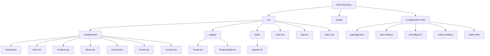

# Getting Started

<cite>
**Referenced Files in This Document**
- [package.json](file://package.json)
- [README.md](file://README.md)
- [vite.config.ts](file://vite.config.ts)
- [tsconfig.json](file://tsconfig.json)
- [eslint.config.js](file://eslint.config.js)
- [index.html](file://index.html)
- [src/main.tsx](file://src/main.tsx)
- [src/App.tsx](file://src/App.tsx)
- [src/pages/Home.tsx](file://src/pages/Home.tsx)
- [src/pages/ProjectDetail.tsx](file://src/pages/ProjectDetail.tsx)
- [src/data/projects.ts](file://src/data/projects.ts)
- [src/index.css](file://src/index.css)
</cite>

## Table of Contents
1. [Introduction](#introduction)
2. [Prerequisites](#prerequisites)
3. [Installation](#installation)
4. [Development Setup](#development-setup)
5. [Build and Preview](#build-and-preview)
6. [Project Structure Overview](#project-structure-overview)
7. [Key Technologies](#key-technologies)
8. [Troubleshooting Guide](#troubleshooting-guide)
9. [Next Steps](#next-steps)

## Introduction
Welcome to the Fahim Portfolio Next.js project! This is a modern React portfolio built with TypeScript, Vite, Tailwind CSS, and React Router. The project showcases game development projects with interactive navigation, responsive design, and dynamic content rendering. Whether you're new to React/Vite development or an experienced developer, this guide will help you set up and run the development environment quickly.

## Prerequisites
Before you begin, ensure you have the following installed on your development machine:

- **Node.js**: Version 18 or higher (required for optimal compatibility with Vite and modern tooling)
- **Package Manager**: Either npm (comes with Node.js) or Yarn (recommended for faster dependency resolution)
- **Command Line Interface**: Basic familiarity with terminal commands (Windows PowerShell, macOS Terminal, or Linux shell)
- **Text Editor**: VS Code recommended with TypeScript and ESLint extensions for the best development experience

**Section sources**
- [package.json](file://package.json#L1-L35)
- [README.md](file://README.md#L1-L74)

## Installation
Follow these steps to set up the development environment:

1. **Clone the Repository**
   ```bash
   git clone <repository-url>
   cd fahim-portfolio-nextjs
   ```

2. **Install Dependencies**
   Choose one of the following package managers:
   
   Using npm:
   ```bash
   npm install
   ```
   
   Using Yarn:
   ```bash
   yarn install
   ```

3. **Verify Installation**
   After installation completes, verify that all dependencies are properly installed by checking the `node_modules` folder exists and the `package-lock.json` or `yarn.lock` file is present.

**Section sources**
- [package.json](file://package.json#L1-L35)

## Development Setup
Start the local development server with hot module replacement (HMR):

```bash
npm run dev
```

Or with Yarn:
```bash
yarn dev
```

**What happens when you run the development server:**
- Vite starts a local development server on port 5173 (by default)
- TypeScript compilation occurs in memory for fast rebuilds
- React Fast Refresh enables instant UI updates without losing component state
- Tailwind CSS is processed automatically for styling
- ESLint runs for code quality checks during development

**Section sources**
- [package.json](file://package.json#L6-L11)
- [vite.config.ts](file://vite.config.ts#L1-L9)
- [src/main.tsx](file://src/main.tsx#L1-L11)
- [src/App.tsx](file://src/App.tsx#L1-L30)

## Build and Preview
Once your development work is complete, build the optimized production bundle:

```bash
npm run build
```

Or with Yarn:
```bash
yarn build
```

**Build Process Details:**
- TypeScript compiler runs first (`tsc -b`)
- Vite bundles and optimizes all assets for production
- Static assets are generated in the `dist` folder
- Code splitting and minification are applied automatically

Preview the production build locally:
```bash
npm run preview
```

Or with Yarn:
```bash
yarn preview
```

**Section sources**
- [package.json](file://package.json#L6-L11)
- [vite.config.ts](file://vite.config.ts#L1-L9)

## Project Structure Overview
The project follows a clean, organized structure optimized for React development:



**Diagram sources**
- [package.json](file://package.json#L1-L35)
- [vite.config.ts](file://vite.config.ts#L1-L9)
- [tsconfig.json](file://tsconfig.json#L1-L8)
- [eslint.config.js](file://eslint.config.js#L1-L24)
- [index.html](file://index.html#L1-L24)
- [src/main.tsx](file://src/main.tsx#L1-L11)
- [src/App.tsx](file://src/App.tsx#L1-L30)

**Section sources**
- [package.json](file://package.json#L1-L35)
- [vite.config.ts](file://vite.config.ts#L1-L9)
- [tsconfig.json](file://tsconfig.json#L1-L8)
- [eslint.config.js](file://eslint.config.js#L1-L24)
- [index.html](file://index.html#L1-L24)

## Key Technologies
This project leverages modern web development technologies:

### React 19
- Component-based architecture with hooks
- Concurrent features for improved performance
- Strict Mode enabled for better error detection

### TypeScript
- Type safety across the entire codebase
- Enhanced developer experience with IntelliSense
- Automatic type inference and compile-time error checking

### Vite
- Lightning-fast cold starts and HMR
- Optimized build pipeline
- Excellent plugin ecosystem

### Tailwind CSS v4
- Utility-first styling approach
- Custom theme variables for consistent design
- Responsive design system built-in

### React Router DOM
- Declarative routing for single-page application navigation
- Dynamic route parameters for project detail pages
- Client-side navigation with scroll restoration

**Section sources**
- [package.json](file://package.json#L12-L33)
- [vite.config.ts](file://vite.config.ts#L1-L9)
- [src/index.css](file://src/index.css#L1-L135)
- [src/App.tsx](file://src/App.tsx#L1-L30)

## Troubleshooting Guide

### Common Installation Issues

**Issue: Node.js version compatibility**
- **Problem**: Error messages about unsupported Node.js version
- **Solution**: Install Node.js 18 or higher from [nodejs.org](https://nodejs.org/)
- **Verification**: Run `node --version` and `npm --version` in terminal

**Issue: Permission errors during installation**
- **Problem**: "EACCES: permission denied" errors
- **Solution**: Use `sudo` prefix or configure npm prefix properly
- **Alternative**: Set up npm with proper permissions using `npm config set prefix`

**Issue: Package manager conflicts**
- **Problem**: Mixed npm and Yarn lock files causing conflicts
- **Solution**: Remove one lock file and reinstall dependencies consistently
- **Recommendation**: Choose either npm or Yarn for the entire project

### Development Server Issues

**Issue: Port 5173 already in use**
- **Problem**: "Port 5173 is already in use" error message
- **Solution**: Change the port in Vite configuration or kill the existing process
- **Temporary fix**: Use `lsof -ti:5173 | xargs kill -9` (macOS/Linux)

**Issue: Hot Module Replacement not working**
- **Problem**: Changes not reflecting immediately in browser
- **Solution**: Clear browser cache or disable extensions temporarily
- **Debug**: Check browser console for WebSocket connection errors

**Issue: TypeScript compilation errors**
- **Problem**: Red squiggly lines or build failures
- **Solution**: Verify TypeScript configuration files are intact
- **Check**: Ensure all `.ts` and `.tsx` files follow TypeScript syntax

### Build and Preview Issues

**Issue: Build fails with TypeScript errors**
- **Problem**: Compilation errors preventing production build
- **Solution**: Fix all TypeScript errors before building
- **Tip**: Run `npm run lint` to catch potential issues early

**Issue: Preview server not serving static assets**
- **Problem**: Images or CSS not loading in preview mode
- **Solution**: Verify asset paths are correct and files exist
- **Check**: Ensure public assets are placed in the correct directory structure

**Section sources**
- [package.json](file://package.json#L6-L11)
- [vite.config.ts](file://vite.config.ts#L1-L9)
- [eslint.config.js](file://eslint.config.js#L1-L24)

## Next Steps
After successfully setting up the development environment:

1. **Explore the Codebase**
   - Review the component structure in `src/components/`
   - Examine the routing setup in `src/App.tsx`
   - Study the project data structure in `src/data/projects.ts`

2. **Customize Content**
   - Update project information in `src/data/projects.ts`
   - Modify the color scheme in `src/index.css`
   - Add your own components to `src/components/`

3. **Enhance Functionality**
   - Implement additional routes in `src/App.tsx`
   - Add new pages in `src/pages/`
   - Extend the design system with custom Tailwind utilities

4. **Deployment Preparation**
   - Test the production build locally with `npm run preview`
   - Configure environment variables if needed
   - Set up continuous deployment with your preferred platform

**Section sources**
- [src/data/projects.ts](file://src/data/projects.ts#L1-L485)
- [src/index.css](file://src/index.css#L1-L135)
- [src/App.tsx](file://src/App.tsx#L1-L30)
- [src/pages/Home.tsx](file://src/pages/Home.tsx#L1-L22)
- [src/pages/ProjectDetail.tsx](file://src/pages/ProjectDetail.tsx#L1-L365)