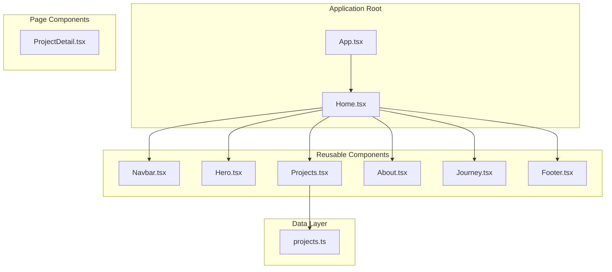
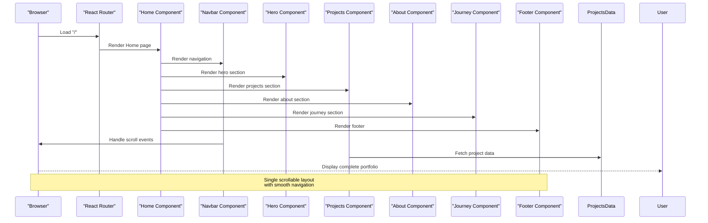
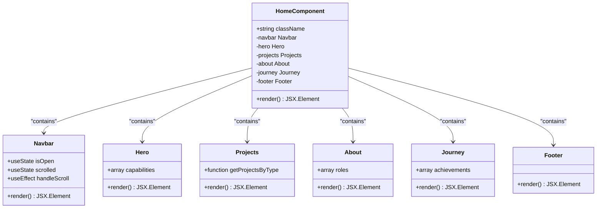
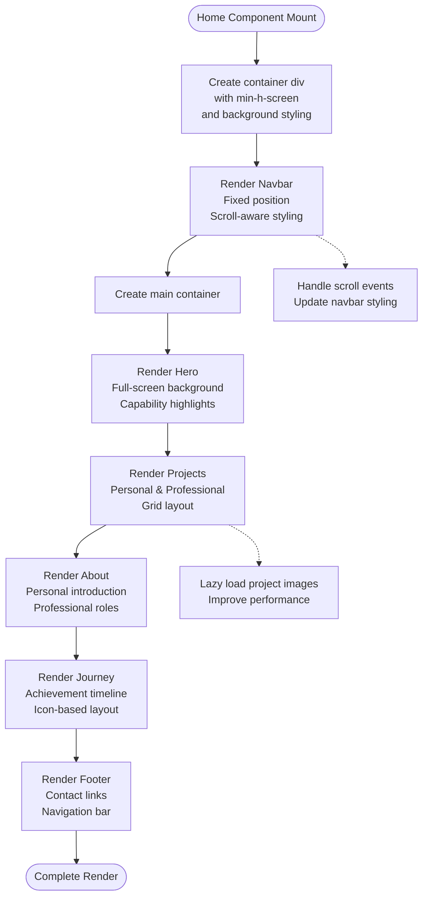
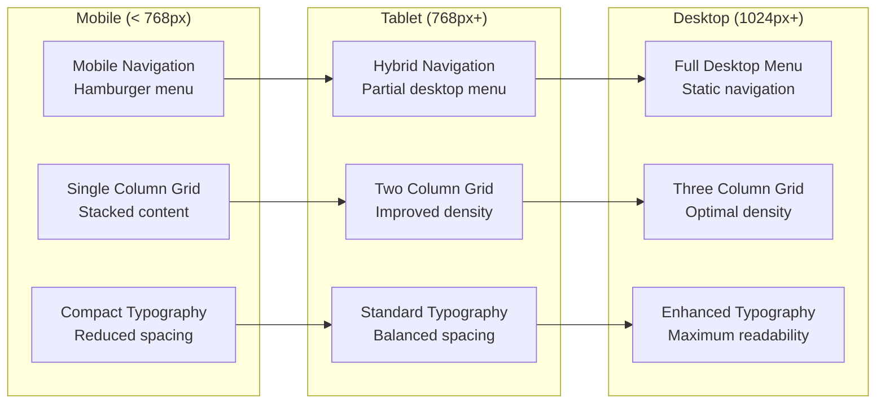
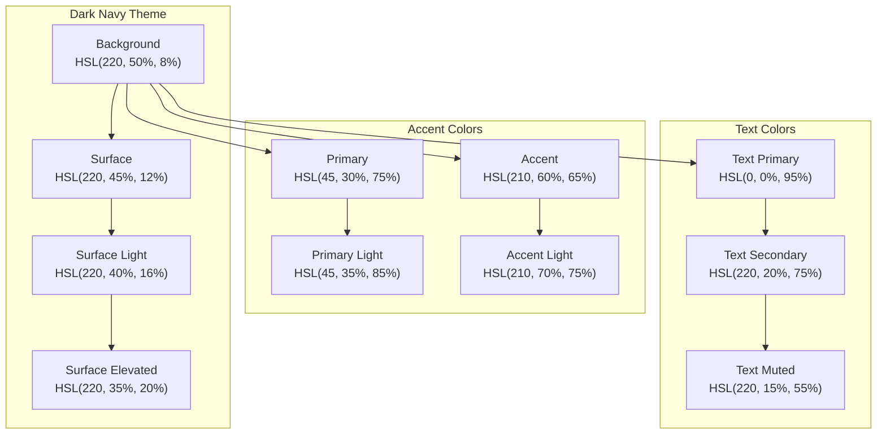
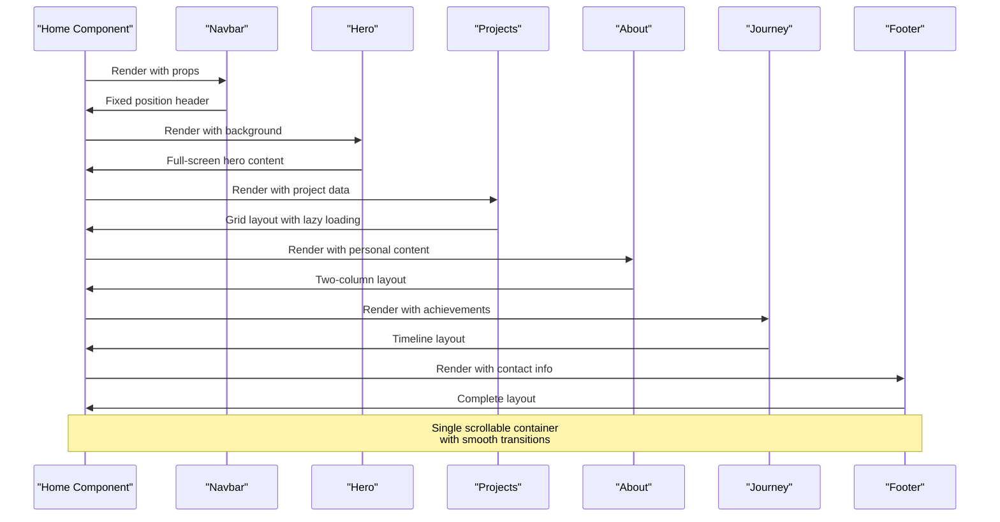
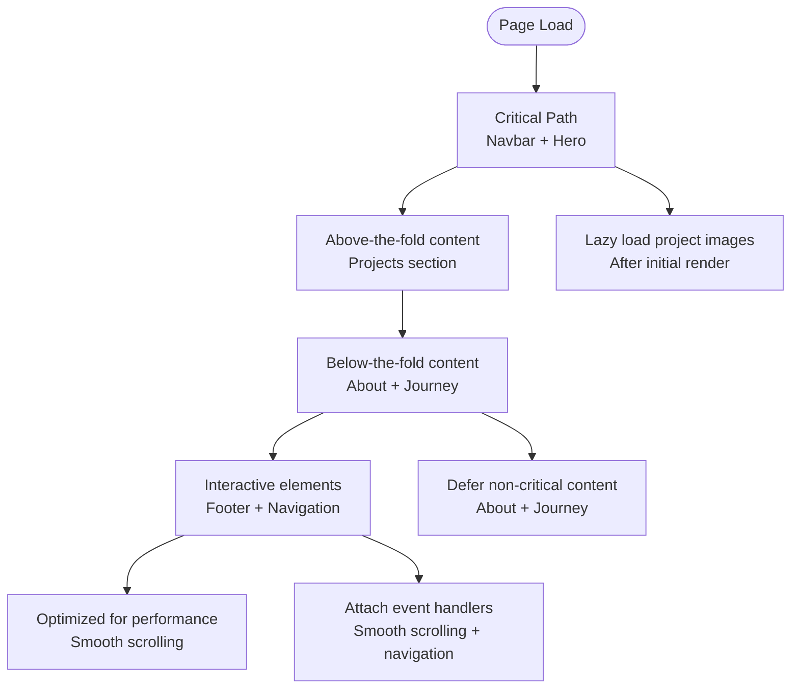
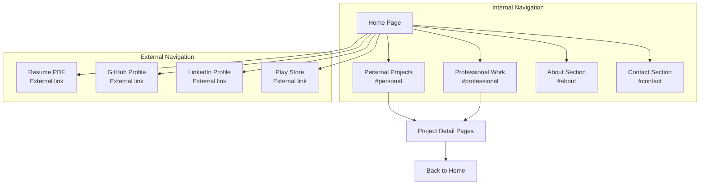

# Home Page Component

<cite>
**Referenced Files in This Document**
- [Home.tsx](file://src/pages/Home.tsx)
- [Navbar.tsx](file://src/components/Navbar.tsx)
- [Hero.tsx](file://src/components/Hero.tsx)
- [Projects.tsx](file://src/components/Projects.tsx)
- [About.tsx](file://src/components/About.tsx)
- [Journey.tsx](file://src/components/Journey.tsx)
- [Footer.tsx](file://src/components/Footer.tsx)
- [projects.ts](file://src/data/projects.ts)
- [App.tsx](file://src/App.tsx)
- [index.css](file://src/index.css)
- [App.css](file://src/App.css)
</cite>

## Table of Contents
1. [Introduction](#introduction)
2. [Project Structure](#project-structure)
3. [Core Components](#core-components)
4. [Architecture Overview](#architecture-overview)
5. [Detailed Component Analysis](#detailed-component-analysis)
6. [Responsive Design Implementation](#responsive-design-implementation)
7. [Background Styling and Visual Hierarchy](#background-styling-and-visual-hierarchy)
8. [Component Composition Pattern](#component-composition-pattern)
9. [Performance Considerations](#performance-considerations)
10. [Navigation and Content Delivery](#navigation-and-content-delivery)
11. [Troubleshooting Guide](#troubleshooting-guide)
12. [Conclusion](#conclusion)

## Introduction

The Home page component serves as the primary landing page and navigation hub for the portfolio application. It orchestrates all portfolio sections in a single scrollable layout, providing visitors with a comprehensive overview of the developer's work, skills, and professional journey. This component acts as a container that integrates multiple specialized components while maintaining visual coherence and responsive design principles.

The Home page follows a modern single-page application architecture where the Home component serves as the main entry point, coordinating navigation, hero content, project showcases, about section, professional journey, and footer components. The design emphasizes clean typography, strategic spacing, and a cohesive dark-themed aesthetic with gold accents.

## Project Structure

The portfolio application follows a component-based architecture with clear separation of concerns:

**Diagram sources**
- [App.tsx](file://src/App.tsx#L1-L30)
- [Home.tsx](file://src/pages/Home.tsx#L1-L22)

**Section sources**
- [App.tsx](file://src/App.tsx#L1-L30)
- [Home.tsx](file://src/pages/Home.tsx#L1-L22)

## Core Components

The Home page component orchestrates six primary sections, each serving a distinct purpose in the portfolio presentation:

### Component Composition Overview

The Home component implements a sequential composition pattern where components are rendered in a specific order to guide user experience:

1. **Navbar** - Fixed position navigation with scroll-aware styling
2. **Hero** - Full-screen introduction with capability highlights
3. **Projects** - Dual-section showcase (Personal & Professional)
4. **About** - Personal introduction and professional roles
5. **Journey** - Professional achievements timeline
6. **Footer** - Contact information and navigation links

### Visual Hierarchy and Spacing

The component establishes a clear visual hierarchy through strategic use of:
- Section padding using CSS custom properties
- Background color variations for content separation
- Typography scaling from hero to body text
- Grid layouts for content organization

**Section sources**
- [Home.tsx](file://src/pages/Home.tsx#L8-L21)

## Architecture Overview

The Home page component operates within a broader application architecture that emphasizes component reusability and clean separation of concerns:

**Diagram sources**
- [App.tsx](file://src/App.tsx#L17-L27)
- [Home.tsx](file://src/pages/Home.tsx#L8-L21)

**Section sources**
- [App.tsx](file://src/App.tsx#L1-L30)
- [Home.tsx](file://src/pages/Home.tsx#L1-L22)

## Detailed Component Analysis

### Home Container Component

The Home component serves as the primary container that orchestrates all portfolio sections:

**Diagram sources**
- [Home.tsx](file://src/pages/Home.tsx#L8-L21)
- [Navbar.tsx](file://src/components/Navbar.tsx#L13-L112)
- [Hero.tsx](file://src/components/Hero.tsx#L21-L67)
- [Projects.tsx](file://src/components/Projects.tsx#L76-L107)
- [About.tsx](file://src/components/About.tsx#L10-L102)
- [Journey.tsx](file://src/components/Journey.tsx#L14-L39)
- [Footer.tsx](file://src/components/Footer.tsx#L3-L81)

### Component Rendering Flow

The Home component implements a sequential rendering pattern that ensures proper content flow:

**Diagram sources**
- [Home.tsx](file://src/pages/Home.tsx#L8-L21)
- [Navbar.tsx](file://src/components/Navbar.tsx#L17-L23)
- [Projects.tsx](file://src/components/Projects.tsx#L18-L22)

**Section sources**
- [Home.tsx](file://src/pages/Home.tsx#L8-L21)

### Responsive Design Implementation

The Home component implements comprehensive responsive design through Tailwind CSS utility classes and CSS custom properties:

#### Breakpoint Strategy
- **Mobile-first approach** with progressive enhancement
- **Tablet breakpoints** at md: (768px)
- **Desktop breakpoints** at lg: (1024px) and xl: (1280px)
- **Flexible grid layouts** using CSS Grid and Flexbox

#### Layout Adaptations
- Hero section maintains 60vh minimum height across devices
- Project grids adapt from 1 column (mobile) to 3 columns (desktop)
- Typography scales appropriately using clamp() functions
- Navigation transforms from mobile hamburger to desktop menu

**Section sources**
- [Hero.tsx](file://src/components/Hero.tsx#L25-L47)
- [Projects.tsx](file://src/components/Projects.tsx#L86-L104)
- [index.css](file://src/index.css#L41-L41)

## Responsive Design Implementation

The portfolio implements a sophisticated responsive design system that adapts seamlessly across device sizes:

### Breakpoint-Specific Behaviors

**Diagram sources**
- [Navbar.tsx](file://src/components/Navbar.tsx#L42-L64)
- [Projects.tsx](file://src/components/Projects.tsx#L86-L104)
- [Hero.tsx](file://src/components/Hero.tsx#L52-L63)

### Adaptive Navigation System

The Navbar component demonstrates sophisticated responsive behavior:

- **Mobile**: Hamburger menu with slide-down animation
- **Tablet**: Hybrid menu with partial desktop elements
- **Desktop**: Full navigation bar with hover effects
- **Scroll-aware**: Changes styling based on viewport position

**Section sources**
- [Navbar.tsx](file://src/components/Navbar.tsx#L13-L112)

## Background Styling and Visual Hierarchy

The Home page employs a carefully orchestrated color scheme and visual hierarchy that creates depth and maintains accessibility:

### Color Palette Architecture

**Diagram sources**
- [index.css](file://src/index.css#L3-L29)

### Visual Hierarchy Implementation

The component establishes clear visual hierarchy through:

- **Typography scaling**: Hero headings scale from 5xl to 8xl on larger screens
- **Color contrast**: Primary colors for emphasis against neutral backgrounds
- **Spacing system**: Consistent padding using CSS custom properties
- **Layering**: Strategic use of z-index for fixed navigation

**Section sources**
- [index.css](file://src/index.css#L3-L51)
- [Hero.tsx](file://src/components/Hero.tsx#L37-L45)

## Component Composition Pattern

The Home page implements a sophisticated composition pattern that balances functionality with performance:

### Sequential Composition Flow

**Diagram sources**
- [Home.tsx](file://src/pages/Home.tsx#L8-L21)

### Data Flow Integration

The Home component coordinates with the data layer through:

- **Project data fetching** via `getProjectsByType()` function
- **TypeScript interfaces** for type-safe data handling
- **Component prop passing** for consistent data flow
- **Error handling** for missing project data

**Section sources**
- [Home.tsx](file://src/pages/Home.tsx#L1-L6)
- [projects.ts](file://src/data/projects.ts#L482-L484)

## Performance Considerations

The Home page implements several performance optimization strategies:

### Initial Load Optimization

- **Lazy loading**: Project images use `loading="lazy"` attribute
- **Code splitting**: Route-based code splitting through React Router
- **Minimal dependencies**: Only essential libraries included
- **Efficient rendering**: No unnecessary re-renders through proper component structure

### Rendering Order Strategy

### Memory Management

- **Event cleanup**: Proper cleanup of scroll event listeners in Navbar
- **Component lifecycle**: Efficient mounting/unmounting of components
- **State management**: Minimal state updates to prevent unnecessary renders

**Section sources**
- [Navbar.tsx](file://src/components/Navbar.tsx#L17-L23)
- [Projects.tsx](file://src/components/Projects.tsx#L18-L22)

## Navigation and Content Delivery

The Home page serves as the primary navigation hub and content delivery mechanism:

### Internal Navigation System

**Diagram sources**
- [Navbar.tsx](file://src/components/Navbar.tsx#L5-L11)
- [Footer.tsx](file://src/components/Footer.tsx#L62-L75)

### Content Delivery Patterns

The Home page implements several content delivery strategies:

- **Progressive disclosure**: Content revealed as user scrolls
- **Contextual navigation**: Clear pathways between sections
- **Cross-linking**: Seamless navigation between related content
- **Accessibility**: Keyboard navigation and screen reader support

**Section sources**
- [Navbar.tsx](file://src/components/Navbar.tsx#L5-L11)
- [Footer.tsx](file://src/components/Footer.tsx#L62-L75)

## Troubleshooting Guide

Common issues and solutions for the Home page component:

### Layout Issues

**Problem**: Content overlaps with fixed navigation
**Solution**: Ensure proper z-index stacking and fixed positioning
- Verify `fixed top-0 left-0 right-0` classes on Navbar
- Check `z-50` class for proper layering
- Confirm `min-h-screen` on container div

**Problem**: Images not loading properly
**Solution**: Implement lazy loading and error handling
- Use `loading="lazy"` attribute on images
- Add fallback alt text for accessibility
- Implement error boundaries for failed loads

### Performance Issues

**Problem**: Slow initial page load
**Solution**: Optimize resource loading
- Minimize image sizes and use appropriate formats
- Implement code splitting for non-critical components
- Use browser caching strategies

**Problem**: Poor scroll performance
**Solution**: Optimize scroll-related components
- Debounce scroll event handlers
- Use CSS transforms instead of layout-affecting properties
- Implement virtualization for large lists

### Responsive Design Problems

**Problem**: Content misalignment on mobile devices
**Solution**: Test across various viewport sizes
- Use mobile-first CSS approach
- Implement proper viewport meta tags
- Test with real device testing tools

**Section sources**
- [Home.tsx](file://src/pages/Home.tsx#L10-L10)
- [Navbar.tsx](file://src/components/Navbar.tsx#L26-L30)

## Conclusion

The Home page component successfully orchestrates a comprehensive portfolio presentation through its sophisticated component composition pattern. The implementation demonstrates excellent architectural decisions including:

- **Clean separation of concerns** with dedicated components for each portfolio section
- **Responsive design** that adapts seamlessly across all device sizes
- **Performance optimization** through lazy loading and efficient rendering
- **Accessibility compliance** with proper semantic markup and keyboard navigation
- **Maintainable code structure** using TypeScript interfaces and modular components

The component serves as both a functional navigation hub and a visually compelling showcase of the developer's work. Its single-scroll design creates an engaging user experience while maintaining clear content hierarchy and professional presentation standards.

The implementation provides a solid foundation for portfolio websites, offering scalability for additional sections and content while maintaining optimal performance characteristics. The component architecture supports easy maintenance and extension for future portfolio additions.