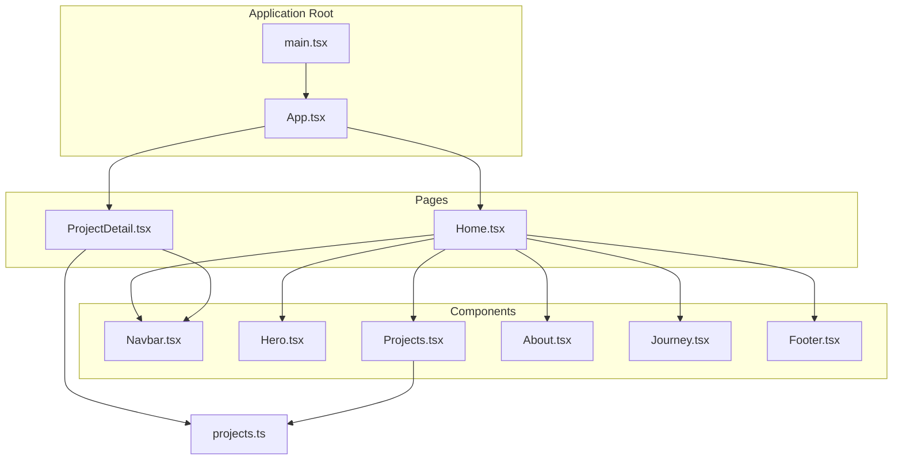
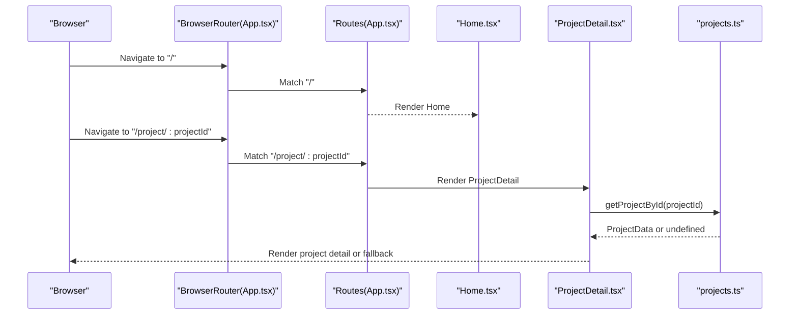
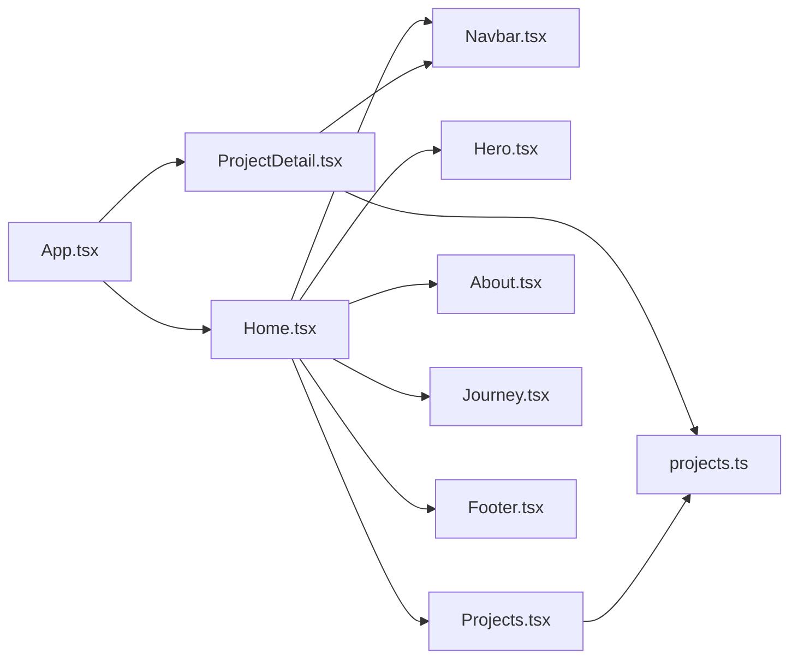

# Page Components

<cite>
**Referenced Files in This Document**
- [Home.tsx](file://src/pages/Home.tsx)
- [ProjectDetail.tsx](file://src/pages/ProjectDetail.tsx)
- [App.tsx](file://src/App.tsx)
- [projects.ts](file://src/data/projects.ts)
- [Navbar.tsx](file://src/components/Navbar.tsx)
- [Hero.tsx](file://src/components/Hero.tsx)
- [Projects.tsx](file://src/components/Projects.tsx)
- [About.tsx](file://src/components/About.tsx)
- [Journey.tsx](file://src/components/Journey.tsx)
- [Footer.tsx](file://src/components/Footer.tsx)
- [main.tsx](file://src/main.tsx)
- [package.json](file://package.json)
</cite>

## Table of Contents
1. [Introduction](#introduction)
2. [Project Structure](#project-structure)
3. [Core Components](#core-components)
4. [Architecture Overview](#architecture-overview)
5. [Detailed Component Analysis](#detailed-component-analysis)
6. [Dependency Analysis](#dependency-analysis)
7. [Performance Considerations](#performance-considerations)
8. [Troubleshooting Guide](#troubleshooting-guide)
9. [Conclusion](#conclusion)

## Introduction
This document focuses on the top-level page components of the portfolio application. It explains the Home page as the main landing page with a single scrollable layout and the ProjectDetail page for displaying individual project information. It covers navigation integration, responsive design patterns, content organization, page-level state management, component composition, routing integration, navigation examples, content loading strategies, user interaction patterns, and performance considerations for page transitions and data fetching.

## Project Structure
The application is structured around two primary pages:
- Home page: A single-scroll landing page composed of multiple sections.
- ProjectDetail page: A dedicated page for a single project with dynamic content rendering and navigation aids.

Routing is handled via react-router-dom with automatic scroll-to-top on route changes. The Home page composes reusable components for navigation, hero, projects, about, journey, and footer. The ProjectDetail page composes a set of helper components for layout, navigation, and content rendering.

**Diagram sources**
- [main.tsx](file://src/main.tsx#L1-L11)
- [App.tsx](file://src/App.tsx#L1-L30)
- [Home.tsx](file://src/pages/Home.tsx#L1-L22)
- [ProjectDetail.tsx](file://src/pages/ProjectDetail.tsx#L1-L365)
- [projects.ts](file://src/data/projects.ts#L1-L485)
- [Navbar.tsx](file://src/components/Navbar.tsx#L1-L112)
- [Hero.tsx](file://src/components/Hero.tsx#L1-L68)
- [Projects.tsx](file://src/components/Projects.tsx#L1-L108)
- [About.tsx](file://src/components/About.tsx#L1-L103)
- [Journey.tsx](file://src/components/Journey.tsx#L1-L41)
- [Footer.tsx](file://src/components/Footer.tsx#L1-L82)

**Section sources**
- [main.tsx](file://src/main.tsx#L1-L11)
- [App.tsx](file://src/App.tsx#L1-L30)

## Core Components
- Home page: Single scrollable page that composes Navbar, Hero, Projects, About, Journey, and Footer. It uses Tailwind classes for responsive layout and spacing.
- ProjectDetail page: Renders a single project’s detailed content, including overview, role & skills, screenshots gallery, dynamic sections, and reflection. It integrates quick navigation and footer navigation.

Key responsibilities:
- Home page: Orchestrates section composition and maintains a cohesive single-page experience.
- ProjectDetail page: Handles route parameter extraction, project data lookup, and dynamic rendering of project sections.

**Section sources**
- [Home.tsx](file://src/pages/Home.tsx#L1-L22)
- [ProjectDetail.tsx](file://src/pages/ProjectDetail.tsx#L88-L103)

## Architecture Overview
The routing system uses react-router-dom with BrowserRouter and Routes. A ScrollToTop component ensures the viewport scrolls to the top on route changes. The Home page renders all sections in order, while ProjectDetail renders a single project’s content based on the route parameter.

**Diagram sources**
- [App.tsx](file://src/App.tsx#L17-L27)
- [ProjectDetail.tsx](file://src/pages/ProjectDetail.tsx#L88-L103)
- [projects.ts](file://src/data/projects.ts#L478-L480)

## Detailed Component Analysis

### Home Page Component
The Home page is a single scrollable layout composed of:
- Navbar: Fixed header with desktop and mobile navigation, scroll-aware styling, and responsive behavior.
- Hero: Full-height hero with background image and capability highlights.
- Projects: Two project sections (Personal and Professional) rendered via Projects component.
- About: Personal introduction and social links.
- Journey: Timeline-style achievements.
- Footer: Contact information and internal navigation.

Responsive design patterns:
- Mobile-first with hidden mobile menus that toggle open/closed state.
- Grid layouts adapt from single column to multiple columns based on breakpoints.
- Lazy loading for images in project cards.

Navigation integration:
- Internal anchor links in Navbar and Footer navigate to sections within the Home page.
- Project cards link to ProjectDetail with route parameters.

Page-level state management:
- Navbar manages isOpen and scrolled state using useState and useEffect.
- No page-level state is maintained in Home itself; it composes stateful components.

Component composition:
- Home composes all major sections as separate components for modularity and reusability.

Practical examples:
- Navigating from Navbar to About or Contact sections.
- Clicking a project card to view ProjectDetail.
- Using Footer navigation to jump to sections.

**Section sources**
- [Home.tsx](file://src/pages/Home.tsx#L1-L22)
- [Navbar.tsx](file://src/components/Navbar.tsx#L13-L112)
- [Hero.tsx](file://src/components/Hero.tsx#L21-L68)
- [Projects.tsx](file://src/components/Projects.tsx#L76-L108)
- [About.tsx](file://src/components/About.tsx#L10-L103)
- [Journey.tsx](file://src/components/Journey.tsx#L14-L41)
- [Footer.tsx](file://src/components/Footer.tsx#L3-L82)

### ProjectDetail Page Component
The ProjectDetail page displays a single project’s information with:
- Route parameter handling: Extracts projectId from URL and loads the matching project.
- Fallback: Displays a “not found” message with a link back to Home.
- Hero section: Background image overlay, back link, genre tag, title, and role.
- Overview & Role: Two-column layout with project description, engine, timeframe, team, role description, and skill badges.
- Screenshots gallery: Responsive grid of images.
- Dynamic sections: Iterates over project.sections to render content, bullets, subsections, and images.
- Reflection: Final section with back-to-list link and optional external links.
- Footer: Quick navigation to overview and first few sections.

Navigation integration:
- Quick navigation sidebar for desktop.
- Footer navigation links to overview and first few sections.
- Back links to Home and to the project category list.

Content organization:
- Uses helper components for layout and structure:
  - QuickNav: Desktop-only navigation sidebar.
  - SectionDivider: Horizontal divider with scroll margin.
  - SectionWrapper: Background variants and container padding.
  - Panel and PanelBar: Card-like containers for content blocks.

Route parameter handling:
- useParams extracts projectId.
- getProjectById returns the project or undefined.
- Conditional rendering handles missing projects.

Dynamic content rendering:
- Iterates over project.overview.description, roleSkills.description, roleSkills.badges, screenshots, and project.sections.
- Supports optional bullets, subsections, and images within sections.

**Section sources**
- [ProjectDetail.tsx](file://src/pages/ProjectDetail.tsx#L88-L103)
- [ProjectDetail.tsx](file://src/pages/ProjectDetail.tsx#L105-L364)
- [projects.ts](file://src/data/projects.ts#L478-L480)

### Helper Components Used by ProjectDetail
- QuickNav: Desktop-only navigation sidebar with links to overview, screenshots, dynamic sections, and reflection.
- SectionDivider: Horizontal divider with scroll margin and section ID.
- SectionWrapper: Background variant selector (default, alt, dark) and container padding.
- Panel and PanelBar: Card-like containers with bar header.

These components encapsulate layout concerns and enable consistent rendering across sections.

**Section sources**
- [ProjectDetail.tsx](file://src/pages/ProjectDetail.tsx#L6-L70)

### Data Model and Access
The project data model defines the shape of each project and provides helper functions:
- ProjectData interface: Defines id, title, genre, role, type, image, overview, roleSkills, screenshots, sections, and optional links.
- projects array: Contains all projects.
- getProjectById: Retrieves a project by id.
- getProjectsByType: Filters projects by type (personal/professional).

This enables the Pages to remain decoupled from data sources and simplifies testing and maintenance.

**Section sources**
- [projects.ts](file://src/data/projects.ts#L1-L42)
- [projects.ts](file://src/data/projects.ts#L43-L477)
- [projects.ts](file://src/data/projects.ts#L478-L485)

## Dependency Analysis
Routing and navigation:
- App.tsx sets up BrowserRouter, Routes, and ScrollToTop.
- Home.tsx composes Navbar, Hero, Projects, About, Journey, and Footer.
- ProjectDetail.tsx composes Navbar and uses react-router-dom for navigation and params.

State and lifecycle:
- Navbar uses useState and useEffect for menu state and scroll awareness.
- ScrollToTop uses useEffect to scroll to top on pathname changes.

Data access:
- ProjectDetail.tsx and Projects.tsx depend on projects.ts for data.

**Diagram sources**
- [App.tsx](file://src/App.tsx#L1-L30)
- [Home.tsx](file://src/pages/Home.tsx#L1-L22)
- [ProjectDetail.tsx](file://src/pages/ProjectDetail.tsx#L1-L365)
- [projects.ts](file://src/data/projects.ts#L1-L485)

**Section sources**
- [App.tsx](file://src/App.tsx#L1-L30)
- [Navbar.tsx](file://src/components/Navbar.tsx#L13-L112)
- [projects.ts](file://src/data/projects.ts#L478-L485)

## Performance Considerations
- Lazy loading: Project images in the Projects component use lazy loading to improve initial load performance.
- Minimal state: Navbar uses local state for menu and scroll awareness; keep state minimal to reduce re-renders.
- Efficient data access: getProjectById is O(n); consider memoization or a Map keyed by id if performance becomes a concern.
- Scroll-to-top: ScrollToTop triggers a scroll on route changes; ensure it does not cause unnecessary layout thrashing.
- Images: Hero background and project screenshots are loaded from static assets; ensure appropriate sizes and formats for performance.
- Routing: react-router-dom handles client-side navigation efficiently; avoid excessive re-renders by keeping page components pure and using stable keys for lists.

[No sources needed since this section provides general guidance]

## Troubleshooting Guide
Common issues and resolutions:
- Project not found: ProjectDetail displays a fallback message with a link back to Home when projectId is invalid.
- Navigation not scrolling to top: Ensure ScrollToTop is included in App.tsx and that pathname changes trigger the effect.
- Mobile menu not closing: Navbar toggles isOpen; ensure click handlers close the menu on mobile navigation.
- Anchor links not working: Ensure section IDs match the href targets (e.g., overview, screenshots, reflection, and dynamic section ids).

**Section sources**
- [ProjectDetail.tsx](file://src/pages/ProjectDetail.tsx#L92-L103)
- [App.tsx](file://src/App.tsx#L7-L15)
- [Navbar.tsx](file://src/components/Navbar.tsx#L67-L107)

## Conclusion
The page components are designed for clarity and maintainability. The Home page provides a cohesive single-scroll experience, while the ProjectDetail page delivers a rich, dynamic view of a single project. Navigation is integrated across components, responsive patterns are consistently applied, and data access is centralized. Following the outlined patterns ensures predictable performance and user experience across both pages.