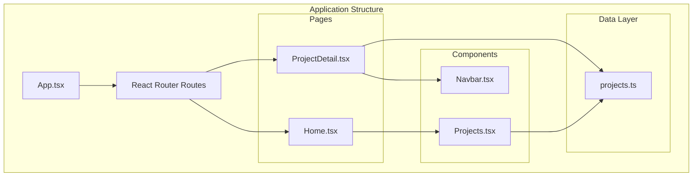
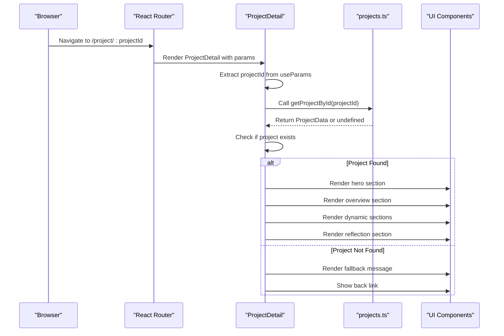
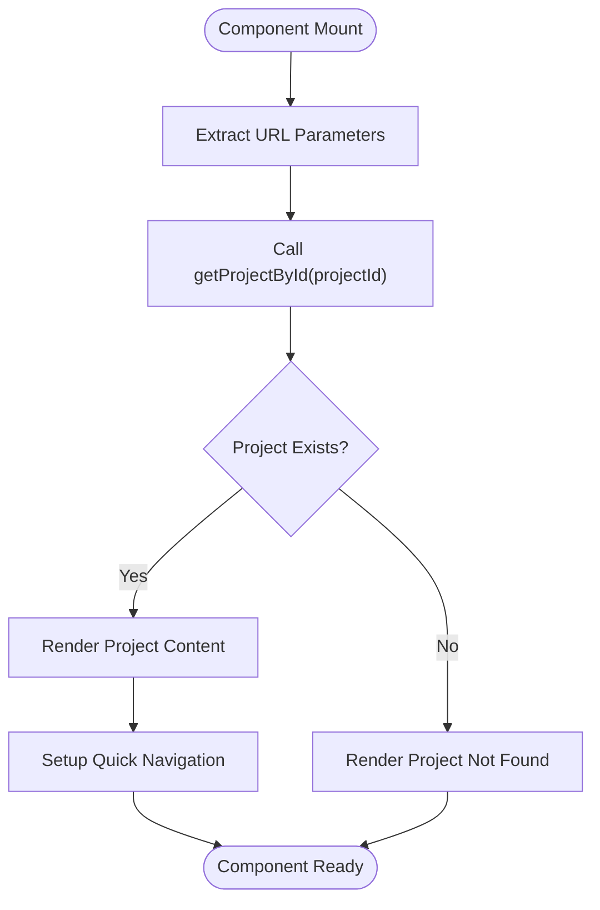
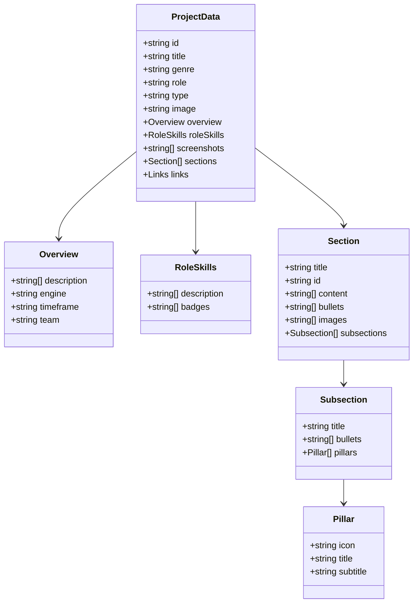
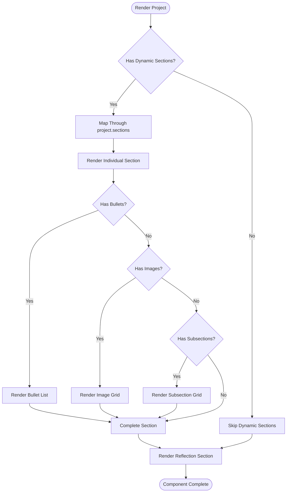
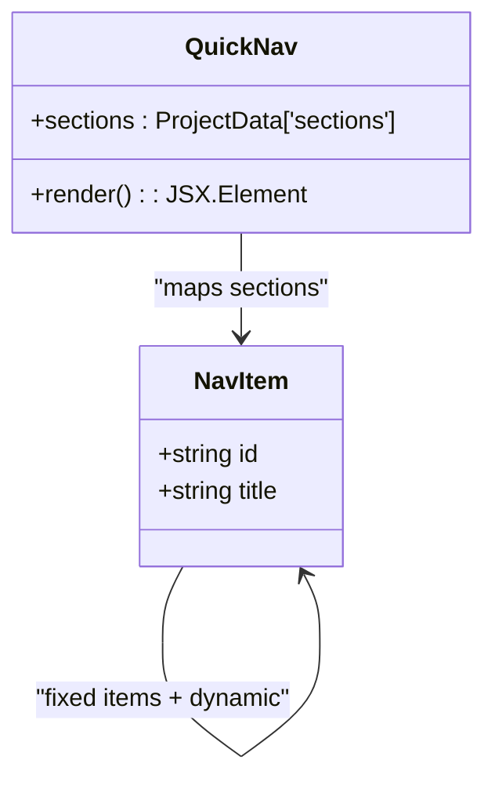
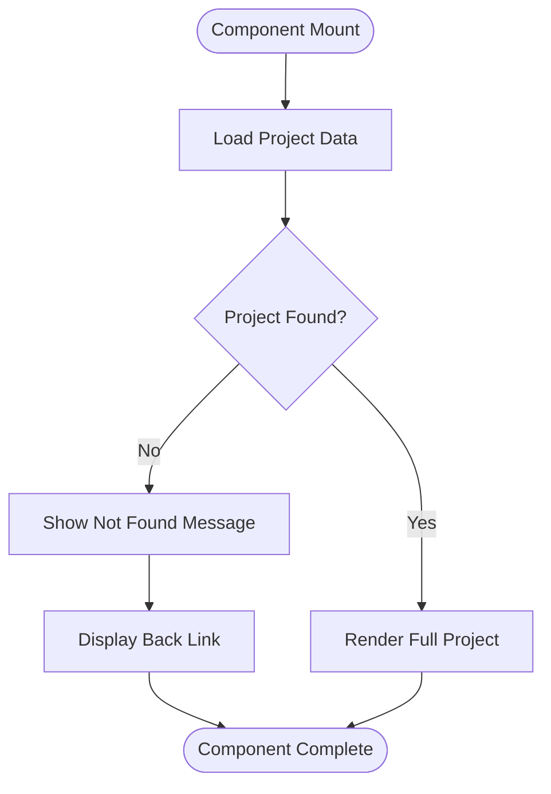
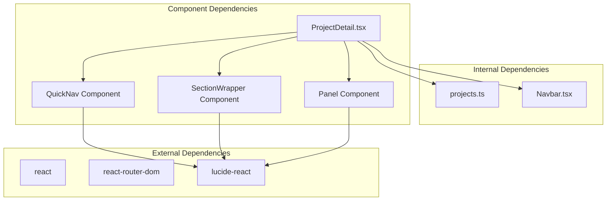

# Project Detail Page Component

<cite>
**Referenced Files in This Document**
- [ProjectDetail.tsx](file://src/pages/ProjectDetail.tsx)
- [projects.ts](file://src/data/projects.ts)
- [App.tsx](file://src/App.tsx)
- [Projects.tsx](file://src/components/Projects.tsx)
- [Home.tsx](file://src/pages/Home.tsx)
- [Navbar.tsx](file://src/components/Navbar.tsx)
- [package.json](file://package.json)
</cite>

## Table of Contents
1. [Introduction](#introduction)
2. [Project Structure](#project-structure)
3. [Core Components](#core-components)
4. [Architecture Overview](#architecture-overview)
5. [Detailed Component Analysis](#detailed-component-analysis)
6. [Dependency Analysis](#dependency-analysis)
7. [Performance Considerations](#performance-considerations)
8. [Troubleshooting Guide](#troubleshooting-guide)
9. [Conclusion](#conclusion)

## Introduction
The ProjectDetail page component is a sophisticated React-based implementation that renders individual project information with dynamic content generation. This component serves as the centerpiece for showcasing game development projects, handling URL-based routing, data fetching from a centralized projects data source, and presenting structured content through reusable UI components.

The component implements a comprehensive project display system that includes hero sections, detailed overviews, interactive galleries, dynamic content sections, and reflection areas. It demonstrates advanced React patterns including parameter extraction, conditional rendering, and responsive design implementation.

## Project Structure
The ProjectDetail component follows a modular architecture within the Next.js/Vite application structure:

**Diagram sources**
- [App.tsx](file://src/App.tsx#L17-L27)
- [ProjectDetail.tsx](file://src/pages/ProjectDetail.tsx#L1-L5)
- [projects.ts](file://src/data/projects.ts#L1-L485)

**Section sources**
- [App.tsx](file://src/App.tsx#L1-L30)
- [ProjectDetail.tsx](file://src/pages/ProjectDetail.tsx#L1-L370)
- [projects.ts](file://src/data/projects.ts#L1-L485)

## Core Components
The ProjectDetail component consists of several specialized sub-components that handle different aspects of project presentation:

### Parameter Extraction and Validation
The component uses React Router's useParams hook to extract the project identifier from the URL path `/project/:projectId`. This creates a strongly-typed parameter extraction mechanism that ensures type safety throughout the component lifecycle.

### Data Fetching Patterns
The component utilizes a centralized data source through the `getProjectById` function, which performs O(n) linear search through the projects array. This approach provides flexibility for data manipulation while maintaining simplicity in the component's data access patterns.

### Dynamic Content Generation
The component implements sophisticated conditional rendering based on project properties, enabling dynamic content generation for:
- Variable section counts and layouts
- Optional content blocks (bullets, images, subsections)
- Conditional link rendering based on availability
- Responsive grid layouts for screenshots and images

**Section sources**
- [ProjectDetail.tsx](file://src/pages/ProjectDetail.tsx#L93-L108)
- [projects.ts](file://src/data/projects.ts#L478-L480)

## Architecture Overview
The ProjectDetail component operates within a well-defined architectural pattern that separates concerns across multiple layers:

**Diagram sources**
- [App.tsx](file://src/App.tsx#L22-L24)
- [ProjectDetail.tsx](file://src/pages/ProjectDetail.tsx#L93-L108)
- [projects.ts](file://src/data/projects.ts#L478-L480)

The architecture demonstrates clear separation of concerns:
- **Routing Layer**: Handles URL parsing and navigation
- **Presentation Layer**: Manages component rendering and state
- **Data Layer**: Provides centralized project information
- **UI Layer**: Implements reusable component patterns

## Detailed Component Analysis

### Route Parameter Handling
The component implements robust URL parameter extraction using React Router's useParams hook with TypeScript type safety:

**Diagram sources**
- [ProjectDetail.tsx](file://src/pages/ProjectDetail.tsx#L93-L108)

The parameter extraction ensures that:
- Type-safe parameter access prevents runtime errors
- Graceful fallback handling for invalid identifiers
- Consistent URL structure across the application

**Section sources**
- [ProjectDetail.tsx](file://src/pages/ProjectDetail.tsx#L93-L95)

### Data Fetching and Mapping
The component interacts with a centralized data source through well-defined functions:

**Diagram sources**
- [projects.ts](file://src/data/projects.ts#L1-L41)

The data structure supports:
- Hierarchical content organization
- Flexible section composition
- Optional content blocks
- Rich media support (images, videos)

**Section sources**
- [projects.ts](file://src/data/projects.ts#L1-L485)

### Dynamic Content Generation
The component implements sophisticated conditional rendering based on project properties:

**Diagram sources**
- [ProjectDetail.tsx](file://src/pages/ProjectDetail.tsx#L227-L296)

The dynamic rendering system supports:
- Variable content complexity
- Responsive layout adaptation
- Conditional UI element visibility
- Performance-optimized rendering

**Section sources**
- [ProjectDetail.tsx](file://src/pages/ProjectDetail.tsx#L227-L296)

### Navigation and User Experience
The component implements comprehensive navigation features:

#### Quick Navigation System
The QuickNav component provides contextual navigation through the project content:

**Diagram sources**
- [ProjectDetail.tsx](file://src/pages/ProjectDetail.tsx#L6-L35)

#### Section Organization
The component uses a structured approach to content organization:
- Fixed sections: Overview, Screenshots, Reflection
- Dynamic sections: Generated from project.sections array
- Consistent ID-based navigation system

**Section sources**
- [ProjectDetail.tsx](file://src/pages/ProjectDetail.tsx#L6-L49)

### Error Handling and Fallbacks
The component implements robust error handling for project not found scenarios:

**Diagram sources**
- [ProjectDetail.tsx](file://src/pages/ProjectDetail.tsx#L97-L108)

The fallback system provides:
- Clear user messaging
- Easy navigation back to home
- Consistent styling with main application

**Section sources**
- [ProjectDetail.tsx](file://src/pages/ProjectDetail.tsx#L97-L108)

## Dependency Analysis
The ProjectDetail component has well-defined dependencies that contribute to its modularity and maintainability:

**Diagram sources**
- [package.json](file://package.json#L12-L17)
- [ProjectDetail.tsx](file://src/pages/ProjectDetail.tsx#L1-L5)

The dependency structure supports:
- Minimal external dependencies
- Internal module organization
- Reusable component patterns
- Type-safe development experience

**Section sources**
- [package.json](file://package.json#L12-L17)
- [ProjectDetail.tsx](file://src/pages/ProjectDetail.tsx#L1-L5)

## Performance Considerations
The ProjectDetail component implements several performance optimization strategies:

### Data Access Optimization
- **Centralized Data Source**: Single point of truth reduces duplication
- **Linear Search Pattern**: O(n) complexity acceptable for small datasets
- **TypeScript Integration**: Compile-time error detection prevents runtime issues

### Rendering Optimization
- **Conditional Rendering**: Only renders available content sections
- **Responsive Grid Layouts**: Efficient CSS Grid implementation
- **Lazy Loading**: Image lazy loading through HTML attributes
- **Component Memoization**: Reusable sub-components reduce re-renders

### Memory Management
- **Component Cleanup**: Proper cleanup of event listeners
- **Image Optimization**: Efficient image loading and caching
- **State Management**: Minimal local state reduces memory footprint

### Bundle Size Considerations
- **Tree Shaking**: Unused imports automatically removed
- **Icon Optimization**: Selective import of Lucide icons
- **CSS Optimization**: Tailwind CSS utility classes minimize custom styles

**Section sources**
- [ProjectDetail.tsx](file://src/pages/ProjectDetail.tsx#L18-L23)
- [projects.ts](file://src/data/projects.ts#L478-L480)

## Troubleshooting Guide

### Common Issues and Solutions

#### Project Not Found Error
**Symptoms**: Blank screen or fallback message appears
**Causes**: Invalid project ID in URL, missing project data
**Solutions**:
- Verify URL contains valid project ID
- Check projects array for existing entries
- Implement proper error boundaries

#### Data Type Mismatches
**Symptoms**: Runtime type errors or undefined properties
**Causes**: Missing optional properties in project data
**Solutions**:
- Use TypeScript type checking
- Implement defensive property access
- Add data validation layers

#### Performance Issues
**Symptoms**: Slow rendering or memory leaks
**Causes**: Excessive re-renders or large image assets
**Solutions**:
- Optimize image sizes and formats
- Implement virtual scrolling for long lists
- Use React.memo for expensive components

#### Routing Problems
**Symptoms**: Navigation failures or broken links
**Causes**: Incorrect route configuration or parameter handling
**Solutions**:
- Verify route definitions match URL patterns
- Check parameter extraction logic
- Test navigation from different entry points

**Section sources**
- [ProjectDetail.tsx](file://src/pages/ProjectDetail.tsx#L97-L108)
- [App.tsx](file://src/App.tsx#L22-L24)

## Conclusion
The ProjectDetail page component represents a comprehensive implementation of dynamic content rendering in a React-based portfolio application. It successfully demonstrates advanced patterns including URL parameter handling, centralized data management, and sophisticated conditional rendering.

Key achievements include:
- **Type-Safe Implementation**: Comprehensive TypeScript integration ensures reliability
- **Flexible Content Model**: Support for diverse project structures and content types
- **Performance Optimization**: Efficient rendering patterns and resource management
- **User Experience Focus**: Intuitive navigation and responsive design
- **Maintainable Architecture**: Modular design enables easy updates and extensions

The component serves as an excellent example of modern React development practices, showcasing how to build scalable, maintainable applications that effectively present complex content structures while maintaining optimal performance characteristics.