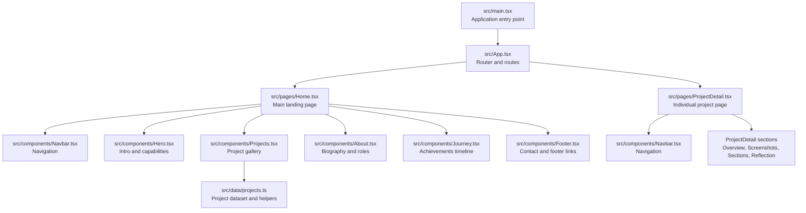
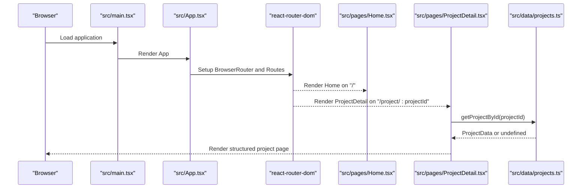
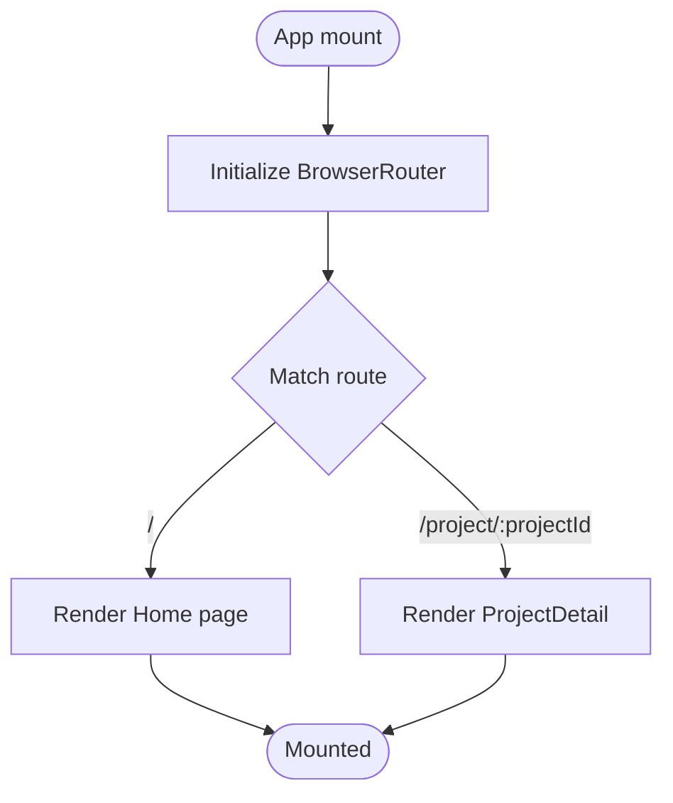
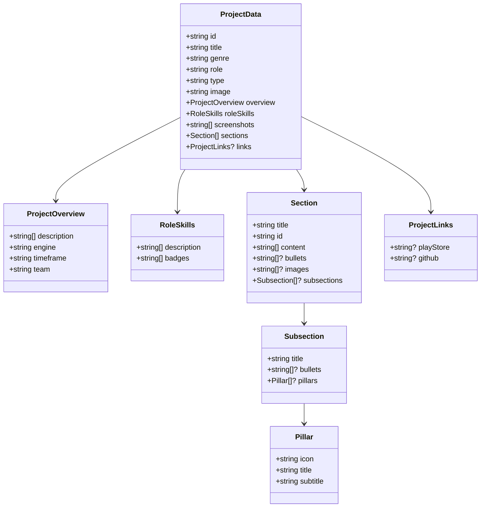
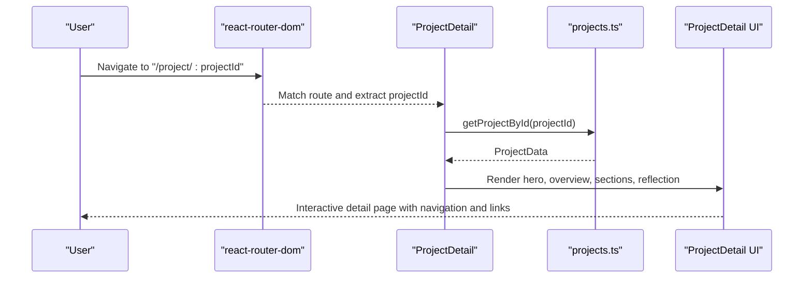
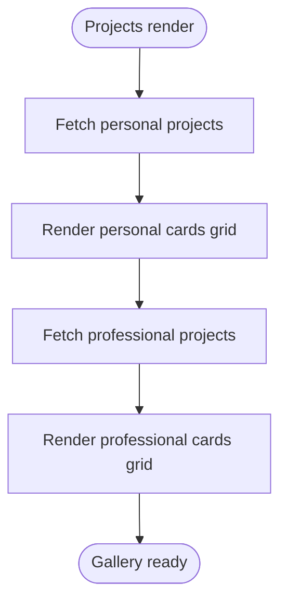
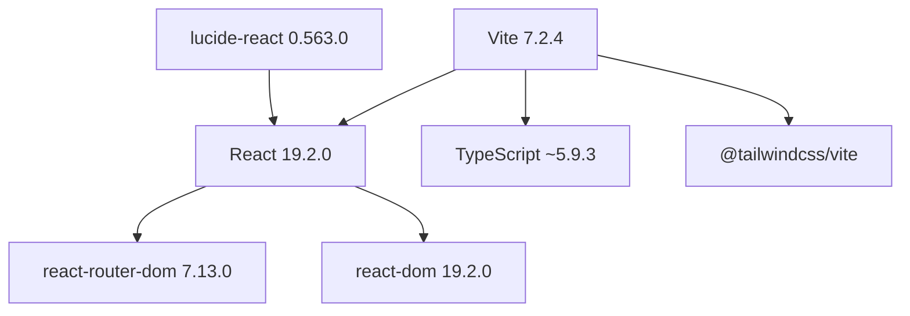

# Project Overview

<cite>
**Referenced Files in This Document**
- [README.md](file://README.md)
- [package.json](file://package.json)
- [vite.config.ts](file://vite.config.ts)
- [src/main.tsx](file://src/main.tsx)
- [src/App.tsx](file://src/App.tsx)
- [src/pages/Home.tsx](file://src/pages/Home.tsx)
- [src/pages/ProjectDetail.tsx](file://src/pages/ProjectDetail.tsx)
- [src/components/Navbar.tsx](file://src/components/Navbar.tsx)
- [src/components/Hero.tsx](file://src/components/Hero.tsx)
- [src/components/Projects.tsx](file://src/components/Projects.tsx)
- [src/components/About.tsx](file://src/components/About.tsx)
- [src/components/Journey.tsx](file://src/components/Journey.tsx)
- [src/components/Footer.tsx](file://src/components/Footer.tsx)
- [src/components/Contact.tsx](file://src/components/Contact.tsx)
- [src/data/projects.ts](file://src/data/projects.ts)
</cite>

## Table of Contents
1. [Introduction](#introduction)
2. [Project Structure](#project-structure)
3. [Core Components](#core-components)
4. [Architecture Overview](#architecture-overview)
5. [Detailed Component Analysis](#detailed-component-analysis)
6. [Dependency Analysis](#dependency-analysis)
7. [Performance Considerations](#performance-considerations)
8. [Troubleshooting Guide](#troubleshooting-guide)
9. [Conclusion](#conclusion)

## Introduction
This project is a professional portfolio website for a game developer and level designer, showcasing both personal and professional game development work. It targets recruiters, potential collaborators, clients, and peers in the game industry who want to quickly assess technical contributions, design philosophy, and production experience. The site emphasizes a clean, responsive presentation of interactive media with a focus on navigation, project storytelling, and accessibility across devices.

Key objectives:
- Present a curated gallery of game projects with detailed breakdowns
- Demonstrate technical and design expertise through structured project pages
- Provide seamless navigation between overview and deep-dive content
- Maintain a modern, accessible, and visually coherent experience using contemporary web technologies

## Project Structure
The portfolio follows a single-page application (SPA) architecture with client-side routing. The application is bootstrapped with Vite, uses React 19.2.0, TypeScript for type safety, and Tailwind CSS for styling. The routing is handled by react-router-dom, enabling smooth transitions between the home page and individual project detail pages.

**Diagram sources**
- [src/main.tsx](file://src/main.tsx#L1-L11)
- [src/App.tsx](file://src/App.tsx#L1-L30)
- [src/pages/Home.tsx](file://src/pages/Home.tsx#L1-L22)
- [src/pages/ProjectDetail.tsx](file://src/pages/ProjectDetail.tsx#L1-L365)
- [src/components/Navbar.tsx](file://src/components/Navbar.tsx#L1-L112)
- [src/components/Hero.tsx](file://src/components/Hero.tsx#L1-L68)
- [src/components/Projects.tsx](file://src/components/Projects.tsx#L1-L108)
- [src/components/About.tsx](file://src/components/About.tsx#L1-L103)
- [src/components/Journey.tsx](file://src/components/Journey.tsx#L1-L41)
- [src/components/Footer.tsx](file://src/components/Footer.tsx#L1-L82)
- [src/data/projects.ts](file://src/data/projects.ts#L1-L485)

**Section sources**
- [README.md](file://README.md#L1-L74)
- [package.json](file://package.json#L1-L35)
- [vite.config.ts](file://vite.config.ts#L1-L9)
- [src/main.tsx](file://src/main.tsx#L1-L11)
- [src/App.tsx](file://src/App.tsx#L1-L30)

## Core Components
- Application shell and routing: The SPA is defined in the root App component with BrowserRouter and Routes, rendering either the Home page or a ProjectDetail page based on the URL path.
- Pages:
  - Home: Aggregates Hero, Projects, About, Journey, and Footer sections into a cohesive landing experience.
  - ProjectDetail: Renders a comprehensive single-project view with overview, role and skills, screenshots, dynamic sections, and reflection.
- Data layer:
  - projects.ts defines a strongly typed ProjectData interface and exports a collection of projects along with helper functions to filter and retrieve projects by ID/type.
- Components:
  - Navbar: Responsive navigation with scroll-aware styling and mobile menu toggle.
  - Hero: Hero background with capability highlights.
  - Projects: Grid-based project cards linking to detail pages, with optional external links.
  - About: Personal introduction, roles, and social links.
  - Journey: Timeline-style achievements and skills.
  - Footer: Contact information and quick navigation.
  - Contact: Static contact form using mailto action.

Practical examples:
- Project galleries: The Projects component renders two distinct sections (personal and professional) using the data helpers to filter entries.
- Detailed project pages: ProjectDetail composes a hero, overview, role and skills, screenshots, dynamic sections, and reflection, with quick navigation and external links.
- Responsive design: Tailwind utility classes are used consistently across components to adapt layouts for mobile and desktop.

**Section sources**
- [src/App.tsx](file://src/App.tsx#L1-L30)
- [src/pages/Home.tsx](file://src/pages/Home.tsx#L1-L22)
- [src/pages/ProjectDetail.tsx](file://src/pages/ProjectDetail.tsx#L1-L365)
- [src/components/Projects.tsx](file://src/components/Projects.tsx#L1-L108)
- [src/components/Navbar.tsx](file://src/components/Navbar.tsx#L1-L112)
- [src/components/Hero.tsx](file://src/components/Hero.tsx#L1-L68)
- [src/components/About.tsx](file://src/components/About.tsx#L1-L103)
- [src/components/Journey.tsx](file://src/components/Journey.tsx#L1-L41)
- [src/components/Footer.tsx](file://src/components/Footer.tsx#L1-L82)
- [src/components/Contact.tsx](file://src/components/Contact.tsx#L1-L117)
- [src/data/projects.ts](file://src/data/projects.ts#L1-L485)

## Architecture Overview
The application is a client-side SPA with the following high-level flow:
- Entry point initializes React and mounts the App component.
- App sets up routing with react-router-dom and a ScrollToTop effect to reset scroll position on navigation.
- Home composes reusable components to present an overview of the developer’s work.
- ProjectDetail fetches a project by ID from the data module and renders a rich, structured detail page.
- Styling is applied via Tailwind utility classes configured through Vite and @tailwindcss/vite plugin.

**Diagram sources**
- [src/main.tsx](file://src/main.tsx#L1-L11)
- [src/App.tsx](file://src/App.tsx#L1-L30)
- [src/pages/Home.tsx](file://src/pages/Home.tsx#L1-L22)
- [src/pages/ProjectDetail.tsx](file://src/pages/ProjectDetail.tsx#L1-L365)
- [src/data/projects.ts](file://src/data/projects.ts#L478-L485)

## Detailed Component Analysis

### SPA Routing and Navigation
The SPA uses react-router-dom for declarative routing. A ScrollToTop helper ensures the viewport resets to the top on route changes. The App component defines two primary routes:
- "/" renders the Home page
- "/project/:projectId" renders the ProjectDetail page

**Diagram sources**
- [src/App.tsx](file://src/App.tsx#L1-L30)

**Section sources**
- [src/App.tsx](file://src/App.tsx#L1-L30)

### Project Data Model and Helpers
The data module defines a robust ProjectData interface and exports:
- projects: An array of project entries with metadata, overview, role and skills, screenshots, dynamic sections, and optional links.
- Helper functions:
  - getProjectById(id): Retrieves a single project by its identifier.
  - getProjectsByType(type): Filters projects by type (personal or professional).

**Diagram sources**
- [src/data/projects.ts](file://src/data/projects.ts#L1-L42)

**Section sources**
- [src/data/projects.ts](file://src/data/projects.ts#L1-L485)

### ProjectDetail Page Composition
The ProjectDetail page composes multiple reusable UI patterns:
- Hero area with background image and gradient overlay
- Back navigation and genre metadata
- Overview section with engine, timeframe, and team info
- Role and skills with badges
- Screenshot gallery
- Dynamic sections with alternating backgrounds, optional bullets, subsections with pillars, and optional images
- Reflection footer with navigation and external links

**Diagram sources**
- [src/pages/ProjectDetail.tsx](file://src/pages/ProjectDetail.tsx#L1-L365)
- [src/data/projects.ts](file://src/data/projects.ts#L478-L485)

**Section sources**
- [src/pages/ProjectDetail.tsx](file://src/pages/ProjectDetail.tsx#L1-L365)
- [src/data/projects.ts](file://src/data/projects.ts#L1-L485)

### Projects Gallery
The Projects component renders two distinct sections:
- Personal Projects: A responsive grid of project cards with genre, title overlay, role, and optional external links.
- Professional Work: Similar card grid for professional entries.

**Diagram sources**
- [src/components/Projects.tsx](file://src/components/Projects.tsx#L76-L107)
- [src/data/projects.ts](file://src/data/projects.ts#L482-L484)

**Section sources**
- [src/components/Projects.tsx](file://src/components/Projects.tsx#L1-L108)
- [src/data/projects.ts](file://src/data/projects.ts#L478-L485)

### Conceptual Overview
For beginners, the portfolio demonstrates:
- How to structure a React SPA with routing
- How to organize data in TypeScript interfaces
- How to compose reusable UI components
- How to apply responsive design with Tailwind utilities

For experienced developers, the portfolio showcases:
- Clean separation of concerns between pages, components, and data
- Efficient client-side navigation and scroll management
- Scalable data modeling for dynamic content
- Practical patterns for responsive grids and typography

[No sources needed since this section doesn't analyze specific source files]

## Dependency Analysis
The project relies on the following core technologies:
- Runtime: React 19.2.0, react-dom 19.2.0, react-router-dom 7.13.0
- Tooling: Vite 7.2.4, TypeScript ~5.9.3, Tailwind CSS ^4.1.18
- Icons: lucide-react ^0.563.0
- Styling: Tailwind CSS configured via @tailwindcss/vite plugin
- Linting: ESLint with TypeScript and React-specific configurations

**Diagram sources**
- [package.json](file://package.json#L12-L32)
- [vite.config.ts](file://vite.config.ts#L1-L9)

**Section sources**
- [package.json](file://package.json#L1-L35)
- [vite.config.ts](file://vite.config.ts#L1-L9)

## Performance Considerations
- Client-side routing minimizes server requests and enables instant navigation between views.
- Lazy loading is supported by the image elements in components like Projects and ProjectDetail, improving initial load performance.
- Tailwind utility classes keep styles modular and scoped, reducing CSS overhead.
- The data model centralizes content, allowing efficient filtering and rendering without repeated computations.

[No sources needed since this section provides general guidance]

## Troubleshooting Guide
Common issues and resolutions:
- Route not changing or scroll not resetting:
  - Verify BrowserRouter is mounted and ScrollToTop is included in the App tree.
- Project not found on detail page:
  - Ensure the projectId in the URL matches an existing entry in the projects array.
- Styling inconsistencies:
  - Confirm Tailwind is properly initialized via the Vite plugin and that class names match Tailwind utilities.
- Build errors:
  - Check TypeScript configuration and ensure all components adhere to the ProjectData interface.

**Section sources**
- [src/App.tsx](file://src/App.tsx#L1-L30)
- [src/pages/ProjectDetail.tsx](file://src/pages/ProjectDetail.tsx#L88-L103)
- [vite.config.ts](file://vite.config.ts#L1-L9)
- [package.json](file://package.json#L18-L32)

## Conclusion
This portfolio effectively communicates a game developer’s and level designer’s expertise through a modern, responsive, and well-structured SPA. It balances beginner-friendly concepts with advanced patterns for experienced developers, leveraging React, TypeScript, Vite, and Tailwind to deliver a polished, maintainable experience. The clear separation of pages, components, and data enables easy expansion and iteration as the developer’s career evolves.

[No sources needed since this section summarizes without analyzing specific files]