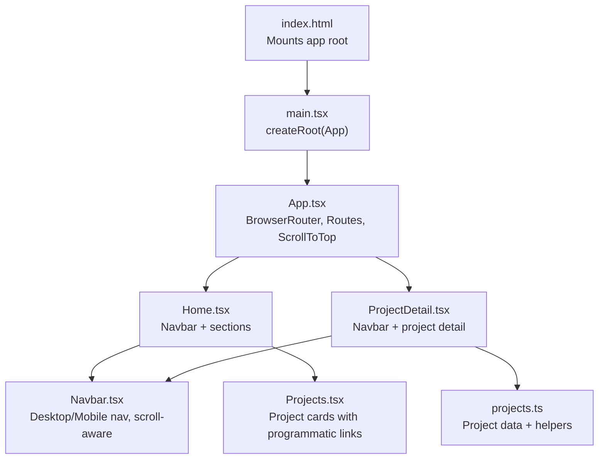
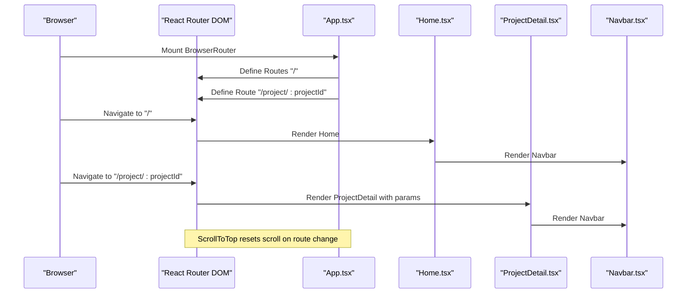
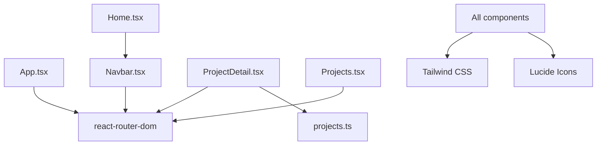

# Routing and Navigation

<cite>
**Referenced Files in This Document**
- [App.tsx](file://src/App.tsx)
- [main.tsx](file://src/main.tsx)
- [Navbar.tsx](file://src/components/Navbar.tsx)
- [Home.tsx](file://src/pages/Home.tsx)
- [ProjectDetail.tsx](file://src/pages/ProjectDetail.tsx)
- [Projects.tsx](file://src/components/Projects.tsx)
- [projects.ts](file://src/data/projects.ts)
- [index.html](file://index.html)
- [index.css](file://src/index.css)
- [package.json](file://package.json)
</cite>

## Table of Contents
1. [Introduction](#introduction)
2. [Project Structure](#project-structure)
3. [Core Components](#core-components)
4. [Architecture Overview](#architecture-overview)
5. [Detailed Component Analysis](#detailed-component-analysis)
6. [Dependency Analysis](#dependency-analysis)
7. [Performance Considerations](#performance-considerations)
8. [Troubleshooting Guide](#troubleshooting-guide)
9. [Conclusion](#conclusion)

## Introduction
This document explains the routing and navigation system implemented with React Router DOM in a Next.js-like Vite-based React application. It covers the App.tsx routing configuration, scroll-to-top behavior, and navigation handling. It documents the Navbar component’s role in navigation, mobile menu implementation, and scroll-aware styling. Practical examples include programmatic navigation, hash link navigation for section jumping, and route parameter handling for project detail pages. Accessibility features, smooth scrolling, responsive navigation patterns, and integration between routing and component lifecycle are addressed for both desktop and mobile users.

## Project Structure
The routing and navigation system centers around a small set of files:
- Application shell and router configuration
- Page components for home and project detail
- Navigation component with responsive behavior
- Data module for project content and routing parameters
- Global styles enabling smooth scrolling and theme tokens

**Diagram sources**
- [index.html](file://index.html#L19-L22)
- [main.tsx](file://src/main.tsx#L6-L10)
- [App.tsx](file://src/App.tsx#L17-L27)
- [Home.tsx](file://src/pages/Home.tsx#L8-L21)
- [ProjectDetail.tsx](file://src/pages/ProjectDetail.tsx#L88-L103)
- [Navbar.tsx](file://src/components/Navbar.tsx#L13-L111)
- [Projects.tsx](file://src/components/Projects.tsx#L76-L107)
- [projects.ts](file://src/data/projects.ts#L478-L485)

**Section sources**
- [index.html](file://index.html#L1-L24)
- [main.tsx](file://src/main.tsx#L1-L11)
- [App.tsx](file://src/App.tsx#L1-L30)

## Core Components
- App.tsx: Configures React Router DOM with BrowserRouter, defines routes, and implements a ScrollToTop side-effect to reset scroll on route changes.
- Navbar.tsx: Provides responsive navigation with desktop and mobile views, scroll-aware styling, and external link handling.
- Home.tsx: Renders the landing page with sections and integrates Navbar.
- ProjectDetail.tsx: Implements route parameter handling, hash-based section navigation, and quick navigation sidebar.
- Projects.tsx: Uses programmatic navigation via react-router-dom Link to navigate to project detail pages.
- projects.ts: Supplies project data and helper functions used by ProjectDetail and Projects.

**Section sources**
- [App.tsx](file://src/App.tsx#L1-L30)
- [Navbar.tsx](file://src/components/Navbar.tsx#L1-L112)
- [Home.tsx](file://src/pages/Home.tsx#L1-L22)
- [ProjectDetail.tsx](file://src/pages/ProjectDetail.tsx#L1-L365)
- [Projects.tsx](file://src/components/Projects.tsx#L1-L108)
- [projects.ts](file://src/data/projects.ts#L1-L485)

## Architecture Overview
The routing architecture follows a classic SPA pattern:
- BrowserRouter wraps the entire app.
- Routes define two paths: the home page and the project detail page with a parameterized segment.
- ScrollToTop ensures the viewport scrolls to the top on route changes.
- Navbar provides internal navigation via hash links to sections within the home page and external links to PDF and external resources.
- Programmatic navigation is used to enter project detail pages from the Projects component.

**Diagram sources**
- [App.tsx](file://src/App.tsx#L17-L27)
- [Home.tsx](file://src/pages/Home.tsx#L8-L21)
- [ProjectDetail.tsx](file://src/pages/ProjectDetail.tsx#L88-L103)
- [Navbar.tsx](file://src/components/Navbar.tsx#L13-L111)

## Detailed Component Analysis

### App.tsx: Routing Configuration and Scroll-to-Top
- Wraps the app with BrowserRouter.
- Defines two routes:
  - "/" renders the Home page.
  - "/project/:projectId" renders the ProjectDetail page with a route parameter.
- Implements a ScrollToTop component that uses useLocation and useEffect to scroll to the top whenever the pathname changes.

Practical implications:
- Ensures a clean viewport on navigation.
- Prevents sticky scroll positions when switching between pages.

Accessibility and UX:
- The scroll reset aligns with user expectations for SPAs.
- Combined with global smooth scrolling, improves perceived responsiveness.

**Section sources**
- [App.tsx](file://src/App.tsx#L1-L30)

### Navbar.tsx: Navigation, Responsive Behavior, and Scroll-Aware Styling
Responsibilities:
- Maintains open/closed state for the mobile menu.
- Tracks scroll position to conditionally apply a backdrop blur and background to the header.
- Provides desktop navigation links and a mobile hamburger menu.
- Handles external links (PDF and external sites) with appropriate attributes.

Responsive patterns:
- Desktop navigation is hidden on mobile; mobile menu toggles visibility with transitions.
- Scroll-aware header styling enhances readability against backgrounds.

Accessibility features:
- Uses aria-label on the mobile menu toggle.
- Uses semantic anchor tags for navigation.
- Focus styles are globally defined for keyboard navigation.

Navigation behavior:
- Desktop links use hash anchors to jump to sections within the home page.
- External links open in new tabs with noreferrer and noopener for security.

**Section sources**
- [Navbar.tsx](file://src/components/Navbar.tsx#L1-L112)

### Home.tsx: Page Composition and Integration with Navbar
- Renders the landing page layout and includes Navbar at the top.
- Composes sections that correspond to the hash targets used by Navbar.

Integration with routing:
- Navbar’s hash links navigate to sections within this page.
- No programmatic navigation here; relies on hash-based navigation.

**Section sources**
- [Home.tsx](file://src/pages/Home.tsx#L1-L22)

### ProjectDetail.tsx: Route Parameter Handling, Hash Navigation, and Quick Navigation
Route parameter handling:
- Extracts projectId from URL parameters and loads the corresponding project data.
- Displays a fallback message if the project is not found.

Hash-based section navigation:
- Uses hash anchors to jump to sections within the detail page.
- SectionWrapper applies scroll-margin utilities to prevent header overlap.
- QuickNav provides a desktop-only sidebar with links to major sections.

Programmatic navigation:
- Uses react-router-dom Link to navigate back to the home page or to a specific section on the home page.
- Uses Link to return to the appropriate project list (personal/professional) based on the project type.

Accessibility and UX:
- Smooth scrolling is enabled globally via CSS.
- Focus styles and hover states improve interactivity.
- External links open in new tabs with appropriate security attributes.

**Section sources**
- [ProjectDetail.tsx](file://src/pages/ProjectDetail.tsx#L1-L365)
- [projects.ts](file://src/data/projects.ts#L478-L485)

### Projects.tsx: Programmatic Navigation to Project Detail Pages
- Uses react-router-dom Link to navigate to "/project/:projectId".
- Renders project cards with genre metadata, role, and optional external links.

Integration with routing:
- The Link’s to prop corresponds to the route parameter used by ProjectDetail.
- Enables seamless navigation from the home page to project detail pages.

**Section sources**
- [Projects.tsx](file://src/components/Projects.tsx#L1-L108)

### projects.ts: Data Model and Helpers for Route Parameters
- Defines the ProjectData interface and exports helper functions:
  - getProjectById(id): returns a project or undefined.
  - getProjectsByType(type): filters projects by type.

Used by:
- ProjectDetail to load the selected project.
- Projects to render project cards.

**Section sources**
- [projects.ts](file://src/data/projects.ts#L1-L485)

## Dependency Analysis
The routing and navigation system depends on:
- React Router DOM for routing and navigation primitives.
- Tailwind CSS for responsive design and theme tokens.
- Lucide icons for UI affordances.

**Diagram sources**
- [App.tsx](file://src/App.tsx#L1-L4)
- [Home.tsx](file://src/pages/Home.tsx#L1-L6)
- [ProjectDetail.tsx](file://src/pages/ProjectDetail.tsx#L1-L4)
- [Projects.tsx](file://src/components/Projects.tsx#L1-L3)
- [Navbar.tsx](file://src/components/Navbar.tsx#L1-L3)
- [projects.ts](file://src/data/projects.ts#L1-L41)
- [package.json](file://package.json#L12-L17)

**Section sources**
- [package.json](file://package.json#L12-L17)

## Performance Considerations
- Minimal re-renders: ScrollToTop is lightweight and only triggers on pathname changes.
- Efficient navigation: Hash links avoid full page reloads; programmatic navigation via react-router-dom is fast.
- Smooth scrolling: Global CSS enables native smooth scrolling, reducing JavaScript overhead.
- Lazy loading: Images in project cards use lazy loading to improve initial load performance.

[No sources needed since this section provides general guidance]

## Troubleshooting Guide
Common issues and resolutions:
- Navigation does not scroll to top on route change:
  - Verify that ScrollToTop is rendered inside BrowserRouter and that useLocation is used correctly.
  - Confirm that pathname is included in the dependency array of useEffect.

- Hash links do not jump to sections:
  - Ensure section elements have matching id attributes.
  - Confirm that scroll-margin utilities are applied to section wrappers to account for fixed headers.

- External links open in the same tab:
  - Ensure external links use target="_blank" and rel="noopener noreferrer".

- Route parameter not found:
  - Verify that the route path matches the Link’s to prop and that getProjectById receives a valid id.

- Mobile menu does not close after navigation:
  - Ensure click handlers on mobile links set the open state to false.

**Section sources**
- [App.tsx](file://src/App.tsx#L7-L15)
- [ProjectDetail.tsx](file://src/pages/ProjectDetail.tsx#L34-L46)
- [Navbar.tsx](file://src/components/Navbar.tsx#L85-L104)
- [Projects.tsx](file://src/components/Projects.tsx#L14-L29)
- [projects.ts](file://src/data/projects.ts#L478-L485)

## Conclusion
The routing and navigation system combines React Router DOM with thoughtful UI patterns to deliver a smooth, accessible, and responsive experience. App.tsx centralizes routing and scroll behavior, while Navbar provides robust desktop and mobile navigation. ProjectDetail leverages route parameters and hash-based navigation to create a cohesive user journey from project listings to detailed views. Global smooth scrolling and responsive design ensure excellent UX across devices.