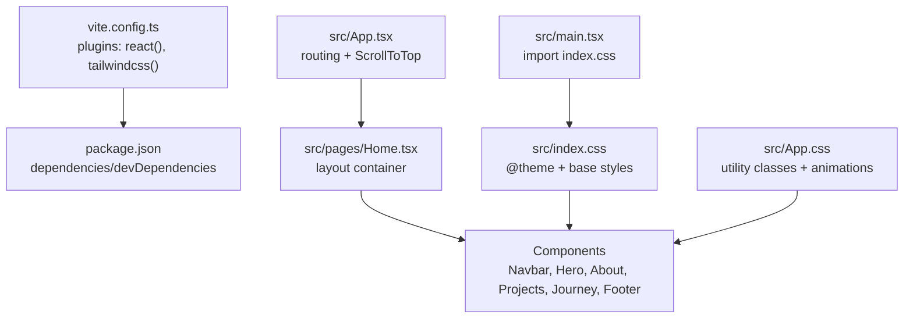
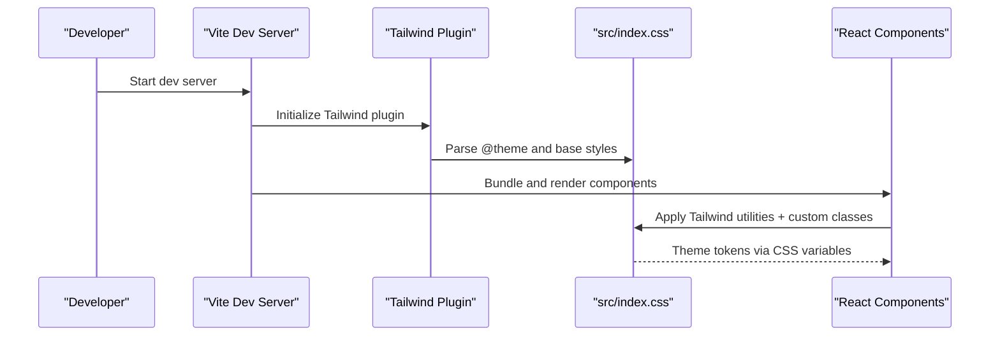
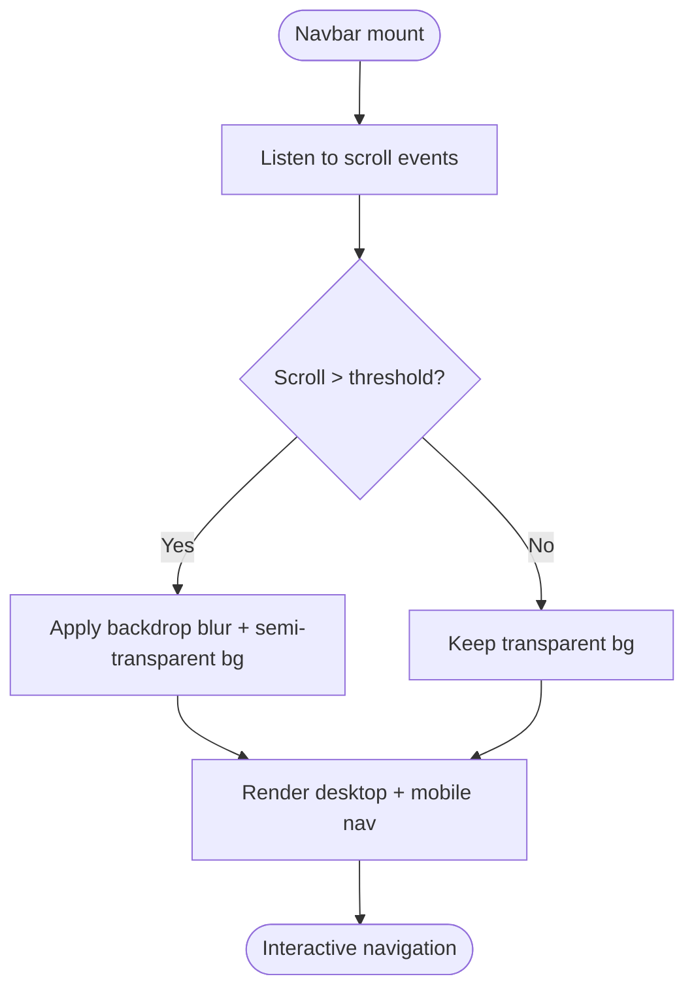
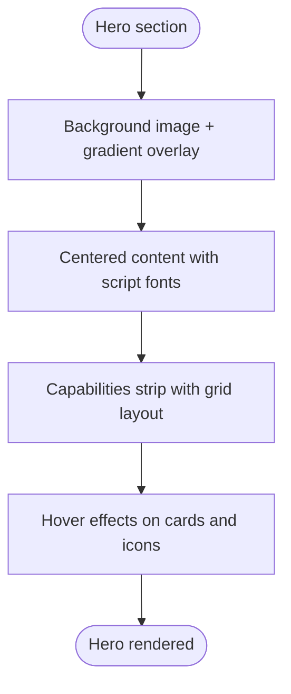
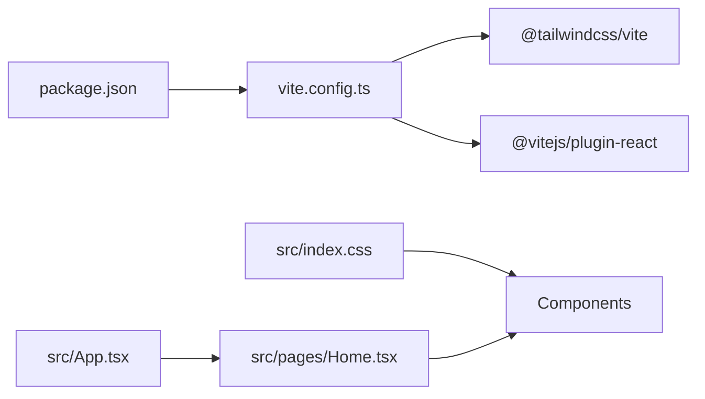

# Styling and Theming

<cite>
**Referenced Files in This Document**
- [vite.config.ts](file://vite.config.ts)
- [package.json](file://package.json)
- [src/index.css](file://src/index.css)
- [src/App.css](file://src/App.css)
- [src/main.tsx](file://src/main.tsx)
- [src/App.tsx](file://src/App.tsx)
- [src/components/Navbar.tsx](file://src/components/Navbar.tsx)
- [src/components/Hero.tsx](file://src/components/Hero.tsx)
- [src/components/About.tsx](file://src/components/About.tsx)
- [src/components/Projects.tsx](file://src/components/Projects.tsx)
- [src/components/Journey.tsx](file://src/components/Journey.tsx)
- [src/components/Footer.tsx](file://src/components/Footer.tsx)
- [src/pages/Home.tsx](file://src/pages/Home.tsx)
- [src/data/projects.ts](file://src/data/projects.ts)
</cite>

## Table of Contents
1. [Introduction](#introduction)
2. [Project Structure](#project-structure)
3. [Core Components](#core-components)
4. [Architecture Overview](#architecture-overview)
5. [Detailed Component Analysis](#detailed-component-analysis)
6. [Dependency Analysis](#dependency-analysis)
7. [Performance Considerations](#performance-considerations)
8. [Troubleshooting Guide](#troubleshooting-guide)
9. [Conclusion](#conclusion)
10. [Appendices](#appendices)

## Introduction
This document explains the styling and theming system for the portfolio site, focusing on the Tailwind CSS integration, custom CSS variables, responsive design patterns, and component-level styling. It covers how the theme is defined, how Tailwind is configured and used, and how utility classes are applied consistently across components. Practical examples demonstrate component styling, animations, and dark/light theme considerations. Guidance is included for maintaining visual consistency and extending the system.

## Project Structure
The styling system is organized around:
- Tailwind CSS integration via Vite
- A central theme definition using CSS variables
- Component-level styling with Tailwind utilities and custom CSS classes
- Responsive patterns using Tailwind’s breakpoint system

**Diagram sources**
- [vite.config.ts](file://vite.config.ts#L1-L9)
- [package.json](file://package.json#L1-L35)
- [src/index.css](file://src/index.css#L1-L135)
- [src/App.css](file://src/App.css#L1-L43)
- [src/main.tsx](file://src/main.tsx#L1-L11)
- [src/App.tsx](file://src/App.tsx#L1-L30)
- [src/pages/Home.tsx](file://src/pages/Home.tsx#L1-L22)

**Section sources**
- [vite.config.ts](file://vite.config.ts#L1-L9)
- [package.json](file://package.json#L1-L35)
- [src/index.css](file://src/index.css#L1-L135)
- [src/App.css](file://src/App.css#L1-L43)
- [src/main.tsx](file://src/main.tsx#L1-L11)
- [src/App.tsx](file://src/App.tsx#L1-L30)
- [src/pages/Home.tsx](file://src/pages/Home.tsx#L1-L22)

## Core Components
- Tailwind integration is configured in Vite with the Tailwind plugin.
- The theme is centralized in a CSS @theme block defining color palettes, typography, spacing, transitions, and radius tokens.
- Global base styles and utility classes are defined in the main stylesheet.
- Component styling leverages Tailwind utilities and theme tokens via CSS variables.

Key implementation references:
- Tailwind plugin setup: [vite.config.ts](file://vite.config.ts#L6-L8)
- Theme variables and base styles: [src/index.css](file://src/index.css#L3-L51), [src/index.css](file://src/index.css#L58-L66)
- Utility classes and animations: [src/index.css](file://src/index.css#L116-L134), [src/App.css](file://src/App.css#L21-L34)

**Section sources**
- [vite.config.ts](file://vite.config.ts#L1-L9)
- [src/index.css](file://src/index.css#L1-L135)
- [src/App.css](file://src/App.css#L1-L43)

## Architecture Overview
The styling pipeline integrates Tailwind with a custom theme and global CSS:
- Vite loads Tailwind via the official plugin.
- Tailwind reads the theme tokens from the CSS @theme block.
- Components apply Tailwind utilities and custom classes.
- Animations and focus styles are defined globally.

**Diagram sources**
- [vite.config.ts](file://vite.config.ts#L6-L8)
- [src/index.css](file://src/index.css#L1-L51)
- [src/main.tsx](file://src/main.tsx#L3)

## Detailed Component Analysis

### Tailwind Configuration and Theme Tokens
- Tailwind is enabled via the Vite plugin in the configuration.
- The theme defines a cohesive color palette (background, surface, primary, accent, text, borders) and typographic tokens.
- CSS variables are used for consistent spacing, transitions, and radius values.
- Base styles set body font, line heights, selection, scrollbar, and focus styles.

Practical references:
- Plugin setup: [vite.config.ts](file://vite.config.ts#L6-L8)
- Theme tokens: [src/index.css](file://src/index.css#L3-L51)
- Base styles: [src/index.css](file://src/index.css#L58-L113)

**Section sources**
- [vite.config.ts](file://vite.config.ts#L1-L9)
- [src/index.css](file://src/index.css#L1-L135)

### Navbar: Sticky Header with Scroll Effects
- Fixed header with conditional background based on scroll position.
- Uses theme tokens for background, text, and accent colors.
- Mobile-first responsive navigation with animated open/close behavior.

**Diagram sources**
- [src/components/Navbar.tsx](file://src/components/Navbar.tsx#L17-L23)
- [src/components/Navbar.tsx](file://src/components/Navbar.tsx#L26-L30)

**Section sources**
- [src/components/Navbar.tsx](file://src/components/Navbar.tsx#L1-L112)

### Hero: Full-Viewport Content with Gradient Overlay
- Full viewport hero area with background image and gradient overlay.
- Uses script fonts and primary/accent colors for headings.
- Capability cards grid with icons and hover states.

**Diagram sources**
- [src/components/Hero.tsx](file://src/components/Hero.tsx#L23-L47)
- [src/components/Hero.tsx](file://src/components/Hero.tsx#L50-L64)

**Section sources**
- [src/components/Hero.tsx](file://src/components/Hero.tsx#L1-L68)

### About: Two-Column Layout with Social Links
- Two-column layout for text and image areas.
- Social links styled with surface backgrounds and hover transitions.
- Consistent use of text tokens for hierarchy and muted accents.

**Section sources**
- [src/components/About.tsx](file://src/components/About.tsx#L1-L103)

### Projects: Grid Cards with Hover Scaling and Overlay
- Responsive grid using Tailwind’s grid utilities.
- Project cards with image overlays and gradient layers.
- Hover scaling effect on images and accent transitions on titles.

**Section sources**
- [src/components/Projects.tsx](file://src/components/Projects.tsx#L1-L108)

### Journey: Achievement List with Icons
- Flex list with icons and two-tone text for emphasis.
- Consistent spacing and color tokens for readability.

**Section sources**
- [src/components/Journey.tsx](file://src/components/Journey.tsx#L1-L41)

### Footer: Contact Links and Navigation
- Two-column layout for message and contact links.
- Footer bar with internal navigation and border separation.

**Section sources**
- [src/components/Footer.tsx](file://src/components/Footer.tsx#L1-L82)

### Home Page Container
- Minimal wrapper around all sections with background color from theme tokens.

**Section sources**
- [src/pages/Home.tsx](file://src/pages/Home.tsx#L1-L22)

### Animation Utilities and Reduced Motion Support
- Global fade-in animation class and keyframes.
- Reduced motion media query to respect user preferences.

**Section sources**
- [src/index.css](file://src/index.css#L127-L134)
- [src/App.css](file://src/App.css#L30-L34)

## Dependency Analysis
- Vite depends on Tailwind plugin and React plugin.
- Tailwind consumes the theme tokens defined in the stylesheet.
- Components depend on Tailwind utilities and theme tokens via CSS variables.
- Routing and scroll behavior are handled in the app shell.

**Diagram sources**
- [package.json](file://package.json#L18-L32)
- [vite.config.ts](file://vite.config.ts#L6-L8)
- [src/index.css](file://src/index.css#L1-L1)
- [src/App.tsx](file://src/App.tsx#L1-L30)
- [src/pages/Home.tsx](file://src/pages/Home.tsx#L1-L22)

**Section sources**
- [package.json](file://package.json#L1-L35)
- [vite.config.ts](file://vite.config.ts#L1-L9)
- [src/index.css](file://src/index.css#L1-L135)
- [src/App.tsx](file://src/App.tsx#L1-L30)

## Performance Considerations
- Prefer Tailwind utilities over ad-hoc CSS to reduce bundle size and maintain consistency.
- Use CSS variables for theme tokens to minimize repeated values and enable easy updates.
- Keep animations subtle and scoped to avoid layout thrashing.
- Utilize lazy loading for images in cards to improve initial load performance.

## Troubleshooting Guide
- If Tailwind utilities do not apply:
  - Verify the Tailwind plugin is present in Vite config.
  - Ensure the stylesheet is imported in the entry file.
- If theme colors appear incorrect:
  - Confirm CSS variables are defined in the @theme block and referenced in components.
- If animations do not respect reduced motion:
  - Check the media query and animation class usage.

**Section sources**
- [vite.config.ts](file://vite.config.ts#L6-L8)
- [src/main.tsx](file://src/main.tsx#L3)
- [src/index.css](file://src/index.css#L3-L51)
- [src/App.css](file://src/App.css#L30-L34)

## Conclusion
The styling and theming system combines Tailwind CSS with a centralized theme defined via CSS variables. This approach ensures consistent colors, typography, spacing, and transitions across components while enabling responsive design through Tailwind’s utility classes. Global animations and accessibility considerations further enhance the user experience. Following the patterns documented here will help maintain visual consistency and simplify future enhancements.

## Appendices

### Tailwind Configuration in vite.config.ts
- Plugins: React and Tailwind CSS.
- Purpose: Enable JIT processing and component scanning.

**Section sources**
- [vite.config.ts](file://vite.config.ts#L1-L9)

### Theme Tokens Reference
- Color palette: background, surface, primary, accent, text, borders.
- Typography: display, script, body fonts.
- Spacing and transitions: section padding, fast/base transitions.
- Border radius: small, medium, large.

**Section sources**
- [src/index.css](file://src/index.css#L3-L51)

### Component Styling Patterns
- Use theme tokens via CSS variables for colors and radii.
- Apply responsive utilities (e.g., sm:, md:, lg:) for breakpoints.
- Combine utility classes for layout, spacing, and states (hover, focus).
- Leverage global animations and reduced motion support.

**Section sources**
- [src/components/Navbar.tsx](file://src/components/Navbar.tsx#L26-L30)
- [src/components/Hero.tsx](file://src/components/Hero.tsx#L37-L46)
- [src/components/Projects.tsx](file://src/components/Projects.tsx#L14-L29)
- [src/index.css](file://src/index.css#L127-L134)

### Dark/Light Theme Considerations
- The current theme is optimized for a dark navy palette with soft gold/accent highlights.
- To add a light variant, define alternate tokens in the @theme block and toggle a root class or data attribute to switch variables at runtime.
- Ensure sufficient contrast ratios for text and interactive elements.

**Section sources**
- [src/index.css](file://src/index.css#L3-L51)